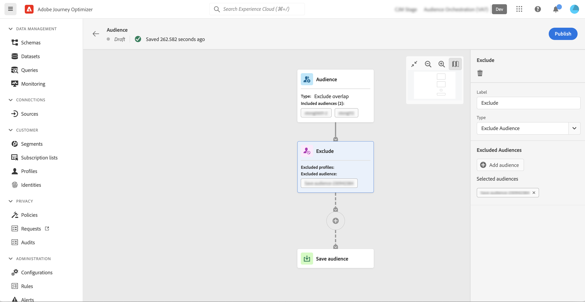

# Arbeta med arbetsytan {#composition-canvas}

Dispositionsarbetsytan är en visuell arbetsyta som gör att du kan skapa kompositioner genom att utnyttja målgrupper och aktiviteter (dela, exkludera..).

Så här konfigurerar du en komposition på arbetsytan:

1. [Definiera era startmålgrupper](#starting-audience)
1. [Lägg till en eller flera aktiviteter](#action-activities)
1. [Spara resultaten till en ny målgrupp](#save)

## Välj den inledande målgruppen {#starting-audience}

>[!CONTEXTUALHELP]
>id="ajo_ao_merge_types"
>title="Sammanfoga typer"
>abstract="Ange hur profilerna för de valda målgrupperna ska sammanfogas."

Det första steget för att skapa en komposition är att välja en eller flera befintliga målgrupper som grund för din komposition.

Välj **[!UICONTROL Audience]** klickar du sedan på **[!UICONTROL Add audience]** sedan en eller flera målgrupper.

I det här exemplet vill vi inrikta oss på alla profiler som tillhör publikerna guld och silver.

Om du väljer flera målgrupper anger du hur profilerna för dessa målgrupper ska sammanfogas:

* **[!UICONTROL Union]**: inkludera alla profiler från de valda målgrupperna,
* **[!UICONTROL Intersection]**: innehåller profiler som är gemensamma för alla valda målgrupper,
* **[!UICONTROL Exclude overlap]**: innehåller profiler som bara tillhör en av målgrupperna. Profiler som tillhör fler än en publik inkluderas inte.

## Lägg till aktiviteter {#action-activities}

Lägg till aktiviteter efter att du har valt den första målgruppen för att förfina urvalet.

Det gör du genom att klicka på plusknappen (+) på kompositionsbanan och sedan välja önskad aktivitet. Den högra rutan öppnas så att du kan konfigurera aktiviteten.

>[!NOTE]
>
>Du kan lägga till så många **[!UICONTROL Audience]** och **[!UICONTROL Exclude]** aktiviteter efter behov i din komposition. Inga ytterligare aktiviteter kan dock läggas till efter **[!UICONTROL Rank]** och **[!UICONTROL Split]** aktiviteter.

Du kan ta bort en aktivitet från arbetsytan när som helst genom att klicka på knappen Ta bort i den högra rutan. Alla aktiviteter som läggs till efter den här aktiviteten tas också bort från arbetsytan.

Tillgängliga aktiviteter är:

* [Målgrupp](#audience): innehålla ytterligare profiler som tillhör en eller flera befintliga målgrupper,
* [Exkludera](#exclude): utesluta profiler som tillhör en befintlig målgrupp eller utesluta profiler som bygger på specifika attribut,
* [Rankning](#rank): rangordna profiler baserat på ett specifikt attribut, ange antalet profiler som ska behållas och inkluderas i din komposition,
* [Dela](#split): dela upp kompositionen i flera banor baserat på slumpmässiga procentsatser eller attribut.

### Målgruppsaktivitet {#audience}

>[!CONTEXTUALHELP]
>id="ajo_ao_audience"
>title="Målgruppsaktivitet"
>abstract="Med hjälp av Audience-aktiviteten kan du i din komposition inkludera ytterligare profiler som tillhör en befintlig målgrupp."

The **[!UICONTROL Audience]** kan du i din komposition inkludera ytterligare profiler som tillhör en befintlig målgrupp.

Konfigurationen för den här aktiviteten är identisk med startvärdet [Målgruppsaktivitet](#starting-audience).

### Exkludera aktivitet {#exclude}

>[!CONTEXTUALHELP]
>id="ajo_ao_exclude_type"
>title="Uteslut typ"
>abstract="Använd typen Uteslut målgrupp för att exkludera profiler som tillhör en befintlig målgrupp. Med attributtypen Uteslut med kan du exkludera profiler baserat på ett specifikt attribut."

>[!CONTEXTUALHELP]
>id="ajo_ao_exclude"
>title="Exkludera aktivitet"
>abstract="Med aktiviteten Uteslut kan du utesluta profiler från kompositionen genom att välja en befintlig målgrupp eller använda en regel."

The **[!UICONTROL Exclude]** kan du utesluta profiler från din komposition. Det finns två typer av undantag:

* **[!UICONTROL Exclude Audience]**: Uteslut profiler som tillhör en befintlig målgrupp.

   Klicka på **[!UICONTROL Add audience]** och sedan välja den målgrupp som ska uteslutas.

   

* **[!UICONTROL Exclude using attribute]**: Uteslut profiler baserade på ett specifikt attribut.

   Välj det attribut som ska slås upp och ange sedan vilket värde som ska uteslutas. I det här exemplet utesluts vi från dispositionsprofiler vars hemadress är i Japan.

   

### Rankningsaktivitet {#rank}

>[!CONTEXTUALHELP]
>id="ajo_ao_ranking"
>title="Rankningsaktivitet"
>abstract="Med aktiviteten Rankning kan du rangordna profiler baserat på ett specifikt attribut och inkludera dem i din komposition. Ta till exempel med de 50 profilerna med det största antalet förmånspoäng."

>[!CONTEXTUALHELP]
>id="ajo_ao_rank_profilelimit_text"
>title="Lägg till profilgräns"
>abstract="Aktivera det här alternativet om du vill ange ett maximalt antal profiler som ska ingå i kompositionen."

The **[!UICONTROL Rank]** Med -aktivitet kan du rangordna profiler baserat på ett specifikt attribut och inkludera dem i din komposition. Du kan till exempel inkludera de 50 profilerna med det största antalet förmånspoäng.

1. Markera det attribut som du vill söka efter och ange en rangordningsordning (stigande eller fallande).

   >[OBS!]
   >
   >Du kan välja attribut med följande datatyper: heltal, tal, kort <!--(other?)-->

1. Växla **[!UICONTROL Add profile limit]** på och ange ett maximalt antal profiler som ska ingå i kompositionen.

   

### Delad aktivitet {#split}

>[!CONTEXTUALHELP]
>id="ajo_ao_control_group_text"
>title="Kontrollgrupp"
>abstract="Använd kontrollgrupper för att isolera en del av profilerna. På så sätt kan ni mäta effekten av en marknadsföringsaktivitet och göra en jämförelse med beteendet hos resten av befolkningen."

>[!CONTEXTUALHELP]
>id="ajo_ao_split"
>title="Delad aktivitet"
>abstract="Med aktiviteten Dela kan du dela upp kompositionen i flera banor. När kompositionen publiceras sparas en publik i Adobe Experience Platform för varje bana."

>[!CONTEXTUALHELP]
>id="ajo_ao_split_type"
>title="Delad text"
>abstract="Använd delningstypen Procent för att slumpmässigt dela upp profiler i flera banor. Med attributdelningstypen kan du dela profiler baserat på ett specifikt attribut."

>[!CONTEXTUALHELP]
>id="ajo_ao_split_otherprofiles_text"
>title="Andra profiler"
>abstract="Aktivera det här alternativet om du vill skapa en ytterligare sökväg med de återstående profilerna som inte matchar något av villkoren som anges i de andra sökvägarna."

The **[!UICONTROL Split]** kan du dela upp kompositionen i flera banor.

Den här åtgärden lägger automatiskt till en **[!UICONTROL Save]** i slutet av varje bana. När kompositionen publiceras sparas en publik i Adobe Experience Platform för varje bana.

Det finns två typer av delade åtgärder:

* **[!UICONTROL Percent split]**: dela upp profiler slumpmässigt i två eller flera banor. Du kan till exempel dela upp profilerna i två olika banor med 45 % vardera och lägga till ytterligare en sökväg för kontrollgruppen.

   

* **[!UICONTROL Attribute split]**: delade profiler baserade på ett specifikt attribut. I det här exemplet delar vi upp profiler baserat på deras rumstypsinställningar.

   

   >[!NOTE]
   >
   >The **[!UICONTROL Other profiles]** kan du skapa ytterligare en sökväg med de återstående profilerna som inte matchar något av villkoren som anges i de andra sökvägarna.

## Spara era målgrupper {#save}

Konfigurera de målgrupper som ska sparas i Adobe Experience Platform.

Om du vill göra det väljer du **[!UICONTROL Save audience]** i slutet av varje bana anger du namnet på den nya målgruppen som ska skapas.

När kompositionen är klar kan du publicera den. [Lär dig hur du skapar kompositioner](create-compositions.md)

Läs mer:

* [Kom igång med målgruppsmaterial](get-started-audience-orchestration.md)
* [Skapa kompositionsarbetsflöden](create-compositions.md)
* [Få åtkomst till och hantera målgrupper](access-audiences.md)
