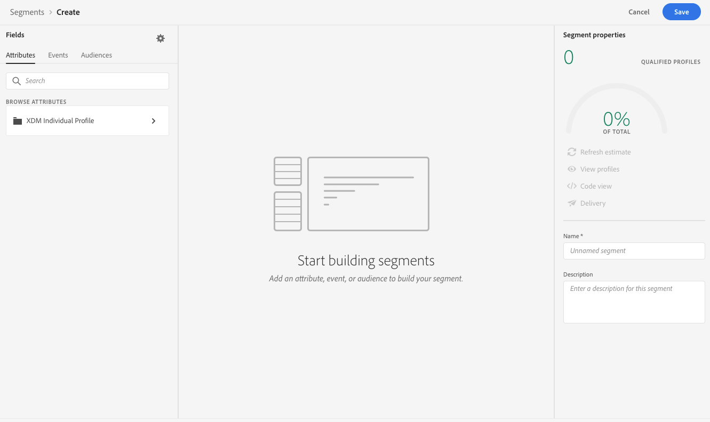

# Skapa segment {#build-segments}

I det här exemplet ska vi skapa ett segment som riktar sig till alla kunder som bor i Atlanta, San Francisco eller Seattle och som är födda efter 1980. Alla dessa kunder bör ha öppnat Luma-applikationen inom de senaste 7 dagarna och sedan köpt den inom 2 timmar efter att ansökan öppnats.

1. Gå till menyn **[!UICONTROL Segments]** och klicka sedan på knappen **[!UICONTROL Create segment]**.

   

   På segmentdefinitionsskärmen kan du konfigurera alla obligatoriska fält för att definiera ditt segment. Lär dig hur du konfigurerar segment i [dokumentationen för segmenteringstjänsten](https://experienceleague.adobe.com/docs/experience-platform/segmentation/ui/overview.html).

   

1. I rutan **[!UICONTROL Segment properties]** anger du ett namn och en beskrivning (valfritt) för segmentet.

   

1. Dra och släpp önskade fält från den vänstra rutan till arbetsytan i mitten och konfigurera dem efter behov.

   >[!NOTE]
   >
   >Observera att fälten som är tillgängliga i den vänstra rutan varierar beroende på hur scheman **XDM Individual Profile** och **XDM ExperienceEvent** har konfigurerats för din organisation.  Läs mer i [XDM-dokumentationen (Experience Data Model)](https://experienceleague.adobe.com/docs/experience-platform/xdm/home.html?lang=sv).

   

   I det här exemplet måste vi förlita oss på fälten **Attribut** och **Händelser** för att skapa segmentet:

   * **Attribut**: profiler som bor i Atlanta, San Francisco eller Seattle, född efter 1980,
   * **Händelser**: som öppnade Luma-programmet inom de senaste 7 dagarna och sedan gjorde ett köp inom 2 timmar efter att programmet öppnats.

      

      

1. När du lägger till och konfigurerar nya fält på arbetsytan uppdateras rutan **[!UICONTROL Segment Properties]** automatiskt med information om de uppskattade profiler som tillhör segmentet.

   

1. När segmentet är klart klickar du på **[!UICONTROL Save]**. Den visas i listan över Adobe Experience Platform-segment. Observera att det finns ett sökfält som du kan använda för att söka efter ett visst segment i listan.

Segmentet kan nu användas på dina resor. Mer information om detta finns i [det här avsnittet](../segment/about-segments.md).
