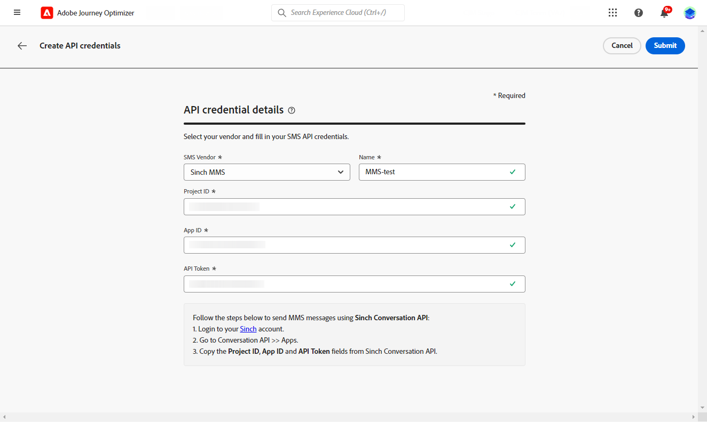

# Skapa ett MMS-meddelande {#create-mms}

## Förutsättningar{#sms-prerequisites}

Innan du skapar SMS-meddelandet måste du först konfigurera SMS-leverantören med Journey Optimizer, så här:

* Innan du skickar SMS måste du integrera providerinställningarna med Journey Optimizer.

+++ Lär dig hur du skapar nya autentiseringsuppgifter för Sinch MMS API.

   1. I den vänstra listen bläddrar du till **[!UICONTROL Administration]** > **[!UICONTROL Channels]** och väljer **[!UICONTROL API Credentials]** -menyn. Klicka på knappen **[!UICONTROL Create new API credentials]**.

      

   1. Konfigurera dina SMS API-autentiseringsuppgifter:

   * För **[!DNL Sinch MMS]**:

      * **[!UICONTROL Name]**: välj ett namn för API-autentiseringsuppgifterna.

      * **[!UICONTROL Project ID]**, **[!UICONTROL App ID]** och **[!UICONTROL API Token]**: på konversations-API-menyn hittar du dina inloggningsuppgifter på App-menyn.  [Läs mer](https://docs.cc.sinch.com/cloud/service-configuration/en/oxy_ex-1/common/wln1620131604643.html)

     

   1. Klicka **[!UICONTROL Submit]** när du är klar med konfigurationen av dina API-autentiseringsuppgifter.

  När du har skapat och konfigurerat API-autentiseringsuppgifterna måste du nu skapa en kanalyta (t.ex. meddelandeförinställning) för SMS-meddelanden.

+++

* När du är klar måste du skapa en SMS-yta. Dessa steg måste utföras av en Adobe Journey Optimizer-systemadministratör.

+++ Lär dig hur du skapar din kanalyta.

   1. I den vänstra listen bläddrar du till **[!UICONTROL Administration]** > **[!UICONTROL Channels]** och markera **[!UICONTROL Branding]** > **[!UICONTROL Channel surfaces]**. Klicka på knappen **[!UICONTROL Create channel surface]**.

      

   1. Ange ett namn och en beskrivning (valfritt) för ytan och välj sedan SMS-kanalen.

      

      >[!NOTE]
      >
      > Namn måste börja med en bokstav (A-Z). Det får bara innehålla alfanumeriska tecken. Du kan också använda understreck `_`, punkt`.` och bindestreck `-` tecken.

   1. Definiera **SMS-inställningar**.

      

      Börja med att välja **[!UICONTROL SMS Type]** som ska skickas med ytan: **[!UICONTROL Transactional]** eller **[!UICONTROL Marketing]**.

      * Välj **Marknadsföring** för marknadsföringsmeddelanden: dessa meddelanden kräver användarens samtycke.
      * Välj **Transactional** för icke-kommersiella meddelanden, t.ex. orderbekräftelse, meddelanden om lösenordsåterställning eller leveransinformation.

      När du skapar ett SMS-meddelande måste du välja en giltig kanalyta som matchar den kategori som du valde för meddelandet.

      >[!CAUTION]
      >
      >**Transactional** SMS-meddelanden kan skickas till profiler som avbeställer marknadskommunikation. Dessa meddelanden kan bara skickas i särskilda sammanhang.

   1. Välj **[!UICONTROL SMS configuration]** för att associera med ytan.

      Mer information om hur du konfigurerar miljön för att skicka SMS-meddelanden finns i [det här avsnittet](#create-api).

   1. Ange **[!UICONTROL Sender number]** &#x200B; som du vill använda för din kommunikation.

   1. Välj **[!UICONTROL SMS Execution Field]** för att välja **[!UICONTROL Profile attribute]** som är kopplade till profilens telefonnummer.

   1. Om du vill använda förkortningsfunktionen för URL i dina SMS-meddelanden väljer du ett alternativ på menyn **[!UICONTROL Subdomain]** lista.

      >[!NOTE]
      >
      >Om du vill kunna välja en underdomän kontrollerar du att du tidigare har konfigurerat minst en SMS-underdomän. [Lär dig mer](sms-subdomains.md)

   1. Ange **[!UICONTROL Opt-out number]** som du vill använda för den här ytan. När profiler avanmäler sig från det här numret kan du fortfarande skicka meddelanden från andra nummer som du använder för att skicka ut SMS-meddelanden med [!DNL Journey Optimizer].

      >[!NOTE]
      >
      >I [!DNL Journey Optimizer], hanteras inte längre SMS-avanmälan på kanalnivå. Den är nu specifik för ett tal.

   1. När alla parametrar har konfigurerats klickar du på **[!UICONTROL Submit]** för att bekräfta. Du kan också spara kanalytan som ett utkast och återuppta konfigurationen senare.

      

   1. När kanalytan har skapats visas den i listan med **[!UICONTROL Processing]** status.

      >[!NOTE]
      >
      >Om kontrollerna inte lyckas kan du läsa mer om orsakerna till eventuella fel i [det här avsnittet](#monitor-channel-surfaces).

   1. När kontrollerna är klara får kanalytan **[!UICONTROL Active]** status. Den är klar att användas för att leverera meddelanden.

      

## Skapa ett SMS-meddelande {#create-sms-journey-campaign}

Bläddra bland flikarna nedan för att lära dig hur du lägger till ett SMS-meddelande i en kampanj eller en resa.

>[!BEGINTABS]

>[!TAB Lägga till ett SMS-meddelande på en resa]

1. Öppna resan och dra och släpp en SMS-aktivitet från **Åtgärder** på paletten.

   

1. Ange grundläggande information i meddelandet (etikett, beskrivning, kategori) och välj sedan den meddelandeyta som ska användas.

   

   Mer information om hur du konfigurerar en resa finns i [den här sidan](../building-journeys/journey-gs.md)

   The **[!UICONTROL Surface]** som standard är fältet förifyllt med den sista yta som användaren använder för den kanalen.

Nu kan du börja designa ditt SMS-meddelande via **[!UICONTROL Edit content]** -knappen. [Definiera ditt SMS-innehåll](#sms-content)

>[!TAB Lägga till ett SMS-meddelande i en kampanj]

1. Skapa en ny schemalagd eller API-utlöst kampanj, välj **[!UICONTROL SMS]** som din åtgärd och väljer **[!UICONTROL App surface]** att använda. [Läs mer om SMS-konfiguration](sms-configuration.md).

   

1. Klicka på **[!UICONTROL Create]**.

1. Från **[!UICONTROL Properties]** redigerar du Campaigns **[!UICONTROL Title]** och **[!UICONTROL Description]**.

   

1. Klicka på **[!UICONTROL Select audience]** för att definiera målgruppen i listan över tillgängliga Adobe Experience Platform-målgrupper. [Läs mer](../audience/about-audiences.md).

1. I **[!UICONTROL Identity namespace]** väljer du det namnutrymme som ska användas för att identifiera personer från den valda målgruppen. [Läs mer](../event/about-creating.md#select-the-namespace).

   

1. Klicka **[!UICONTROL Create experiment]** för att börja konfigurera ert innehållsexperiment och skapa behandlingar för att mäta deras prestanda och identifiera det bästa alternativet för er målgrupp. [Läs mer](../campaigns/content-experiment.md)

1. I **[!UICONTROL Actions tracking]** anger du om du vill spåra klickningar på länkar i SMS-meddelandet.

1. Kampanjer är utformade för att köras ett visst datum eller med en återkommande frekvens. Lär dig hur du konfigurerar **[!UICONTROL Schedule]** av kampanjen i [det här avsnittet](../campaigns/create-campaign.md#schedule).

1. Från **[!UICONTROL Action triggers]** väljer du **[!UICONTROL Frequency]** av SMS-meddelandet:

   * En gång
   * Dagligen
   * Veckovis
   * Month

Nu kan du börja designa ditt SMS-meddelande via **[!UICONTROL Edit content]** -knappen. [Designa ditt SMS-innehåll](#sms-content)

>[!ENDTABS]

## Definiera ditt MMS-innehåll{#mms-content}

1. Klicka på **[!UICONTROL Edit content]** för att konfigurera SMS-innehållet.

1. Klicka på **[!UICONTROL Message]** för att öppna uttrycksredigeraren.

   

1. Använd uttrycksredigeraren för att definiera innehåll och lägga till dynamiskt innehåll. Du kan använda alla attribut, till exempel profilnamnet eller stad. Läs mer om [personalisering](../personalization/personalize.md) och [dynamiskt innehåll](../personalization/get-started-dynamic-content.md) i uttrycksredigeraren.

1. Aktivera alternativet MMS för att lägga till media i SMS-innehåll.

   >[!NOTE]
   >
   > MMS-alternativet är bara tillgängligt med Sinch. Du måste skapa en specifik API-autentiseringsuppgift för att skapa MMS. [Läs mer](sms-configuration.md#create-new-api)

   

1. Lägg till en **[!UICONTROL Title]** till era medier.

1. Ange URL-adressen till dina media i dialogrutan **[!UICONTROL Media]** fält.

   

1. Klicka **[!UICONTROL Save]** och kontrollera meddelandet i förhandsgranskningen. Du kan använda **[!UICONTROL Simulate content]** för att förhandsgranska dina förkortade URL:er eller personaliserat innehåll.

Nu kan du testa och skicka SMS-meddelanden till din målgrupp. [Läs mer](send-sms.md)
När ni har skickat det kan ni mäta effekten av ert SMS i kampanjrapporten eller reserapporten. Mer information om rapportering finns i [det här avsnittet](../reports/campaign-global-report.md#sms-tab).

>[!NOTE]
>
>I enlighet med branschens standarder och bestämmelser måste alla SMS-marknadsföringsmeddelanden innehålla ett sätt för mottagarna att enkelt avbryta prenumerationen. För att göra detta kan SMS-mottagare svara med nyckelord för deltagande och avanmälan. [Lär dig hur du hanterar avanmälan](../privacy/opt-out.md#sms-opt-out-management-sms-opt-out-management)

**Relaterade ämnen**

* [Förhandsgranska, testa och skicka SMS-meddelanden](send-sms.md)
* [Konfigurera SMS-kanal](sms-configuration.md)
* [SMS-rapport](../reports/journey-global-report.md#sms-global)