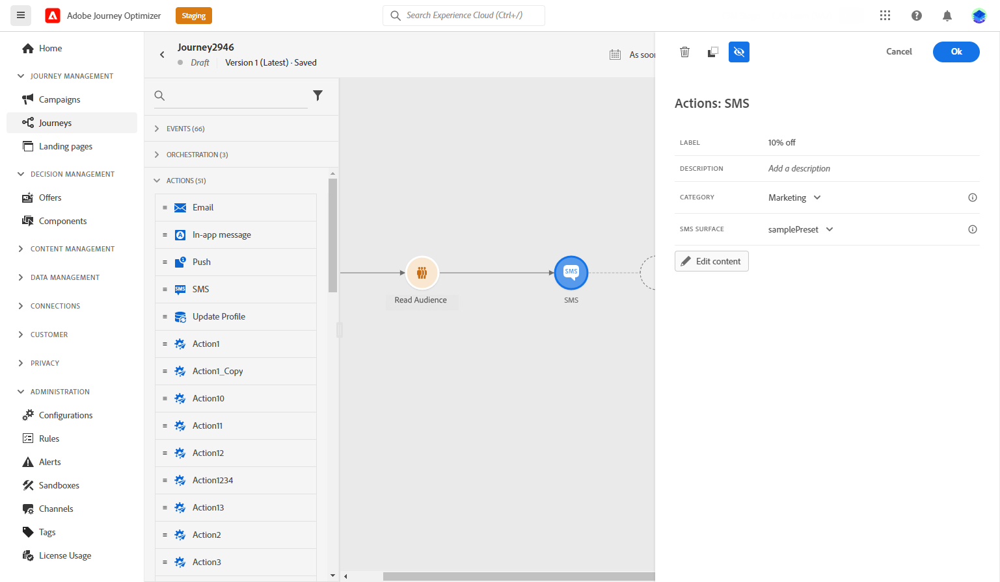
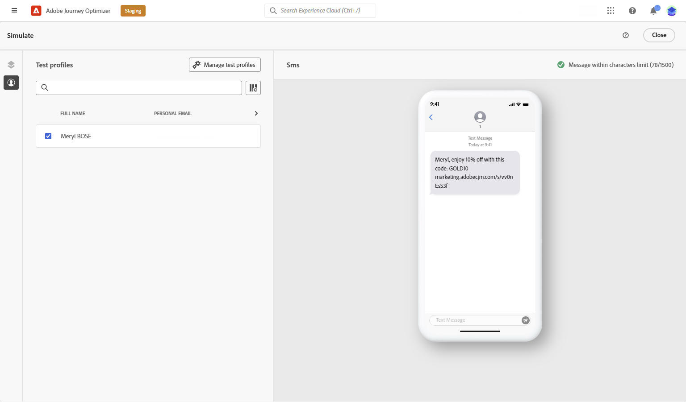

# Skapa ett SMS/MMS/RCS-meddelande {#create-sms}

>[!CONTEXTUALHELP]
>id="ajo_message_sms"
>title="Skapa ett textmeddelande"
>abstract="Om du vill skapa ett textmeddelande (SMS/MMS/RCS) lägger du till en SMS-åtgärd i en resa eller kampanj och börjar personalisera den med personaliseringsredigeraren."

Du kan utforma och skicka textmeddelanden (SMS), multimediemeddelanden (RCS) och multimediemeddelanden (MMS) med Adobe Journey Optimizer. Du måste först lägga till en SMS-åtgärd på en resa eller i en kampanj och sedan definiera innehållet i textmeddelandet, enligt beskrivningen nedan. Adobe Journey Optimizer har också funktioner för att testa textmeddelanden innan de skickas, så att du kan kontrollera återgivning, anpassningsattribut och alla andra inställningar.

>[!NOTE]
>
>I enlighet med branschens standarder och bestämmelser måste alla SMS/MMS-marknadsföringsmeddelanden innehålla ett sätt för mottagarna att enkelt avbryta prenumerationen. För att göra detta kan SMS-mottagare svara med nyckelord för deltagande och avanmälan. [Lär dig hantera avanmälan](../privacy/opt-out.md#sms-opt-out-management-sms-opt-out-management)

## Lägga till ett textmeddelande {#create-sms-journey-campaign}

Bläddra bland flikarna nedan för att lära dig hur du lägger till ett textmeddelande (SMS/MMS/RCS) i en kampanj eller en resa.

>[!BEGINTABS]

>[!TAB Lägg till ett textmeddelande på en resa]

1. Öppna din resa och dra och släpp en SMS-aktivitet från **Åtgärder**-delen av paletten.

   

1. Ange grundläggande information i meddelandet (etikett, beskrivning, kategori) och välj sedan den meddelandekonfiguration som ska användas.

   

   Mer information om hur du konfigurerar en resa finns på [sidan](../building-journeys/journey-gs.md)

   Fältet **[!UICONTROL configuration]** är som standard förfyllt med den senaste konfigurationen som används av användaren för den kanalen.

Nu kan du börja designa innehållet i SMS-meddelandet med knappen **[!UICONTROL Edit content]**, som beskrivs nedan.

>[!TAB Lägg till ett textmeddelande i en kampanj]

1. Öppna menyn **[!UICONTROL Campaigns]** och klicka sedan på **[!UICONTROL Create campaign]**.

1. Välj den typ av kampanj som du vill köra

   * **Schemalagd - marknadsföring**: Kör kampanjen direkt eller på ett angivet datum. Schemalagda kampanjer syftar till att skicka marknadsföringsmeddelanden. De konfigureras och körs från användargränssnittet.

   * **API-utlöst - Markering/transaktion**: Kör kampanjen med ett API-anrop. API-utlösta kampanjer syftar till att skicka antingen marknadsförings- eller transaktionsmeddelanden, dvs. meddelanden som skickas ut efter en åtgärd som utförs av en individ: lösenordsåterställning, kundvagn osv.

1. I avsnittet **[!UICONTROL Properties]** redigerar du din kampanjs **[!UICONTROL Title]** och **[!UICONTROL Description]**.

1. Klicka på knappen **[!UICONTROL Select audience]** för att definiera målgruppen i listan över tillgängliga Adobe Experience Platform-målgrupper. [Läs mer](../audience/about-audiences.md).

1. I fältet **[!UICONTROL Identity namespace]** väljer du det namnutrymme som ska användas för att identifiera personer från den valda målgruppen. [Läs mer](../event/about-creating.md#select-the-namespace).

1. I avsnittet **[!UICONTROL Actions]** väljer du **[!UICONTROL SMS]** och väljer eller skapar en ny konfiguration.

   Läs mer om SMS-konfiguration på [den här sidan](sms-configuration.md).

   

1. Klicka på **[!UICONTROL Create experiment]** för att börja konfigurera ditt innehållsexperiment och skapa behandlingar för att mäta deras prestanda och identifiera det bästa alternativet för målgruppen. [Läs mer](../content-management/content-experiment.md)

1. I avsnittet **[!UICONTROL Actions tracking]** anger du om du vill spåra klickningar på länkar i SMS-meddelandet.

1. Kampanjer är utformade för att köras ett visst datum eller med en återkommande frekvens. Lär dig hur du konfigurerar **[!UICONTROL Schedule]** för din kampanj i [det här avsnittet](../campaigns/create-campaign.md#schedule).

1. Välj **[!UICONTROL Action triggers]** i SMS-meddelandet på menyn **[!UICONTROL Frequency]**:

   * En gång
   * Dagligen
   * Vecka
   * Månad

Nu kan du börja designa innehållet i ditt textmeddelande med knappen **[!UICONTROL Edit content]**, som beskrivs nedan.

>[!ENDTABS]

## Definiera ditt SMS/RCS-innehåll{#sms-content}

>[!CONTEXTUALHELP]
>id="ajo_message_sms_content"
>title="Definiera ditt SMS-innehåll"
>abstract="Anpassa och anpassa dina textmeddelanden (SMS/MMS/RCS) genom att använda personaliseringsredigeraren för att definiera innehållet och införliva dynamiska element."

>[!AVAILABILITY]
>
>RCS Upscale är inte en HIPAA-Ready Service och får inte användas för att samla in, lagra eller bearbeta känsliga personuppgifter, inklusive Tillåtna hälsodata, t.ex. personlig hälsoinformation eller PHI, som din organisation annars kan ha tillstånd att behandla i Journey Optimizer.

Följ stegen nedan för att konfigurera meddelandeinnehållet. Inställningarna för MMS finns i [det här avsnittet](#mms-content).

1. Klicka på knappen **[!UICONTROL Edit content]** på skärmen för resan eller kampanjkonfigurationen för att konfigurera textmeddelandeinnehållet.

1. Klicka på fältet **[!UICONTROL Message]** för att öppna anpassningsredigeraren.

   För RCS-meddelanden med Infobip, Twilio eller andra tredjepartsleverantörer klistrar du in den JSON-nyttolast som krävs i din [anpassade SMS-konfiguration](sms-configuration-custom.md#api-credential).

   

1. Använd personaliseringsredigeraren för att definiera innehåll, lägga till personalisering och dynamiskt innehåll. Du kan använda alla attribut, till exempel profilnamnet eller stad. Du kan också definiera villkorliga regler. Bläddra till följande sidor om du vill veta mer om [personalisering](../personalization/personalize.md) och [dynamiskt innehåll](../personalization/get-started-dynamic-content.md) i personaliseringsredigeraren.

1. När du har definierat innehållet kan du lägga till spårade URL:er i meddelandet. Gå till menyn **[!UICONTROL Helper functions]** och välj **[!UICONTROL Helpers]** om du vill göra det.

   Observera att för att du ska kunna använda funktionen för förkortning av URL måste du först konfigurera en underdomän som sedan länkas till din konfiguration. [Läs mer](sms-subdomains.md)

   >[!NOTE]
   >
   > Om du vill komma åt och redigera SMS-underdomäner måste du ha behörigheten **[!UICONTROL Manage SMS Subdomains]** i produktionssandlådan. Läs mer om behörigheter i [det här avsnittet](../administration/high-low-permissions.md).

   

1. Klicka på **[!UICONTROL Helper functions]** på menyn **[!UICONTROL URL function]** och välj sedan **[!UICONTROL Add URL]**.

   

   <!--The URL shortening function cannot be used within a fragment. TBC-->

1. Klistra in den URL som du vill förkorta i fältet `originalUrl` och klicka på **[!UICONTROL Save]**.

   >[!CAUTION]
   >
   > Livslängden för korta URL-adresser är inställd på 30 dagar. Efter den här perioden kommer dessa korta URL:er inte längre att vara tillgängliga och kommer att visa meddelandet: `404 short-code not found`.

1. Klicka på **[!UICONTROL Save]** och kontrollera meddelandet i förhandsgranskningen. Du kan nu testa och kontrollera meddelandeinnehållet enligt beskrivningen i [det här avsnittet](#sms-mms-test).

## Definiera ditt MMS-innehåll{#mms-content}

Du kan förbättra kommunikationen genom att skicka MMS-meddelanden (Multimedia Message Service), vilket möjliggör delning av media som videor, bilder, ljudklipp och GIF-filer med mera. Dessutom kan MMS innehålla upp till 1 600 tecken i meddelandet.

>[!NOTE]
>
> MMS-kanalen har några begränsningar angivna på [den här sidan](../start/guardrails.md#sms-guardrails).

Så här skapar du MMS-innehåll:

1. Skapa ett SMS enligt beskrivningen i [det här avsnittet](#create-sms-journey-campaign).

1. Redigera ditt SMS-innehåll enligt anvisningarna i [det här avsnittet](#sms-content).

1. Aktivera alternativet MMS för att lägga till media i SMS-innehåll.

   

1. Lägg till en **[!UICONTROL Title]** till dina media.

1. Ange URL-adressen till dina media i fältet **[!UICONTROL Media]**.

   

1. Klicka på **[!UICONTROL Save]** och kontrollera meddelandet i förhandsgranskningen. Du kan nu testa och kontrollera meddelandeinnehållet enligt beskrivningen nedan.

## Testa och skicka meddelanden {#sms-mms-test}

Använd knappen **[!UICONTROL Simulate content]** om du vill förhandsgranska ditt textmeddelandeinnehåll, förkortade URL:er och anpassat innehåll.

När du har utfört testerna och validerat innehållet kan du skicka textmeddelandet till mottagarna. De här stegen beskrivs på [den här sidan](send-sms.md)

När ni har skickat det kan ni mäta effekten av ert SMS i kampanjrapporten eller reserapporten. Mer information om rapportering finns i [det här avsnittet](../reports/campaign-global-report-cja-sms.md).

**Relaterade ämnen**

* [Förhandsgranska, testa och skicka ditt textmeddelande](send-sms.md)
* [Konfigurera SMS-kanal](sms-configuration.md)
* [SMS-/MMS-rapporter](../reports/journey-global-report-cja-sms.md)
* [Lägg till ett meddelande i en resa](../building-journeys/journeys-message.md)
* [Lägg till ett meddelande i en kampanj](../campaigns/create-campaign.md)
