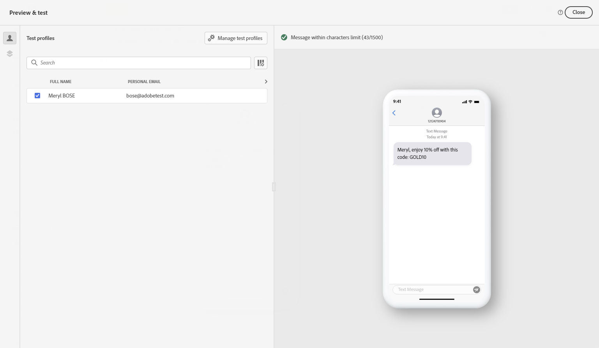

# Kontrollera och skicka textmeddelanden (SMS/MMS) {#send-sms}

## Förhandsgranska textmeddelandet {#preview-sms}

När meddelandeinnehållet har definierats kan du använda testprofiler för att förhandsgranska innehållet. Om du har infogat anpassat innehåll kan du kontrollera hur det här innehållet visas i meddelandet med hjälp av testprofildata.

Det gör du genom att klicka **[!UICONTROL Simulate content]** lägg sedan till en testprofil för att kontrollera meddelandet med testprofilsdata.

Detaljerad information om hur du väljer testprofiler och förhandsgranskar innehållet finns i [Innehållshantering](../content-management/preview-test.md) -avsnitt.

## Validera ditt innehåll {#sms-validate}

Du måste kontrollera varningar i den övre delen av redigeraren. Vissa av dem är enkla varningar, men andra kan hindra dig från att skicka meddelandet. Två typer av varningar kan inträffa: varningar och fel.

* **Varningar** hänvisa till rekommendationer och bästa praxis. Ett varningsmeddelande visas till exempel om ditt textmeddelande är tomt.

* **Fel** hindra er från att testa eller aktivera resan, eller publicera kampanjen, så länge de inte är lösta. Ett felmeddelande varnar dig till exempel när ämnesraden saknas.

>[!NOTE]
>
> Använd telefonnumren i de format som stöds av leverantören för att förbättra leveransmöjligheterna. Twilio och Sinch har till exempel bara stöd för telefonnummer i E.164-format.

## Skicka dina textmeddelanden {#sms-send}

Slutför konfigurationen av [resa](../building-journeys/journey-gs.md) eller [kampanj](../campaigns/create-campaign.md) för att skicka den.

**Relaterade ämnen**

* [Konfigurera SMS-kanal](sms-configuration.md)
* [SMS-/MMS-rapporter](../reports/journey-global-report.md#sms-global)
* [Skapa ett textmeddelande](create-sms.md)
* [Lägg till ett meddelande i en resa](../building-journeys/journeys-message.md)
