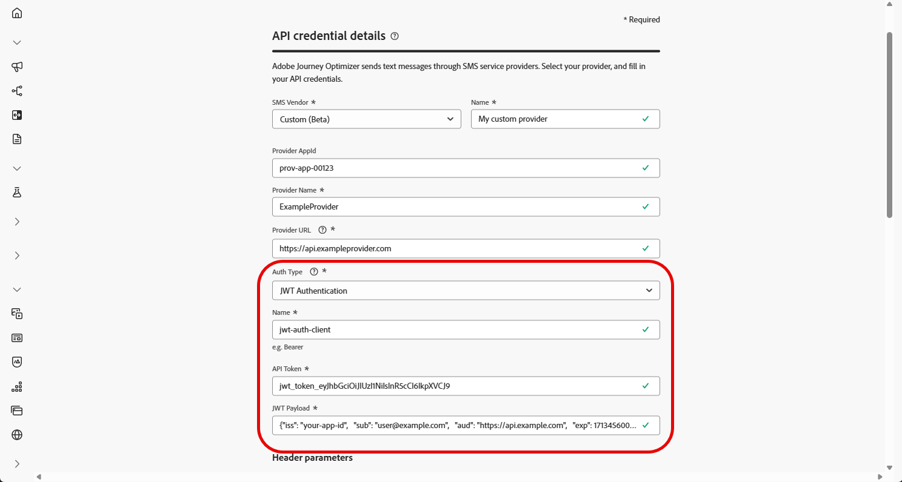

# Konfigurera en anpassad provider {#sms-configuration-custom}

>[!CONTEXTUALHELP]
>id="ajo_admin_sms_api_byop_provider_url"
>title="Provider-URL"
>abstract="Ange URL:en för det externa API som du vill ansluta till. Den här URL:en fungerar som slutpunkt för åtkomst till API:ns funktioner."

>[!CONTEXTUALHELP]
>id="ajo_admin_sms_api_byop_header_parameters"
>title="Huvudparametrar"
>abstract="Ange etikett, typ och värde för ytterligare rubriker för att aktivera korrekt autentisering, innehållsformatering och effektiv API-kommunikation. "

>[!CONTEXTUALHELP]
>id="ajo_admin_sms_api_byop_provider_payload"
>title="Leverantörsnyttolast"
>abstract="Ange nyttolasten för begäran för att säkerställa att rätt data skickas för bearbetning och svarsgenerering."

Med den här funktionen kan du integrera och konfigurera dina egna meddelandeleverantörer och erbjuda flexibilitet utöver standardalternativen (Sinch, Twilio och Infobip). Detta möjliggör smidig redigering, leverans, rapportering och samtyckeshantering för både SMS- och RCS-meddelanden.

Med anpassad leverantörskonfiguration kan du ansluta tredjepartstjänster direkt inifrån Journey Optimizer, anpassa meddelandenyttolaster för dynamiskt innehåll och hantera inställningar för anmälan/avanmälan för att säkerställa regelefterlevnad i både SMS- och RCS-kanaler.

Följ stegen nedan för att konfigurera din anpassade leverantör:

1. [Skapa API-autentiseringsuppgifter](#api-credential)
1. [Skapa webkrok](#webhook)
1. [Skapa kanalkonfiguration](sms-configuration-surface.md)
1. [Skapa resa eller kampanj med SMS-kanalsåtgärd](create-sms.md)

## Skapa API-autentiseringsuppgifter {#api-credential}

Följ de här stegen för att skicka SMS- och RCS-meddelanden i Journey Optimizer med en anpassad leverantör som inte är tillgänglig direkt från Adobe (t.ex. Sinch, Infobip, Twilio):

1. Navigera till **[!UICONTROL Administration]** `>` **[!UICONTROL Channels]** i den vänstra listen, välj menyn **[!UICONTROL API Credentials]** under **[!UICONTROL SMS settings]** och klicka på knappen **[!UICONTROL Create new API credentials]**.

   

1. Konfigurera dina SMS API-autentiseringsuppgifter enligt nedanstående:

   * **[!UICONTROL SMS vendor]**: Anpassad.

   * **[!UICONTROL Name]**: Ange ett namn för API-autentiseringsuppgifterna.

   * **[!UICONTROL Provider AppId]**: Ange det program-ID som din SMS-leverantör har angett.

   * **[!UICONTROL Provider Name]**: Ange namnet på SMS-providern.

   * **[!UICONTROL Provider URL]**: Ange URL:en till din SMS-leverantör.

   * **[!UICONTROL Auth Type&#x200B;]**: Välj auktoriseringstyp och [fyll i motsvarande fält](#auth-options) baserat på den valda autentiseringsmetoden.

     

1. Aktivera alternativet **[!UICONTROL mTLS support]**, som ser till att både klienten och servern autentiserar varandra innan en säker anslutning upprättas.

   Om du bara vill använda mTLS väljer du **[!UICONTROL No Authentication]** i listrutan **[!UICONTROL Auth Type]** och aktiverar sedan **[!UICONTROL mTLS support]**.

1. I avsnittet **[!UICONTROL Headers]** klickar du på **[!UICONTROL Add new parameter]** för att ange HTTP-rubriker för det begärandemeddelande som ska skickas till den externa tjänsten.

   Rubrikfälten **Content-Type** och **Charset** är inställda som standard och kan inte tas bort.

   

1. Lägg till din **[!UICONTROL Provider Payload]** för att validera och anpassa dina begärda nyttolaster.

   För RCS-meddelanden används den här nyttolasten senare under [innehållsdesign](create-sms.md#sms-content).

   >[!NOTE]
   >
   >När du konfigurerar en anpassad SMS-provider med Basic- eller Bearer-autentisering måste du inkludera parametern `authOption` i JSON-nyttolasten. Dessutom måste **providernyttolasten** referera till mallvariablerna `{{fromNumber}}`, `{{toNumber}}` och `{{message}}`.

1. Klicka på **[!UICONTROL Submit]** när du är klar med konfigurationen av dina API-autentiseringsuppgifter.

1. Klicka på **[!UICONTROL API Credentials]** bin-ikonen för att ta bort dina API-autentiseringsuppgifter.

   

1. Om du vill ändra befintliga autentiseringsuppgifter letar du reda på de API-autentiseringsuppgifter du vill ha och klickar på alternativet **[!UICONTROL Edit]** för att göra de ändringar som behövs.

   

1. Klicka på **[!UICONTROL Verify SMS connection]**, bland dina befintliga API-autentiseringsuppgifter, för att testa och verifiera dina SMS API-autentiseringsuppgifter genom att skicka ett exempelmeddelande till en angiven enhet.

1. Fyll i fälten **Number** och **Message** och klicka på **[!UICONTROL Verify connection]**.

   >[!IMPORTANT]
   >
   >Meddelandet måste vara strukturerat så att det överensstämmer med leverantörens nyttolastformat.

   

När du har skapat och konfigurerat API-autentiseringsuppgifterna måste du nu konfigurera [inställningarna för inkommande trafik för Webkrok](#webhook) för SMS-meddelanden.

### Autentiseringsalternativ för anpassade SMS-providers {#auth-options}

>[!CONTEXTUALHELP]
>id="ajo_admin_sms_api_byop_auth_type"
>title="Autentiseringstyp"
>abstract="Ange den autentiseringsmetod som krävs för att få åtkomst till API:t, vilket garanterar säker och auktoriserad kommunikation med den externa tjänsten."

>[!BEGINTABS]

>[!TAB API-nyckel]

När API-autentiseringsuppgifterna har skapats fyller du i de fält som krävs för API-nyckelautentisering:

* **[!UICONTROL Name]** &#x200B;: Ange ett namn för API-nyckelkonfigurationen.
* **[!UICONTROL API Token]** &#x200B;: Ange den API-token som din SMS-leverantör tillhandahåller.

>[!TAB MAC-autentisering]

När API-autentiseringsuppgifterna har skapats fyller du i de fält som krävs för MAC-autentisering:

* **[!UICONTROL Name]** &#x200B;: Ange ett namn för din MAC-autentiseringskonfiguration.
* **[!UICONTROL API Token]** &#x200B;: Ange den API-token som din SMS-leverantör tillhandahåller.
* **[!UICONTROL API Secret Key]**: Ange API-hemlig nyckel från din SMS-leverantör. Den här nyckeln används för att generera MAC (Message Authentication Code) för säker kommunikation.
* **[!UICONTROL Mac Authorization Hash Format]**: Välj hash-format för MAC-autentiseringen.

>[!TAB OAuth-autentisering]

När API-autentiseringsuppgifterna har skapats fyller du i fälten som krävs för OAuth-autentisering:

* **[!UICONTROL Name]** &#x200B;: Ange ett namn för OAuth-autentiseringskonfigurationen.

* **[!UICONTROL API Token]** &#x200B;: Ange den API-token som din SMS-leverantör tillhandahåller.

* **[!UICONTROL OAuth URL]** &#x200B;: Ange URL:en för att hämta OAuth-token.

* **[!UICONTROL OAuth Body]** &#x200B;: Ange OAuth-begärandetexten i JSON-format, inklusive parametrar som `grant_type`, `client_id` och `client_secret`.

>[!TAB JWT-autentisering]

När API-autentiseringsuppgifterna har skapats fyller du i fälten som krävs för JWT-autentisering:

* **[!UICONTROL Name]** &#x200B;: Ange ett namn för JWT-autentiseringskonfigurationen.

* **[!UICONTROL API Token]** &#x200B;: Ange den API-token som din SMS-leverantör tillhandahåller.

* **[!UICONTROL JWT Payload]** &#x200B;: Ange JSON-nyttolasten som innehåller de anspråk som krävs för JWT, till exempel utfärdare, ämne, målgrupp och utgångsdatum.

>[!ENDTABS]

## Skapa webkrok {#webhook}

>[!BEGINSHADEBOX]

Om nyckelord för anmälan eller avanmälan inte anges används standardmeddelanden för godkännande för att respektera användarens integritet. Om du lägger till anpassade nyckelord åsidosätts standardvärdena automatiskt.

**Standardnyckelord:**

* **Opt-In**: SUBSCRIBE, YES, UNSTOP, START, FORTSÄTT, RESUME, BEGIN
* **Opt-Out**: STOP, QUIT, CANCEL, END, UNSUBSCRIBE, NO
* **Hjälp**: HJÄLP

>[!ENDSHADEBOX]

När API-autentiseringsuppgifterna har skapats kan du nu konfigurera Webhooks så att inkommande svar hämtas för hantering av godkännande av anmälan och avanmälan, och så att du får leveransrapporter som läskvitton när de är tillgängliga.

När du konfigurerar en webkrok kan du definiera dess syfte baserat på den typ av data som du vill hämta:

* **[!UICONTROL Inbound]**: Använd det här alternativet om du vill samla in medgivandesvar, t.ex. anmälan eller avanmälan, och samla in användarinställningar.

* **[!UICONTROL Feedback]**: Välj det här alternativet om du vill spåra leverans- och engagemangshändelser, inklusive läskvitton och användarinteraktioner, som stöd för rapportering och analys.

>[!BEGINTABS]

>[!TAB Inkommande]

1. Navigera till **[!UICONTROL Administration]** `>` **[!UICONTROL Channels]** i den vänstra listen, välj menyn **[!UICONTROL SMS Webhooks]** under **[!UICONTROL SMS settings]** och klicka på knappen **[!UICONTROL Create Webhook]**.

   

1. Konfigurera webkrosinställningarna enligt anvisningarna nedan:

   * **[!UICONTROL Name]**: Ange ett namn för din webkrok.

   * **[!UICONTROL Select SMS vendor]**: Anpassad.

   * **[!UICONTROL Type]**: Inkommande.

   * **[!UICONTROL API credentials]**: Välj i listrutan [tidigare konfigurerade API-autentiseringsuppgifter](#api-credential).

   * **[!UICONTROL Sender Phone Number &#x200B;]**: Ange det &#x200B; för avsändarens telefonnummer som du vill använda för kommunikationen.

     

1. Klicka på  för att lägga till dina nyckelordskategorier och konfigurera dem sedan så här:

   * **[!UICONTROL Inbound Keyword Category]**: Välj dina nyckelordskategorier antingen **[!UICONTROL Opt-In]**, **[!UICONTROL Opt-Out]**, **[!UICONTROL Help]** eller **[!UICONTROL Default]**.

   * **[!UICONTROL Enter a keyword]**: Ange standardnyckelord eller anpassade nyckelord som automatiskt kommer att utlösa ditt meddelande. Klicka på  om du vill lägga till flera nyckelord.

   * **[!UICONTROL Reply Message]**: Välj det anpassade svar som skickas automatiskt i listrutan.

   

1. Klicka på **[!UICONTROL View payload editor]** för att validera och anpassa dina begärandataströmmar.

   Du kan dynamiskt anpassa din nyttolast med hjälp av profilattribut och säkerställa att korrekta data skickas för bearbetning och svarsgenerering med hjälp av inbyggda hjälpfunktioner.

1. Klicka på **[!UICONTROL Submit]** när du är klar med konfigurationen av din webkrok.

1. Klicka på ikonen **[!UICONTROL Webhooks]** bin för att ta bort webkroken.

1. Om du vill ändra den befintliga konfigurationen letar du reda på önskad webbkrok och klickar på alternativet **[!UICONTROL Edit]** för att göra de ändringar som behövs.

1. Få åtkomst till och kopiera din nya **[!UICONTROL Webhook URL]** från din tidigare inskickade **[!UICONTROL Webhook]**.

   

När du har skapat och konfigurerat inställningarna för inkommande trafik för webkroken måste du nu skapa en [kanalkonfiguration](sms-configuration-surface.md) för SMS-meddelanden.

När konfigurationen är klar kan ni utnyttja alla färdiga kanalfunktioner som meddelandeframställning, personalisering, länkspårning och rapportering.

>[!TAB Feedback]

1. Navigera till **[!UICONTROL Administration]** `>` **[!UICONTROL Channels]** i den vänstra listen, välj menyn **[!UICONTROL SMS Webhooks]** under **[!UICONTROL SMS settings]** och klicka på knappen **[!UICONTROL Create Webhook]**.

   

1. Konfigurera webkrosinställningarna enligt anvisningarna nedan:

   * **[!UICONTROL Name]**: Ange ett namn för din webkrok.

   * **[!UICONTROL Select SMS vendor]**: Anpassad.

   * **[!UICONTROL Type]**: Feedback.

   

1. Klicka på **[!UICONTROL View payload editor]** för att validera och anpassa dina begärandataströmmar.

   Du kan dynamiskt anpassa din nyttolast med hjälp av profilattribut och säkerställa att korrekta data skickas för bearbetning och svarsgenerering med hjälp av inbyggda hjälpfunktioner.

1. Klicka på **[!UICONTROL Submit]** när du är klar med konfigurationen av din webkrok.

1. Klicka på ikonen **[!UICONTROL Webhooks]** bin för att ta bort webkroken.

1. Om du vill ändra den befintliga konfigurationen letar du reda på önskad webbkrok och klickar på alternativet **[!UICONTROL Edit]** för att göra de ändringar som behövs.

1. Få åtkomst till och kopiera din nya **[!UICONTROL Webhook URL]** från din tidigare inskickade **[!UICONTROL Webhook]**.

   

När du har skapat och konfigurerat inställningarna för inkommande trafik för webkroken måste du nu skapa en [kanalkonfiguration](sms-configuration-surface.md) för SMS-meddelanden.

När konfigurationen är klar kan ni utnyttja alla färdiga kanalfunktioner som meddelandeframställning, personalisering, länkspårning och rapportering.

>[!ENDTABS]

## Instruktionsvideo {#video}

>[!VIDEO](https://video.tv.adobe.com/v/3431625)

