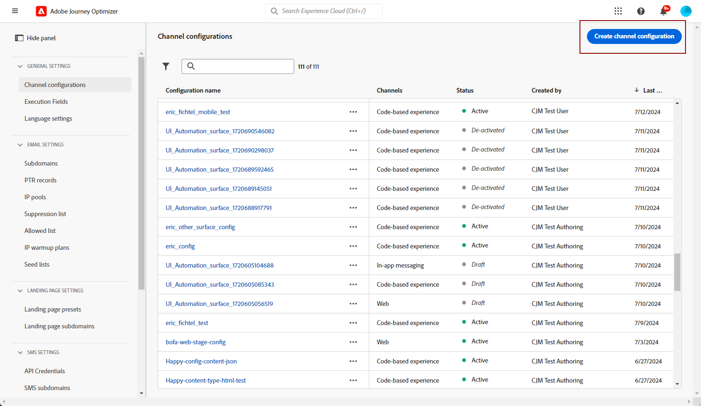

# Skapa en SMS/MMS-yta {#message-preset-sms}

>[!CONTEXTUALHELP]
>id="ajo_admin_surface_sms_type"
>title="Definiera meddelandekategorin"
>abstract="Välj typ av textmeddelanden med den här ytan: Marknadsföring för marknadsföringsmeddelanden som kräver användarens samtycke eller Transaktionsmeddelanden för icke-kommersiella meddelanden, till exempel lösenordsåterställning."
>additional-url="https://experienceleague.adobe.com/docs/journey-optimizer/using/privacy/consent/opt-out.html#sms-opt-out-management" text="Avanmäl dig i marknadsföringstextmeddelanden"

När din SMS/MMS-kanal har konfigurerats måste du skapa en kanal för att kunna skicka SMS- och MMS-meddelanden från **[!DNL Journey Optimizer]**.

Så här skapar du en kanalyta:

1. I den vänstra listen bläddrar du till **[!UICONTROL Administration]** > **[!UICONTROL Channels]** och markera **[!UICONTROL Branding]** > **[!UICONTROL Channel surfaces]**. Klicka på knappen **[!UICONTROL Create channel surface]**.

   

1. Ange ett namn och en beskrivning (valfritt) för ytan och välj sedan SMS-kanalen.

   

   >[!NOTE]
   >
   > Namn måste börja med en bokstav (A-Z). Det får bara innehålla alfanumeriska tecken. Du kan också använda understreck `_`, punkt`.` och bindestreck `-` tecken.

1. Definiera **SMS-inställningar**.

   

   Börja med att välja **[!UICONTROL SMS Type]** som ska skickas med ytan: **[!UICONTROL Transactional]** eller **[!UICONTROL Marketing]**.

   * Välj **Marknadsföring** för kampanjmeddelanden: dessa meddelanden kräver användarens samtycke.
   * Välj **Transactional** för icke-kommersiella meddelanden, t.ex. orderbekräftelse, meddelanden om lösenordsåterställning eller leveransinformation.

   När du skapar ett SMS/MMS måste du välja en giltig kanalyta som matchar den kategori som du valde för meddelandet.

   >[!CAUTION]
   >
   >**Transactional** meddelanden kan skickas till profiler som avbeställer marknadskommunikation. Dessa meddelanden kan bara skickas i särskilda sammanhang.

1. Välj **[!UICONTROL SMS configuration]** för att associera med ytan.

   Mer information om hur du konfigurerar miljön för att skicka SMS-meddelanden finns i [det här avsnittet](#create-api).

1. Ange **[!UICONTROL Sender number]** &#x200B; som du vill använda för din kommunikation.

1. Välj **[!UICONTROL SMS Execution Field]** för att välja **[!UICONTROL Profile attribute]** som är kopplade till profilens telefonnummer.

1. Om du vill använda förkortningsfunktionen för URL i dina SMS-meddelanden väljer du ett alternativ på menyn **[!UICONTROL Subdomain]** lista.

   >[!NOTE]
   >
   >Om du vill kunna välja en underdomän kontrollerar du att du tidigare har konfigurerat minst en SMS/MMS-underdomän. [Lär dig mer](sms-subdomains.md)

1. Ange **[!UICONTROL Opt-out number]** som du vill använda för den här ytan. När profiler avanmäler sig från det här numret kan du fortfarande skicka meddelanden från andra nummer som du använder för att skicka ut textmeddelanden med [!DNL Journey Optimizer].

   >[!NOTE]
   >
   >I [!DNL Journey Optimizer], avanmälning för textmeddelanden hanteras inte längre på kanalnivå. Den är nu specifik för ett tal.

1. När alla parametrar har konfigurerats klickar du på **[!UICONTROL Submit]** för att bekräfta. Du kan också spara kanalytan som ett utkast och återuppta konfigurationen senare.

   

1. När kanalytan har skapats visas den i listan med **[!UICONTROL Processing]** status.

   >[!NOTE]
   >
   >Om kontrollerna inte lyckas kan du läsa mer om orsakerna till eventuella fel i [det här avsnittet](#monitor-channel-surfaces).

1. När kontrollerna är klara får kanalytan **[!UICONTROL Active]** status. Den är klar att användas för att leverera meddelanden.

   

Nu kan du skicka textmeddelanden med Journey Optimizer.

