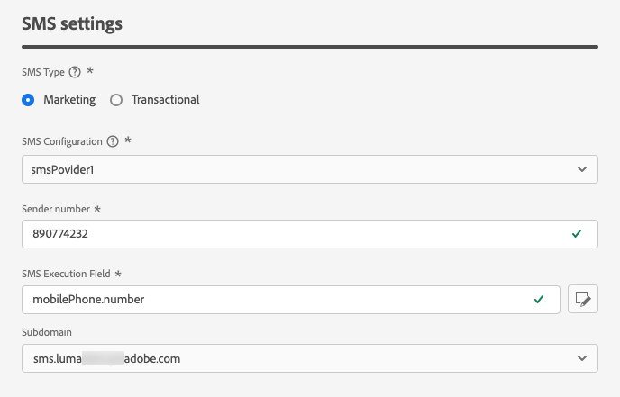

# Konfigurera SMS-kanal {#sms-configuration}

[!DNL Journey Optimizer] kan ni skapa resor och skicka meddelanden till riktade målgrupper.

Konfigurera instansen innan du skickar SMS. Du måste [integrera providerinställningarna](#create-api) med Journey Optimizer och [skapa en SMS-yta](#message-preset-sms) (t.ex. SMS-förinställning). Dessa steg måste utföras av en [Adobe Journey Optimizer systemadministratör](../start/path/administrator.md).

## Förutsättningar{#sms-prerequisites}

Adobe Journey Optimizer är för närvarande integrerat med tredjepartsleverantörer som Sinch, Twilio och Infobip, som erbjuder SMS-tjänster oberoende av Adobe Journey Optimizer.

Innan du konfigurerar SMS måste du skapa ett konto hos någon av dessa SMS-leverantörer för att ta emot API-token och tjänst-ID, vilket gör att du kan upprätta en anslutning mellan Adobe Journey Optimizer och den tillämpliga SMS-providern.

Din användning av SMS-tjänster regleras av ytterligare villkor från den gällande SMS-leverantören. Eftersom Sinch och Twilio är tredjepartsprodukter som är tillgängliga för Adobe Journey Optimizer-användare via en integrering måste användare av Sinch eller Twilio kontakta den tillämpliga SMS-leverantören för att få hjälp med eventuella problem eller frågor som rör SMS-tjänsterna. Adobe kontrollerar inte och ansvarar inte för tredjepartsprodukter.

>[!CAUTION]
>
>Om du vill komma åt och redigera SMS-underdomäner måste du ha **[!UICONTROL Manage SMS Subdomains]** behörighet i produktionssandlådan.

## Skapa nya API-autentiseringsuppgifter {#create-api}

>[!CONTEXTUALHELP]
>id="ajo_admin_sms_api_header"
>title="Konfigurera SMS-leverantören med Journey Optimizer"
>abstract="Välj leverantör och fyll i dina SMS API-autentiseringsuppgifter."

>[!CONTEXTUALHELP]
>id="ajo_admin_sms_api"
>title="Konfigurera SMS-leverantören med Journey Optimizer"
>abstract="Innan du skickar SMS måste du integrera providerinställningarna med Journey Optimizer. När du är klar måste du skapa en SMS-yta. Dessa steg måste utföras av en Adobe Journey Optimizer-systemadministratör."
>additional-url="https://experienceleague.adobe.com/docs/journey-optimizer/using/sms/sms-configuration.html#message-preset-sms" text="Skapa en SMS-kanalyta"

>[!CONTEXTUALHELP]
>id="ajo_admin_sms_configuration"
>title="Välj SMS-leverantörskonfiguration"
>abstract="Välj API-autentiseringsuppgifter som konfigurerats för din SMS-leverantör."

Så här konfigurerar du din SMS-leverantör med Journey Optimizer:

1. I den vänstra listen bläddrar du till **[!UICONTROL Administration]** > **[!UICONTROL Channels]** och väljer **[!UICONTROL API Credentials]** -menyn. Klicka på knappen **[!UICONTROL Create new API credentials]**.

   

1. Konfigurera dina SMS API-autentiseringsuppgifter:

   * För **[!DNL Sinch]**:

      * **[!UICONTROL Name]**: Välj ett namn för dina API-autentiseringsuppgifter.

      * **[!UICONTROL Service ID]** och **[!UICONTROL API Token]**: gå till API:er-sidan och hitta dina autentiseringsuppgifter på fliken SMS.  [Läs mer](https://developers.sinch.com/docs/sms/getting-started/)

   * För **[!DNL Twilio]**:

      * **[!UICONTROL Name]**: Välj ett namn för dina API-autentiseringsuppgifter.

      * **[!UICONTROL Account SID]** och **[!UICONTROL Auth Token]**: gå till rutan Kontoinformation på sidan Twilio Console Dashboard för att hitta dina inloggningsuppgifter.

      * **[!UICONTROL Message SID]**: Ange den unika identifierare som tilldelats alla meddelanden som skapas av Twilios API. [Läs mer](https://support.twilio.com/hc/en-us/articles/223134387-What-is-a-Message-SID-)

   * För **[!DNL Infobip]**:

      * **[!UICONTROL Name]**: Välj ett namn för dina API-autentiseringsuppgifter.

      * **[!UICONTROL API base URL]** och **[!UICONTROL API token]**: gå till webbgränssnittets hemsida eller API-nyckelhanteringssidan för att hitta dina inloggningsuppgifter. [Läs mer](https://www.infobip.com/docs/api)

   

1. Klicka **[!UICONTROL Submit]** när du är klar med konfigurationen av dina API-autentiseringsuppgifter.

När du har skapat och konfigurerat API-autentiseringsuppgifterna måste du nu skapa en kanalyta (t.ex. meddelandeförinställning) för SMS-meddelanden.

## Skapa en SMS-yta {#message-preset-sms}

>[!CONTEXTUALHELP]
>id="ajo_admin_surface_sms_type"
>title="Definiera SMS-kategorin"
>abstract="Välj typ av SMS-meddelanden med den här ytan: Marknadsföring för SMS-kampanjmeddelanden, som kräver användarens samtycke, eller Transactional för icke-kommersiella SMS-meddelanden, som återställning av lösenord."
>additional-url="https://experienceleague.adobe.com/docs/journey-optimizer/using/privacy/consent/opt-out.html#sms-opt-out-management" text="Avanmäl dig i SMS-marknadsföringsmeddelanden"

När SMS-kanalen har konfigurerats måste du skapa en kanalyta för att kunna skicka SMS-meddelanden från **[!DNL Journey Optimizer]**.

Så här skapar du en kanalyta:

1. I den vänstra listen bläddrar du till **[!UICONTROL Administration]** > **[!UICONTROL Channels]** och markera **[!UICONTROL Branding]** > **[!UICONTROL Channel surfaces]**. Klicka på knappen **[!UICONTROL Create channel surface]**.

   

1. Ange ett namn och en beskrivning (valfritt) för ytan och välj sedan SMS-kanalen.

   

   >[!NOTE]
   >
   > Namn måste börja med en bokstav (A-Z). Det får bara innehålla alfanumeriska tecken. Du kan också använda understreck `_`, punkt`.` och bindestreck `-` tecken.

1. Definiera **SMS-inställningar**.

   

   * Välj **[!UICONTROL SMS Type]** som ska skickas med ytan: **[!UICONTROL Transactional]** eller **[!UICONTROL Marketing]**.

      * Välj **Marknadsföring** för SMS: dessa meddelanden kräver användarens samtycke.
      * Välj **Transactional** för icke-kommersiella meddelanden, t.ex. orderbekräftelse, meddelanden om lösenordsåterställning eller leveransinformation.

     >[!CAUTION]
     >
     >**Transactional** SMS-meddelanden kan skickas till profiler som avbeställer marknadskommunikation. Dessa meddelanden kan bara skickas i särskilda sammanhang.

     När du skapar ett SMS-meddelande måste du välja en giltig kanalyta som matchar den kategori som du valde för meddelandet.

   * Välj **[!UICONTROL SMS configuration]** för att associera med ytan.

     Mer information om hur du konfigurerar miljön för att skicka SMS-meddelanden finns i [det här avsnittet](#create-api).

   * Ange **[!UICONTROL Sender number]** &#x200B; som du vill använda för din kommunikation.

   * Välj **[!UICONTROL SMS Execution Field]** för att välja **[!UICONTROL Profile attribute]** som är kopplade till profilens telefonnummer.

1. Om du vill använda förkortningsfunktionen för URL i dina SMS-meddelanden väljer du ett alternativ på menyn **[!UICONTROL Subdomain]** lista.

   >[!NOTE]
   >
   >Om du vill kunna välja en underdomän kontrollerar du att du tidigare har konfigurerat minst en SMS-underdomän. [Lär dig mer](sms-subdomains.md)

1. När alla parametrar har konfigurerats klickar du på **[!UICONTROL Submit]** för att bekräfta. Du kan också spara kanalytan som ett utkast och återuppta konfigurationen senare.

   

1. När kanalytan har skapats visas den i listan med **[!UICONTROL Processing]** status.

   >[!NOTE]
   >
   >Om kontrollerna inte lyckas kan du läsa mer om orsakerna till eventuella fel i [det här avsnittet](#monitor-channel-surfaces).

1. När kontrollerna är klara får kanalytan **[!UICONTROL Active]** status. Den är klar att användas för att leverera meddelanden.

   

Du kan nu skicka SMS-meddelanden med Journey Optimizer.

**Relaterade ämnen**

* [Skapa ett SMS-meddelande](create-sms.md)
* [Lägg till ett meddelande i en resa](../building-journeys/journeys-message.md)
* [Lägg till ett meddelande i en kampanj](../campaigns/create-campaign.md)

