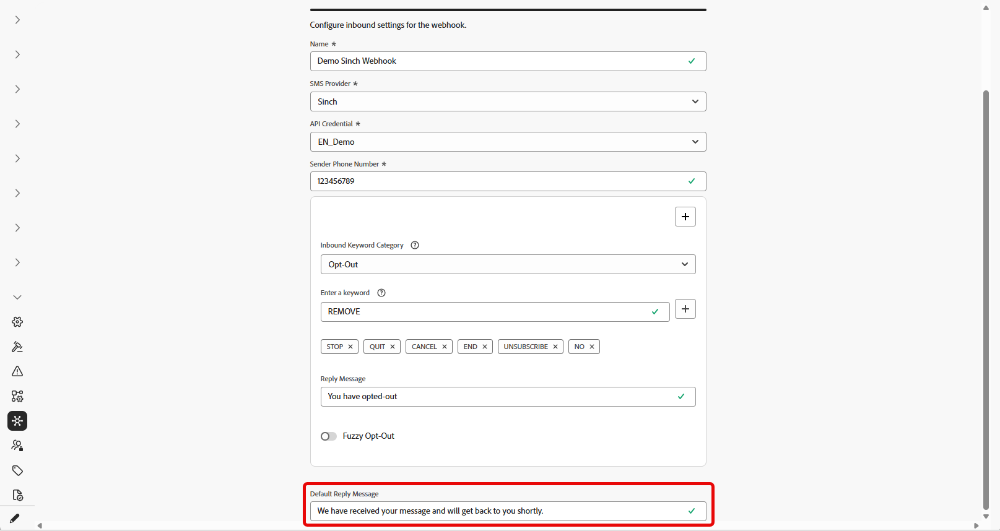

# Skapa webkrok {#webhook}

>[!CONTEXTUALHELP]
>id="ajo_channels_sms_webhook_settings_create"
>title="Skapa en SMS-webkrok"
>abstract="Du kan konfigurera Webhooks att samla in inkommande svar för hantering av godkännande av anmälan och avanmälan och för att ta emot leveransrapporter inklusive läskvitton där det finns tillgängliga."

>[!CONTEXTUALHELP]
>id="ajo_admin_sms_webhook_flow_type"
>title="Välj webkrostyp"
>abstract="När du konfigurerar en webkrok väljer du **Inkommande** om du vill samla in medgivandesvar och användarinställningar, eller **[!UICONTROL Feedback]** om du vill spåra leverans- och engagemangshändelser för rapportering och analys."

>[!BEGINSHADEBOX]

När nya API-autentiseringsuppgifter skapas i Journey Optimizer är SMS-webbhooks nu ett sätt att hämta både inkommande nyckelord och feedback-händelser som leveranser och fel. Eftersom varje leverantör har olika funktioner finns det olika instruktioner för att aktivera webbhooks.
Nu när webbhooks har stöd för Custom Provider är det möjligt att samla in feedback och inkommande nyckelordssamling från alla leverantörer som ska rapporteras och hanteras i Journey Optimizer.

* **Nya kunder:** Instruktionerna här kan följas för att konfigurera SMS-webbplatser korrekt.

* **Befintliga kunder:** Du kan migrera från information som lagras i API-autentiseringsuppgifter till webbhooks och det finns ingen tidslinje för kunderna att migrera. För befintliga kunder som vill migrera till SMS-webhooks måste migreringsstegen utföras enligt beskrivningen i migreringsguiden.

>[!ENDSHADEBOX]

## Översikt {#overview}

När API-autentiseringsuppgifterna har skapats kan du nu konfigurera webbhooks så att de fångar in inkommande svar för hantering av medgivande av anmälan och avanmälan och för att ta emot leveransrapporter inklusive läskvitton där det är tillgängligt.

När du konfigurerar en webkrok kan du definiera dess syfte baserat på den typ av data som du vill hämta:

* **Inkommande**: Använd det här alternativet om du vill samla in medgivandesvar, t.ex. anmälan eller avanmälan, och samla in användarinställningar.

* **Feedback**: Välj det här alternativet om du vill spåra leverans- och engagemangshändelser, inklusive leveranser, utgående fel, läskvitton (om tillämpligt) som stöd för rapportering och analys.

Beroende på din leverantör kommer det att finnas olika förväntningar på vad som behöver konfigureras för att en SMS-implementering ska lyckas:

* **Sinch- och Sinch-konversationer**: Skapa en webkrok som hanterar både inkommande och feedback-händelser. Ingen nyttolastkonfiguration krävs.

* **Infobip**: Skapa två separata webhooks, en för inkommande händelser och en för feedback-händelser. Ingen nyttolastkonfiguration krävs för någon av webkrokarna.

* **Twilio**: Webbhooks är inte tillgängliga. Inkommande data- och feedbackdatainsamling stöds inte.

* **Anpassad provider**: Skapa två separata webhooks, en för inkommande händelser och en för feedbackhändelser. Nyttolastskonfiguration krävs för att båda webbböckerna ska fungera korrekt.

### Leverantörsstöd {#provider-support}

>[!NOTE]
>
>Det enda webbkrokformatet som stöds är JSON. Formulärdata för webhooks stöds inte.

Tabellen nedan visar vilka leverantörer som stöder inkommande och feedback-webhooks och om nyttolastskapande krävs:

| Provider | Ingående webkrok | Feedback Webkrok | Nyckelord | Nödvändigt att skapa nyttolast | Webkrok krävs | Skapa nyttolast |
| --- | --- | --- | --- | --- | --- | --- |
| Infobip | Konfigurerbar | Konfigurerbar | Konfigurerbar | Krävs inte | Obligatoriskt | Krävs inte |
| Sinch | Konfigurerbar | Konfigurerbar | Konfigurerbar | Krävs inte | Nej. Integrerad | N/A |
| Stig konversation | Konfigurerbar | Konfigurerbar | Konfigurerbar | Krävs inte | Nej. Integrerad | N/A |
| Twilio | Inte tillgängligt | Inte tillgängligt | Inte tillgängligt | Inte tillgängligt | Inte tillgängligt | N/A |
| Anpassad | Konfigurerbar | Konfigurerbar | Konfigurerbar | Obligatoriskt | Obligatoriskt | Obligatoriskt |

Information om migreringssökvägen finns i migreringsguiden för kunder som går från API-autentiseringsuppgifter till SMS-webbhooks.

## Skapa webkrok

### För Sinch och Sinch Conversation {#create-webhook-sinch}

För Sinch och Sinch Conversational skapar du en enda webkrok som hanterar både inkommande och feedback-händelser. Ingen anpassad nyttolastkonfiguration krävs.

1. Navigera till **[!UICONTROL Administration]** `>` **[!UICONTROL Channels]** i den vänstra listen, välj menyn **[!UICONTROL SMS Webhooks]** under **[!UICONTROL SMS settings]** och klicka på knappen **[!UICONTROL Create Webhook]**.

   

1. Konfigurera webkrokinställningarna enligt nedan:

   * **[!UICONTROL Name]**: Ange ett namn för webkroken.

   * **[!UICONTROL Select SMS vendor]**: Stig eller Stig konversation.

   * **[!UICONTROL API credentials]**: Välj i listrutan [tidigare konfigurerade API-autentiseringsuppgifter](sms-configuration-sinch.md).

   * **[!UICONTROL Sender Phone Number]**: Ange avsändarens telefonnummer som du vill använda för kommunikationen.

   

1. Börja konfigurera inkommande nyckelord genom att ange nyckelord i fältet **[!UICONTROL Enter a Keyword]**. Flera nyckelord kan läggas till och tas bort. Observera att nyckelord inte är skiftlägeskänsliga.

   

1. Välj en nyckelordskategori i listrutan **[!UICONTROL Inbound Keyword Category]** för att konfigurera:

   * &#x200B;
     +++ Anmäl dig

      * Aktivera nyckelord som avanmäler användare med deras samtycke. När en användares meddelande matchar ett konfigurerat nyckelord väljs användarens telefonnummer in för att ta emot SMS-meddelanden.

      * Som standard är följande nyckelord aktiverade: Prenumerera, Ja, Sluta stoppa, Fortsätt, Återuppta och Börja. Ta bort alla standardnyckelord genom att klicka på .

      * Använd fältet **[!UICONTROL Reply Message]** för att skapa ett meddelande som skickas automatiskt när en användares inkommande meddelande matchar ett Opt-In-nyckelord.

   +++

   * &#x200B;
     +++ Avanmäl dig

      * Aktivera nyckelord som avanmäler användare och tar bort samtycke för att skicka textmeddelanden. När en användares meddelande matchar ett konfigurerat nyckelord avvisas användarens telefonnummer från att ta emot SMS-meddelanden.

      * Som standard är följande nyckelord aktiverade: Stopp, Avsluta, Avbryt, Avsluta, Avsluta, Nej. Ta bort alla standardnyckelord genom att klicka på .

      * Använd fältet **[!UICONTROL Reply Message]** för att skapa ett meddelande som skickas automatiskt när en användares inkommande meddelande matchar ett avanmälningsnyckelord.

      * Aktivera **[!UICONTROL Fuzzy Logic]** för att identifiera liknande nyckelord som de konfigurerade avanmälningsnyckelorden. Om en användares svar är nära men inte exakt skickas meddelandet som anges i fältet **[!UICONTROL Fuzzy Auto Response]**. Det här meddelandet anger vanligtvis att avanmälan inte gjordes och anger det exakta nyckelord som behövs för att avbryta prenumerationen.

   +++

   * &#x200B;
     +++ Dubbel anmälan

      * Aktivera nyckelord för krav på dubbel anmälan. När en användares meddelande matchar ett konfigurerat nyckelord är de inte fullständigt inlagda i det här skedet. Detta tvåstegsarbetsflöde för samtycke kräver att användaren bekräftar sitt val med ett andra nyckelord.

      * Använd fältet **[!UICONTROL Reply Message]** för att skapa ett meddelande som skickas automatiskt när ett nyckelord för dubbel anmälan matchas. Det här meddelandet instruerar användaren att ange ett avanmälningsnyckelord för att slutföra avanmälningsprocessen.

   +++

   * &#x200B;
     +++ Hjälp

      * Aktivera nyckelord som ger ett standardsvar när hjälp begärs. När en användares meddelande matchar ett konfigurerat nyckelord får han/hon ett hjälpsvarsmeddelande.

      * Som standard är följande nyckelord aktiverade: Hjälp, Info, Information. Ta bort alla standardnyckelord genom att klicka på .

      * Använd fältet **[!UICONTROL Reply Message]** för att skapa ett meddelande som skickas automatiskt när en användares inkommande meddelande matchar ett hjälpnyckelord.

   +++

   * &#x200B;
     +++ Anpassad

      * Konfigurera ett enskilt anpassat nyckelord. När en användares meddelande matchar det här nyckelordet skrivs nyckelordet till **[!UICONTROL Message Feedback tracking]**-datauppsättningen för rapportering och målgruppsbyggande.

      * Bygg en målgrupp (direktuppspelning eller batch) som refererar till det här nyckelordet för användning i resor och kampanjer.

   +++

1. Ange **[!UICONTROL Default Reply Message]**. Det här meddelandet skickas automatiskt när en användares svar inte matchar något konfigurerat nyckelord.

   

1. Klicka på **[!UICONTROL Submit]** om du vill spara din webbkrokkonfiguration.

1. På menyn **[!UICONTROL Webhooks]** kan du redigera eller ta bort befintliga webbböcker.

1. Få åtkomst till den nya webkroken och kopiera **[!UICONTROL Webhook URL]**.

   

1. Använd **[!UICONTROL Webhook URL]** för att aktivera händelserna **Feedback** och **Inbound** för att komma in i Journey Optimizer.

   * [Läs mer om SMS-kanalen i Sinch-dokumentationen](https://community.sinch.com/t5/SMS/How-do-I-assign-a-callback-URL-to-an-SMS-service/ta-p/8414)

   * För MMS-kanalen [läs mer i Sinch-dokumentationen](https://developers.sinch.com/docs/conversation/getting-started#5-handle-incoming-messages)

   * För kunder som köpt SMS direkt via Journey Optimizer kan du registrera en supportanmälan med Adobe support. Adobe-kontoteamet konfigurerar webkroks-URL:en för dig.
     

Om din webkrok använder API-autentiseringsuppgifter som är kopplade till en befintlig kanalkonfiguration, träder webkroken i kraft omedelbart. I annat fall skapar du en ny kanalkonfiguration.

➡️[Läs mer om kanalkonfiguration](sms-configuration-surface.md)

### För Infobip {#create-webhook-infobip}

För Infobip skapar du två separata webhooks: en för Feedback-händelser och en för inkommande händelser.

1. Navigera till **[!UICONTROL Administration]** `>` **[!UICONTROL Channels]** i den vänstra listen, välj menyn **[!UICONTROL SMS Webhooks]** under **[!UICONTROL SMS settings]** och klicka på knappen **[!UICONTROL Create Webhook]**.

   

1. Konfigurera webkrokinställningarna enligt nedan:

   * **[!UICONTROL Name]**: Ange ett namn för webkroken.

   * **[!UICONTROL Select SMS vendor]**: Infobip.

   * **[!UICONTROL Type]**: Välj antingen Feedback eller Inbound. Du måste skapa båda separat. Här börjar vi med Inbound.

   * **[!UICONTROL API credentials]**: Välj i listrutan [tidigare konfigurerade API-autentiseringsuppgifter](sms-configuration-infobip.md#api-credential).

   * **[!UICONTROL Sender Phone Number]**: Ange avsändarens telefonnummer som du vill använda för kommunikationen.

   

1. Börja konfigurera inkommande nyckelord genom att ange nyckelord i fältet **[!UICONTROL Enter a Keyword]**. Flera nyckelord kan läggas till och tas bort. Observera att nyckelord inte är skiftlägeskänsliga.

   

1. Välj en nyckelordskategori i listrutan **[!UICONTROL Inbound Keyword Category]** för att konfigurera:

   * &#x200B;
     +++ Anmäl dig

      * Aktivera nyckelord som avanmäler användare med deras samtycke. När en användares meddelande matchar ett konfigurerat nyckelord väljs användarens telefonnummer in för att ta emot SMS-meddelanden.

      * Som standard är följande nyckelord aktiverade: Prenumerera, Ja, Sluta stoppa, Fortsätt, Återuppta och Börja. Ta bort alla standardnyckelord genom att klicka på .

      * Använd fältet **[!UICONTROL Reply Message]** för att skapa ett meddelande som skickas automatiskt när en användares inkommande meddelande matchar ett Opt-In-nyckelord.

   +++

   * &#x200B;
     +++ Avanmäl dig

      * Aktivera nyckelord som avanmäler användare och tar bort samtycke för att skicka textmeddelanden. När en användares meddelande matchar ett konfigurerat nyckelord avvisas användarens telefonnummer från att ta emot SMS-meddelanden.

      * Som standard är följande nyckelord aktiverade: Stopp, Avsluta, Avbryt, Avsluta, Avsluta, Nej. Ta bort alla standardnyckelord genom att klicka på .

      * Använd fältet **[!UICONTROL Reply Message]** för att skapa ett meddelande som skickas automatiskt när en användares inkommande meddelande matchar ett avanmälningsnyckelord.

      * Aktivera **[!UICONTROL Fuzzy Logic]** för att identifiera liknande nyckelord som de konfigurerade avanmälningsnyckelorden. Om en användares svar är nära men inte exakt skickas meddelandet som anges i fältet **[!UICONTROL Fuzzy Auto Response]**. Det här meddelandet anger vanligtvis att avanmälan inte gjordes och anger det exakta nyckelord som behövs för att avbryta prenumerationen.

   +++

   * &#x200B;
     +++ Dubbel anmälan

      * Aktivera nyckelord för krav på dubbel anmälan. När en användares meddelande matchar ett konfigurerat nyckelord är de inte fullständigt inlagda i det här skedet. Detta tvåstegsarbetsflöde för samtycke kräver att användaren bekräftar sitt val med ett andra nyckelord.

      * Använd fältet **[!UICONTROL Reply Message]** för att skapa ett meddelande som skickas automatiskt när ett nyckelord för dubbel anmälan matchas. Det här meddelandet instruerar användaren att ange ett avanmälningsnyckelord för att slutföra avanmälningsprocessen.

   +++

   * &#x200B;
     +++ Hjälp

      * Aktivera nyckelord som ger ett standardsvar när hjälp begärs. När en användares meddelande matchar ett konfigurerat nyckelord får han/hon ett hjälpsvarsmeddelande.

      * Som standard är följande nyckelord aktiverade: Hjälp, Info, Information. Ta bort alla standardnyckelord genom att klicka på .

      * Använd fältet **[!UICONTROL Reply Message]** för att skapa ett meddelande som skickas automatiskt när en användares inkommande meddelande matchar ett hjälpnyckelord.

   +++

   * &#x200B;
     +++ Anpassad

      * Konfigurera ett enskilt anpassat nyckelord. När en användares meddelande matchar det här nyckelordet skrivs nyckelordet till **[!UICONTROL Message Feedback tracking]**-datauppsättningen för rapportering och målgruppsbyggande.

      * Bygg en målgrupp (direktuppspelning eller batch) som refererar till det här nyckelordet för användning i resor och kampanjer.

   +++

1. Ange **[!UICONTROL Default Reply Message]**. Det här meddelandet skickas automatiskt när en användares svar inte matchar något konfigurerat nyckelord.

   

1. Klicka på **[!UICONTROL Submit]** om du vill spara din webbkrokkonfiguration.

1. På menyn **[!UICONTROL Webhooks]** måste du nu skapa en **Feedback**-webkrok för Infobip.

1. Konfigurera webkrokinställningarna enligt nedan:

   * **[!UICONTROL Name]**: Ange ett namn för webkroken.

   * **[!UICONTROL Select SMS vendor]**: Infobip.

   * **[!UICONTROL Type]**: Välj Feedback.

   

1. Klicka på **[!UICONTROL Submit]** om du vill spara din Feedback-webbkrokkonfiguration.

1. På menyn **[!UICONTROL Webhooks]** kan du redigera eller ta bort befintliga webbböcker.

1. Få åtkomst till dina nyligen skapade webbhooks och kopiera **[!UICONTROL Webhook URL]** från var och en av dina webbhooks.

   

1. Du kan nu använda dessa URL:er för att aktivera både återanrops-URL:er för att hämta återkoppling och inkommande händelser till Journey Optimizer.

Om din webkrok använder API-autentiseringsuppgifter som är kopplade till en befintlig kanalkonfiguration, träder webkroken i kraft omedelbart. I annat fall skapar du en ny kanalkonfiguration.

➡️[Läs mer om kanalkonfiguration](sms-configuration-surface.md)

### För anpassad leverantör {#create-webhook-custom}

För anpassade SMS-leverantörer skapar du två separata webhooks: en för Feedback-händelser och en för inkommande händelser.

1. Navigera till **[!UICONTROL Administration]** `>` **[!UICONTROL Channels]** i den vänstra listen, välj menyn **[!UICONTROL SMS Webhooks]** under **[!UICONTROL SMS settings]** och klicka på knappen **[!UICONTROL Create Webhook]**.

   

1. Konfigurera webkrokinställningarna enligt nedan:

   * **[!UICONTROL Name]**: Ange ett namn för webkroken.

   * **[!UICONTROL Select SMS vendor]**: Anpassad.

   * **[!UICONTROL Type]**: Välj antingen Feedback eller Inbound. Du måste skapa båda separat. Här börjar vi med Inbound.

   * **[!UICONTROL API credentials]**: Välj i listrutan [tidigare konfigurerade API-autentiseringsuppgifter](sms-configuration-custom.md).

   * **[!UICONTROL Sender Phone Number]**: Ange avsändarens telefonnummer som du vill använda för kommunikationen.

   

1. Börja konfigurera inkommande nyckelord genom att ange nyckelord i fältet **[!UICONTROL Enter a Keyword]**. Flera nyckelord kan läggas till och tas bort. Observera att nyckelord inte är skiftlägeskänsliga.

   

1. Välj en nyckelordskategori i listrutan **[!UICONTROL Inbound Keyword Category]** för att konfigurera:

   * &#x200B;
     +++ Anmäl dig

      * Aktivera nyckelord som avanmäler användare med deras samtycke. När en användares meddelande matchar ett konfigurerat nyckelord väljs användarens telefonnummer in för att ta emot SMS-meddelanden.

      * Som standard är följande nyckelord aktiverade: Prenumerera, Ja, Sluta stoppa, Fortsätt, Återuppta och Börja. Ta bort alla standardnyckelord genom att klicka på .

      * Använd fältet **[!UICONTROL Reply Message]** för att skapa ett meddelande som skickas automatiskt när en användares inkommande meddelande matchar ett Opt-In-nyckelord.

   +++

   * &#x200B;
     +++ Avanmäl dig

      * Aktivera nyckelord som avanmäler användare och tar bort samtycke för att skicka textmeddelanden. När en användares meddelande matchar ett konfigurerat nyckelord avvisas användarens telefonnummer från att ta emot SMS-meddelanden.

      * Som standard är följande nyckelord aktiverade: Stopp, Avsluta, Avbryt, Avsluta, Avsluta, Nej. Ta bort alla standardnyckelord genom att klicka på .

      * Använd fältet **[!UICONTROL Reply Message]** för att skapa ett meddelande som skickas automatiskt när en användares inkommande meddelande matchar ett avanmälningsnyckelord.

      * Aktivera **[!UICONTROL Fuzzy Logic]** för att identifiera liknande nyckelord som de konfigurerade avanmälningsnyckelorden. Om en användares svar är nära men inte exakt skickas meddelandet som anges i fältet **[!UICONTROL Fuzzy Auto Response]**. Det här meddelandet anger vanligtvis att avanmälan inte gjordes och anger det exakta nyckelord som behövs för att avbryta prenumerationen.

   +++

   * &#x200B;
     +++ Dubbel anmälan

      * Aktivera nyckelord för krav på dubbel anmälan. När en användares meddelande matchar ett konfigurerat nyckelord är de inte fullständigt inlagda i det här skedet. Detta tvåstegsarbetsflöde för samtycke kräver att användaren bekräftar sitt val med ett andra nyckelord.

      * Använd fältet **[!UICONTROL Reply Message]** för att skapa ett meddelande som skickas automatiskt när ett nyckelord för dubbel anmälan matchas. Det här meddelandet instruerar användaren att ange ett avanmälningsnyckelord för att slutföra avanmälningsprocessen.

   +++

   * &#x200B;
     +++ Hjälp

      * Aktivera nyckelord som ger ett standardsvar när hjälp begärs. När en användares meddelande matchar ett konfigurerat nyckelord får han/hon ett hjälpsvarsmeddelande.

      * Som standard är följande nyckelord aktiverade: Hjälp, Info, Information. Ta bort alla standardnyckelord genom att klicka på .

      * Använd fältet **[!UICONTROL Reply Message]** för att skapa ett meddelande som skickas automatiskt när en användares inkommande meddelande matchar ett hjälpnyckelord.

   +++

   * &#x200B;
     +++ Anpassad

      * Konfigurera ett enskilt anpassat nyckelord. När en användares meddelande matchar det här nyckelordet skrivs nyckelordet till **[!UICONTROL Message Feedback tracking]**-datauppsättningen för rapportering och målgruppsbyggande.

      * Bygg en målgrupp (direktuppspelning eller batch) som refererar till det här nyckelordet för användning i resor och kampanjer.

   +++

1. Ange **[!UICONTROL Default Reply Message]**. Det här meddelandet skickas automatiskt när en användares svar inte matchar något konfigurerat nyckelord.

   

1. Skapa en anpassad nyttolast som matchar den JSON som kommer från providern. Observera att det enda webbkrokformatet som stöds är JSON. Formulärdata för webhooks stöds inte.

   Den inkommande webkroken kräver att följande fält tar emot värden från din leverantörs webkrok:

   * **InboundMessage**: Det inkommande meddelandet eller nyckelordet togs emot från användaren.
   * **ProfileNumber**: Telefonnumret till den användare som skickade meddelandet.
   * **RequestID**: En unik identifierare som tillhandahålls av din SMS-leverantör för att identifiera en specifik transaktion.
   * **OriginTimestamp**: Tidsstämpeln när meddelandet togs emot, i UTC-format.
   * **InboundNumber**: Telefonnumret som används för den här webkrockkonfigurationen.

   +++Exempel på nyttolast

       &quot;json
       &lbrace;
       &quot;inboundMessage&quot;: {{inboundMessage}},
       &quot;profileNumber&quot;: {{profileNumber}},
       &quot;requestId&quot;: {{requestId}},
       &quot;originTimestamp&quot;: {{originTimestamp}},
       &quot;inboundNumber&quot;: &quot;{{inboundNumber}}&quot;
       
       &quot;
   +++

1. När JSON-filen skapas klickar du på **[!UICONTROL View payload editor]**, kopierar och klistrar in JSON-nyttolasten i redigeraren och sparar den.

   

1. Klicka på **[!UICONTROL Submit]** om du vill spara din webbkrokkonfiguration.

1. På menyn **[!UICONTROL Webhooks]** måste du nu skapa en **Feedback**-webkrok för den anpassade providern.

1. Konfigurera webkrokinställningarna enligt nedan:

   * **[!UICONTROL Name]**: Ange ett namn för webkroken.

   * **[!UICONTROL Select SMS vendor]**: Anpassad.

   * **[!UICONTROL Type]**: Välj Feedback.

   

1. Skapa en anpassad nyttolast som matchar JSON-formatet från din leverantör. Observera att det enda webbkrokformatet som stöds är JSON. Formulärdata för webhooks stöds inte.

   Följande fält krävs för att få värden från din leverantörs webkrok:

   * **Klientreferens**: En unik identifierare returnerades i nyttolasten för loggningsändamål.
   * **Kod**: Felkoden som tillhandahålls av SMS-providern.
   * **Status**: Felstatusen från SMS-providern.

   +++Exempel på nyttolast

       &quot;json
       &lbrace;
       &quot;clientReference&quot;: {{client_reference}}, 
       &quot;status&quot;: &lbrack;
&rbrack;       &lbrace;
&rbrace;       &quot;code&quot;: &quot;{{failureCode}}&quot;, 
       &quot;status&quot;: {{feedbackStatus}} 
        
       &rbrack;
        
       &quot;
   
   +++

1. Klicka på **[!UICONTROL View payload editor]**, kopiera och klistra sedan in JSON-nyttolasten i redigeraren och spara den.

   

1. Klicka på **[!UICONTROL Submit]** om du vill spara din Feedback-webbkrokkonfiguration.

1. På menyn **[!UICONTROL Webhooks]** kan du redigera eller ta bort befintliga webbböcker.

1. Få åtkomst till dina nyligen skapade webbhooks och kopiera **[!UICONTROL Webhook URL]** från var och en av dina webbhooks.

1. Konfigurera din SMS-leverantör för att skicka **feedback** - och **inkommande**-händelser till dessa webkroks-URL:er i Journey Optimizer.

   Konfigurationsanvisningarna varierar mellan olika SMS-leverantörer. Mer information om hur du konfigurerar URL:er för återanrop finns i dokumentationen till din leverantör.

Om din webkrok använder API-autentiseringsuppgifter som är kopplade till en befintlig kanalkonfiguration, träder webkroken i kraft omedelbart. I annat fall skapar du en ny kanalkonfiguration.

➡️[Läs mer om kanalkonfiguration](sms-configuration-surface.md)
