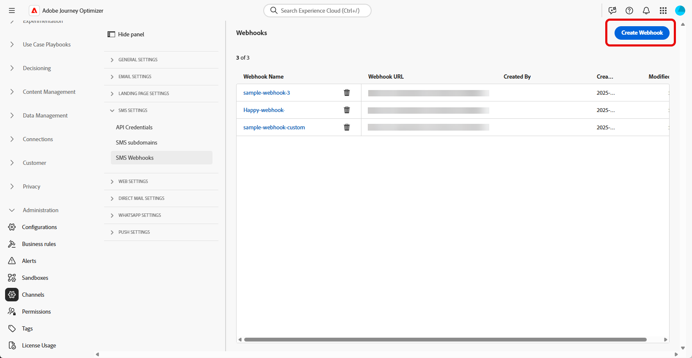

# Skapa webkrok {#webhook}

>[!CONTEXTUALHELP]
>id="ajo_channels_sms_webhook_settings_create"
>title="Skapa en SMS-webkrok"
>abstract="Du kan konfigurera Webhooks att samla in inkommande svar för hantering av godkännande av anmälan och avanmälan och för att ta emot leveransrapporter inklusive läskvitton där det finns tillgängliga."

>[!CONTEXTUALHELP]
>id="ajo_admin_sms_webhook_flow_type"
>title="Välj webkrostyp"
>abstract="När du konfigurerar en webkrok väljer du **Inkommande** om du vill samla in medgivandesvar och användarinställningar, eller **[!UICONTROL Feedback]** om du vill spåra leverans- och engagemangshändelser för rapportering och analys."

>[!BEGINSHADEBOX]

Om nyckelord för anmälan eller avanmälan inte anges används standardmeddelanden för godkännande för att respektera användarens integritet. Om du lägger till anpassade nyckelord åsidosätts standardvärdena automatiskt.

**Standardnyckelord:**

* **Opt-In**: SUBSCRIBE, YES, UNSTOP, START, FORTSÄTT, RESUME, BEGIN
* **Opt-Out**: STOP, QUIT, CANCEL, END, UNSUBSCRIBE, NO
* **Hjälp**: HJÄLP

>[!ENDSHADEBOX]

När API-autentiseringsuppgifterna har skapats kan du nu konfigurera Webhooks så att inkommande svar hämtas för hantering av godkännande av anmälan och avanmälan, och så att du får leveransrapporter som läskvitton när de är tillgängliga.

När du konfigurerar en webkrok kan du definiera dess syfte baserat på den typ av data som du vill hämta:

* **[!UICONTROL Inbound]**: Använd det här alternativet om du vill samla in medgivandesvar, t.ex. anmälan eller avanmälan, och samla in användarinställningar.

* **[!UICONTROL Feedback]**: Välj det här alternativet om du vill spåra leverans- och engagemangshändelser, inklusive läskvitton och användarinteraktioner, som stöd för rapportering och analys.

Bläddra bland flikarna nedan beroende på vilka SMS-leverantörer du har:

>[!BEGINTABS]

>[!TAB Egen]

1. Navigera till **[!UICONTROL Administration]** `>` **[!UICONTROL Channels]** i den vänstra listen, välj menyn **[!UICONTROL SMS Webhooks]** under **[!UICONTROL SMS settings]** och klicka på knappen **[!UICONTROL Create Webhook]**.

   {zoomable="yes"}

1. Konfigurera webkrosinställningarna enligt anvisningarna nedan:

   * **[!UICONTROL Name]**: Ange ett namn för din webkrok.

   * **[!UICONTROL Select SMS vendor]**: Anpassad.

   * **[!UICONTROL Type]**: Inkommande.

   * **[!UICONTROL API credentials]**: Välj i listrutan [tidigare konfigurerade API-autentiseringsuppgifter](sms-configuration-custom.md#api-credential).

   * **[!UICONTROL Sender Phone Number &#x200B;]**: Ange det &#x200B; för avsändarens telefonnummer som du vill använda för kommunikationen.

     {zoomable="yes"}

1. Klicka på  om du vill lägga till dina nyckelordskategorier och konfigurera dem sedan beroende på din SMS-leverantör:

   * **[!UICONTROL Inbound Keyword Category]**: Välj dina nyckelordskategorier antingen **[!UICONTROL Opt-In]**, **[!UICONTROL Opt-Out]**, **[!UICONTROL Double Opt-In]**, **[!UICONTROL Help]** eller **[!UICONTROL Custom]**.

   * **[!UICONTROL Enter a keyword]**: Ange standardnyckelord eller anpassade nyckelord som automatiskt kommer att utlösa ditt meddelande. Klicka på  om du vill lägga till flera nyckelord.

     Använd icke-medgivande-relaterade nyckelord för gruppbaserade åtgärder inom en resa för **[!UICONTROL Custom keyword]**.

   * **[!UICONTROL Reply Message]**: Välj det anpassade svar som skickas automatiskt i listrutan.

   * **[!UICONTROL Fuzzy Opt-out]**: Aktivera det här alternativet om du vill skicka ett automatiskt svar när ett nyckelord för avanmälan som nästan matchar identifieras.

   {zoomable="yes"}

1. Ange en **[!UICONTROL Default Reply Message]** som skickas automatiskt när ett inkommande meddelande inte matchar något konfigurerat nyckelord eller någon konfigurerad kategori.

1. Klicka på **[!UICONTROL View payload editor]** för att validera och anpassa dina begärandataströmmar.

   Du kan dynamiskt anpassa din nyttolast med hjälp av profilattribut och säkerställa att korrekta data skickas för bearbetning och svarsgenerering med hjälp av inbyggda hjälpfunktioner.

1. Klicka på **[!UICONTROL Submit]** när du är klar med konfigurationen av din webkrok.

1. Om du vill skapa en **[!UICONTROL Feedback]**-webkrok följer du stegen ovan och väljer **[!UICONTROL Feedback]** som webkrok **[!UICONTROL Type]**.

1. På menyn **[!UICONTROL Webhooks]** kan du redigera eller ta bort befintliga webbböcker eller komma åt och kopiera **[!UICONTROL Webhook URL]** för integrering med din SMS-leverantör.

   {zoomable="yes"}

När du har skapat och konfigurerat inställningarna för webkroken måste du nu skapa en [kanalkonfiguration](sms-configuration-surface.md) för SMS-meddelanden.

När konfigurationen är klar kan ni utnyttja alla färdiga kanalfunktioner som meddelandeframställning, personalisering, länkspårning och rapportering.

>[!TAB Infobip]

1. Navigera till **[!UICONTROL Administration]** `>` **[!UICONTROL Channels]** i den vänstra listen, välj menyn **[!UICONTROL SMS Webhooks]** under **[!UICONTROL SMS settings]** och klicka på knappen **[!UICONTROL Create Webhook]**.

   {zoomable="yes"}

1. Konfigurera webkrosinställningarna enligt anvisningarna nedan:

   * **[!UICONTROL Name]**: Ange ett namn för din webkrok.

   * **[!UICONTROL Select SMS vendor]**: Infobip.

   * **[!UICONTROL Type]**: Inkommande.

   * **[!UICONTROL API credentials]**: Välj i listrutan [tidigare konfigurerade API-autentiseringsuppgifter](sms-configuration-infobip.md#api-credential).

   * **[!UICONTROL Sender Phone Number &#x200B;]**: Ange det &#x200B; för avsändarens telefonnummer som du vill använda för kommunikationen.

     {zoomable="yes"}

1. Klicka på  om du vill lägga till dina nyckelordskategorier och konfigurera dem sedan beroende på din SMS-leverantör:

   * **[!UICONTROL Inbound Keyword Category]**: Välj dina nyckelordskategorier antingen **[!UICONTROL Opt-In]**, **[!UICONTROL Opt-Out]**, **[!UICONTROL Double Opt-In]**, **[!UICONTROL Help]** eller **[!UICONTROL Custom]**.

   * **[!UICONTROL Enter a keyword]**: Ange standardnyckelord eller anpassade nyckelord som automatiskt kommer att utlösa ditt meddelande. Klicka på  om du vill lägga till flera nyckelord.

     Använd icke-medgivande-relaterade nyckelord för gruppbaserade åtgärder inom en resa för **[!UICONTROL Custom keyword]**.

   * **[!UICONTROL Reply Message]**: Välj det anpassade svar som skickas automatiskt i listrutan.

   * **[!UICONTROL Fuzzy Opt-out]**: Aktivera det här alternativet om du vill skicka ett automatiskt svar när ett nyckelord för avanmälan som nästan matchar identifieras.

   {zoomable="yes"}

1. Ange en **[!UICONTROL Default Reply Message]** som skickas automatiskt när ett inkommande meddelande inte matchar något konfigurerat nyckelord eller någon konfigurerad kategori.

1. Klicka på **[!UICONTROL Submit]** när du är klar med konfigurationen av din webkrok.

1. Om du vill skapa en **[!UICONTROL Feedback]**-webkrok följer du stegen ovan och väljer **[!UICONTROL Feedback]** som webkrok **[!UICONTROL Type]**.

1. På menyn **[!UICONTROL Webhooks]** kan du redigera eller ta bort befintliga webbböcker eller komma åt och kopiera **[!UICONTROL Webhook URL]** för integrering med din SMS-leverantör.

   {zoomable="yes"}

När du har skapat och konfigurerat inställningarna för inkommande trafik för webkroken måste du nu skapa en [kanalkonfiguration](sms-configuration-surface.md) för SMS-meddelanden.

När konfigurationen är klar kan ni utnyttja alla färdiga kanalfunktioner som meddelandeframställning, personalisering, länkspårning och rapportering.

>[!TAB Dra]

1. Navigera till **[!UICONTROL Administration]** `>` **[!UICONTROL Channels]** i den vänstra listen, välj menyn **[!UICONTROL SMS Webhooks]** under **[!UICONTROL SMS settings]** och klicka på knappen **[!UICONTROL Create Webhook]**.

   {zoomable="yes"}

1. Konfigurera webkrosinställningarna enligt anvisningarna nedan:

   * **[!UICONTROL Name]**: Ange ett namn för din webkrok.

   * **[!UICONTROL Select SMS vendor]**: Dra.

   * **[!UICONTROL Type]**: Inkommande.

   * **[!UICONTROL API credentials]**: Välj i listrutan [tidigare konfigurerade API-autentiseringsuppgifter](sms-configuration-sinch.md#create-api).

   * **[!UICONTROL Sender Phone Number &#x200B;]**: Ange det &#x200B; för avsändarens telefonnummer som du vill använda för kommunikationen.

     {zoomable="yes"}

1. Klicka på  om du vill lägga till dina nyckelordskategorier och konfigurera dem sedan beroende på din SMS-leverantör:

   * **[!UICONTROL Inbound Keyword Category]**: Välj dina nyckelordskategorier antingen **[!UICONTROL Opt-In]**, **[!UICONTROL Opt-Out]**, **[!UICONTROL Double Opt-In]**, **[!UICONTROL Help]** eller **[!UICONTROL Custom]**.

   * **[!UICONTROL Enter a keyword]**: Ange standardnyckelord eller anpassade nyckelord som automatiskt kommer att utlösa ditt meddelande. Klicka på  om du vill lägga till flera nyckelord.

     Använd icke-medgivande-relaterade nyckelord för gruppbaserade åtgärder inom en resa för **[!UICONTROL Custom keyword]**.

   * **[!UICONTROL Reply Message]**: Välj det anpassade svar som skickas automatiskt i listrutan.

   * **[!UICONTROL Fuzzy Opt-out]**: Aktivera det här alternativet om du vill skicka ett automatiskt svar när ett nyckelord för avanmälan som nästan matchar identifieras.

   {zoomable="yes"}

1. Ange en **[!UICONTROL Default Reply Message]** som skickas automatiskt när ett inkommande meddelande inte matchar något konfigurerat nyckelord eller någon konfigurerad kategori.

1. Klicka på **[!UICONTROL Submit]** när du är klar med konfigurationen av din webkrok.

1. Klicka på ikonen **[!UICONTROL Webhooks]** bin för att ta bort webkroken.

1. Om du vill ändra den befintliga konfigurationen letar du reda på önskad webbkrok och klickar på alternativet **[!UICONTROL Edit]** för att göra de ändringar som behövs.

1. Få åtkomst till och kopiera din nya **[!UICONTROL Webhook URL]** från din tidigare inskickade **[!UICONTROL Webhook]**.

   {zoomable="yes"}

När du har skapat och konfigurerat inställningarna för inkommande trafik för webkroken måste du nu skapa en [kanalkonfiguration](sms-configuration-surface.md) för SMS-meddelanden.

När konfigurationen är klar kan ni utnyttja alla färdiga kanalfunktioner som meddelandeframställning, personalisering, länkspårning och rapportering.

<!--
>[!TAB Twilio]

1. In the left rail, navigate to **[!UICONTROL Administration]** `>` **[!UICONTROL Channels]**, select the **[!UICONTROL SMS Webhooks]** menu under **[!UICONTROL SMS settings]**, and click the **[!UICONTROL Create Webhook]** button.

    {zoomable="yes"}

1. Configure your Webhook Settings, as detailed below:

    * **[!UICONTROL Name]**: Enter a name for your Webhook.

    * **[!UICONTROL Select SMS vendor]**: Twilio.

    * **[!UICONTROL Type]**: Inbound.

    * **[!UICONTROL API credentials]**: Choose from the drop-down you [previously configured API credentials](sms-configuration-twilio.md#create-api).

    * **[!UICONTROL Sender Phone Number ​]**: Enter the Sender phone number ​you want to use for your communications.
        
1. Click  to add your keywords categories, then, configure them depending on your SMS provider:

    * **[!UICONTROL Inbound Keyword Category]**: Choose your keyword categories either **[!UICONTROL Opt-In]**, **[!UICONTROL Opt-Out]**, **[!UICONTROL Double Opt-In]**, **[!UICONTROL Help]** or **[!UICONTROL Custom]**. 

    * **[!UICONTROL Enter a keyword]**: Enter the default or custom keywords that will automatically trigger your message. Click  to add multiple keywords.

        For **[!UICONTROL Custom keyword]**, use non-consent–related keywords for batch-based actions within a journey.

    * **[!UICONTROL Reply Message]**: Select from the drop-down the custom response that is automatically sent.

    * **[!UICONTROL Fuzzy Opt-out]**: Enable this option to send an automatic reply when a near-match opt-out keyword is detected.

1. Enter a **[!UICONTROL Default Reply Message]** automatically sent when an inbound message does not match any configured keyword or category.

1. Click **[!UICONTROL Submit]** when you finished the configuration of your Webhook.

1. In the **[!UICONTROL Webhooks]** menu, click the  to delete your Webhook.

1. To modify existing configuration, locate the desired Webhook and click the **[!UICONTROL Edit]** option to make the necessary changes.

1. Access and copy your new **[!UICONTROL Webhook URL]** from your previously submitted **[!UICONTROL Webhook]**.

After creating and configuring the inbound settings for the Webhook, you now need to create a [channel configuration](sms-configuration-surface.md) for SMS messages. 

Once configured, you can leverage all out-of-the-box channel capabilities such as message authoring, personalization, link tracking, and reporting.
-->

>[!ENDTABS]

## Instruktionsvideo {#video}

>[!VIDEO](https://video.tv.adobe.com/v/3431625)
