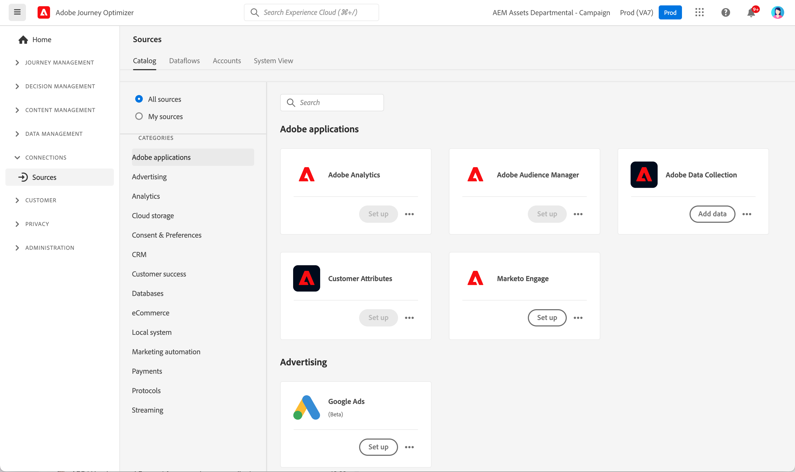

# Kom igång med källkopplingar {#sources-gs}

Med Adobe Journey Optimizer kan data hämtas från externa källor samtidigt som du kan strukturera, märka och förbättra inkommande data med hjälp av plattformstjänster. Du kan importera data från en mängd olika källor, till exempel Adobe-program, molnbaserade lager, databaser och många andra.

Läs om källanslutningar och hur du konfigurerar dem i Journey Optimizer i den här videon:

>[!VIDEO](https://video.tv.adobe.com/v/335919?quality=12)

Läs mer om hur du importerar data från externa källor med källkopplingar i [Adobe Experience Platform-dokumentation](https://experienceleague.adobe.com/docs/experience-platform/sources/home.htmll?lang=sv){target="_blank"}.
