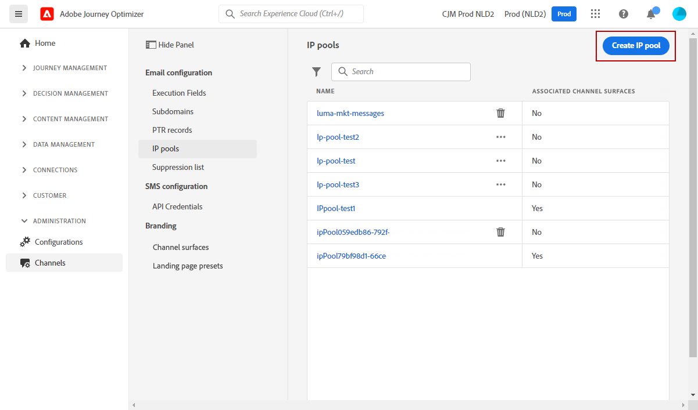
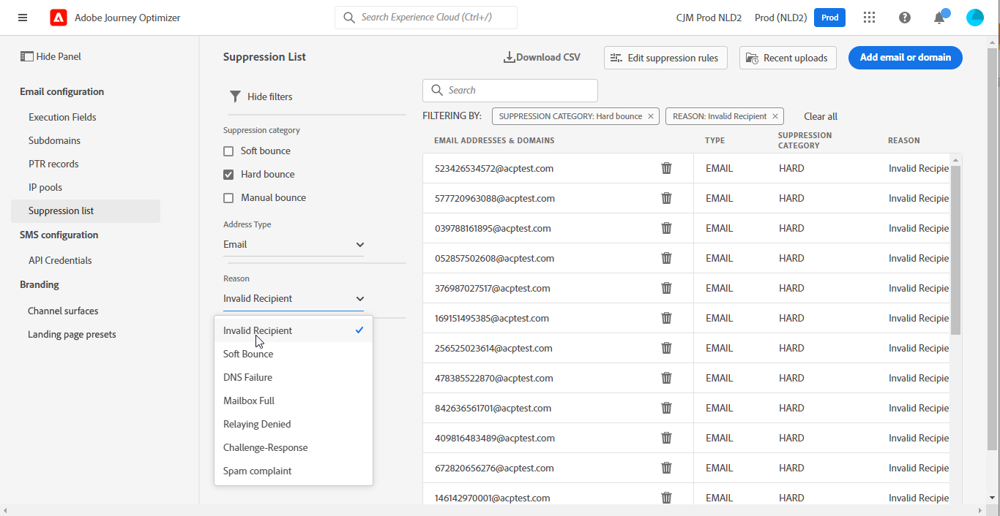

# Kom igång med systemadministratörer {#get-started-sys-admins}

Innan du börjar [!DNL Adobe Journey Optimizer]krävs flera steg för att förbereda miljön.  Du måste utföra dessa steg så att [Datatekniker](data-engineer.md) och [Resehandledare](marketer.md) kan börja arbeta med [!DNL Adobe Journey Optimizer].

Som en **Systemadministratör** måste du **förstå produktprofiler och tilldela behörigheter** för sandlådeadministration och kanalkonfiguration. Du måste också konfigurera sandlådor och hantera dem för de tillgängliga produktprofilerna. Sedan kan du tilldela teammedlemmar till produktprofiler.

Dessa funktioner kan hanteras av **[!UICONTROL Product administrators]** som har tillgång till Admin Console. [Läs mer om Adobe Admin Console](https://helpx.adobe.com/se/enterprise/admin-guide.html){target="_blank"}.

Lär dig mer om åtkomsthantering på följande sidor:

1. **Skapa sandlådor** för att partitionera instanserna i separata, isolerade virtuella miljöer. **Sandlådor** skapas i [!DNL Journey Optimizer]. Läs mer i [Sandlådor](../../administration/sandboxes.md) -avsnitt.

   >[!NOTE]
   >Som en **Systemadministratör** om du inte ser **[!UICONTROL Sandboxes]** menyn i [!DNL Journey Optimizer], uppdatera dina behörigheter i [Admin Console](https://adminconsole.adobe.com/){target="_blank"}. Lär dig hur du uppdaterar din produktprofil i [den här sidan](../../administration/permissions.md#edit-product-profile).
   >

1. **Förstå produktprofiler**. Produktprofiler är en uppsättning enhetsbehörigheter som ger användarna tillgång till vissa funktioner eller objekt i gränssnittet. Läs mer i [Färdiga produktprofiler](../../administration/ootb-product-profiles.md) -avsnitt.

1. **Ange behörigheter** för produktprofiler, inklusive **Sandlådor** och ge teammedlemmarna tillgång genom att tilldela dem till olika produktprofiler. Det här steget utförs i [Admin Console](https://adminconsole.adobe.com/){target="_blank"}. Behörigheter är enhetsbehörigheter som gör att du kan definiera de behörigheter som tilldelats till **[!UICONTROL Product profile]**. Varje tillstånd samlas under funktioner, t.ex. Resor eller Erbjudanden, som representerar de olika funktionerna eller objekten i [!DNL Journey Optimizer]. Läs mer i [Behörighetsnivåer](../../administration/high-low-permissions.md) -avsnitt.

Dessutom måste du lägga till användare som behöver åtkomst till Assets Essentials i **Assets Essentials-användare** eller/och **Assets Essentials** Produktprofiler. [Läs mer i Assets Essentials dokumentation](https://experienceleague.adobe.com/docs/experience-manager-assets-essentials/help/deploy-administer.html){target="_blank"}.

>[!NOTE]
>För Journey Optimizer-produkter som köpts före 6 januari 2022 måste du driftsätta [!DNL Adobe Experience Manager Assets Essentials] för er organisation. Läs mer i [Distribuera Assets Essentials](https://experienceleague.adobe.com/docs/experience-manager-assets-essentials/help/deploy-administer.html){target="_blank"} -avsnitt.

Vid åtkomst [!DNL Journey Optimizer] För första gången tilldelas du en produktionssandlåda och ett visst antal IP-adresser beroende på ditt kontrakt.

Om du vill kunna skapa dina resor och skicka meddelanden går du till **ADMINISTRATION** -menyn. Sök i **[!UICONTROL Channels]** -menyn för att konfigurera meddelanden och kanalytor (t.ex. meddelandeförinställningar).

>[!NOTE]
>Som en **Systemadministratör** om du inte ser **[!UICONTROL Channels]** menyn i [!DNL Journey Optimizer], uppdatera dina behörigheter i [Admin Console](https://adminconsole.adobe.com/){target="_blank"}. Lär dig hur du uppdaterar din produktprofil i [den här sidan](../../administration/permissions.md#edit-product-profile).
>

Följ stegen nedan:

1. **Konfigurera meddelanden och kanaler**: definiera ytor, anpassa och anpassa inställningar för e-post, sms och push-meddelanden

   * Definiera **inställningar för push-meddelanden** i båda [!DNL Adobe Experience Platform] och [!DNL Adobe Experience Platform Launch]. [Läs mer](../../push/push-gs.md)

   * Skapa **kanalytor** (t.ex. meddelandeförinställningar) för att konfigurera alla tekniska parametrar som krävs för e-post, sms och push-meddelanden. [Läs mer](../../configuration/channel-surfaces.md)

   * Konfigurera **SMS-kanal** för att konfigurera alla tekniska parametrar som krävs för SMS. [Läs mer](../../sms/sms-configuration.md)

   * Hantera antalet dagar som **återförsök** utförs innan e-postadresser skickas till listan. [Läs mer](../../configuration/manage-suppression-list.md)

1. **Delegera underdomäner**: för alla nya underdomäner som ska användas i Journey Optimizer är det första steget att delegera den. [Läs mer](../../configuration/about-subdomain-delegation.md)

   

1. **Skapa IP-pooler**: Förbättra e-postleveransen och ditt anseende genom att gruppera IP-adresser som har etablerats med din instans. [Läs mer](../../configuration/ip-pools.md)

   

1. **Hantera inaktiveringen och tillåtelselista**: förbättra din leveransförmåga med dämpning och tillåtelselista

   * A [utelämningslista](../../reports/suppression-list.md) består av e-postadresser som du vill utesluta från leveranserna, eftersom det kan skada ditt anseende och din leveransfrekvens om du skickar till dessa kontakter. Du kan övervaka alla e-postadresser som automatiskt har uteslutits från att skickas under en resa, till exempel ogiltiga adresser, adresser som alltid har mjuka studsar, och som kan påverka ditt e-postanseende negativt, samt mottagare som gör något slags skräppostklagomål mot något av dina e-postmeddelanden. Lär dig hantera [utelämningslista](../../configuration/manage-suppression-list.md) och [återförsök](../../configuration/retries.md).

   

   * The [tillåtelselista](../../configuration/allow-list.md) Med kan du ange enskilda e-postadresser eller domäner som ska vara de enda mottagarna eller domänerna som har behörighet att ta emot e-postmeddelanden som du skickar från en viss sandlåda. Detta kan förhindra att du av misstag skickar e-post till verkliga kundadresser när du befinner dig i en testmiljö. Lär dig hur [aktivera tillåtelselista](../../configuration/allow-list.md).

   Läs mer om hantering av slutprodukter i [!DNL Adobe Journey Optimizer] [på den här sidan](../../reports/deliverability.md).
