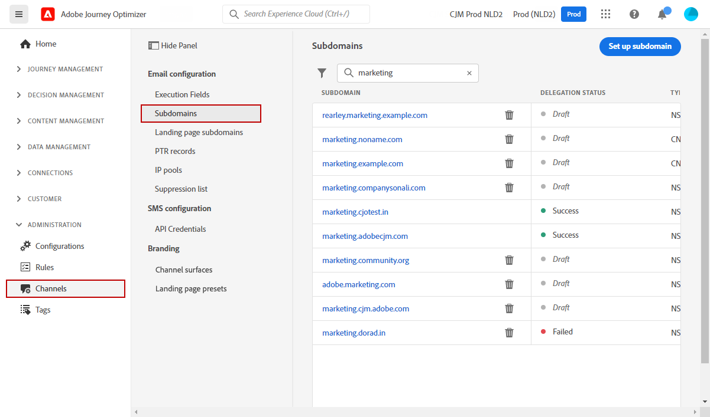

# Kom igång med systemadministratörer {#get-started-sys-admins}

Innan du börjar använda [!DNL Adobe Journey Optimizer] krävs flera steg för att förbereda miljön. Du måste utföra de här stegen så att [datateknikern](data-engineer.md) och [marknadsföraren](marketer.md) kan börja arbeta med [!DNL Adobe Journey Optimizer].

Som **systemadministratör** måste du **förstå roller och tilldela behörigheter** för sandlådeadministration och kanalkonfiguration. Du måste också konfigurera sandlådor och hantera dem för de tillgängliga rollerna. Sedan kan du tilldela teammedlemmar till roller. Medan [datatekniker](data-engineer.md) konfigurerar datamodeller och datakällor, och [utvecklare](developer.md) implementerar tekniska integreringar, ser du till att rätt personer har tillgång till rätt funktioner.

Dessa funktioner kan hanteras av **[!UICONTROL Product administrators]** som har åtkomst till produkten Behörigheter. [Läs mer om behörigheter](../../administration/permissions.md){target="_blank"}.

## Konfigurera åtkomst och behörigheter

Följ de här stegen för att konfigurera åtkomsthantering:

1. **Skapa sandlådor** för att partitionera dina instanser i separata, isolerade virtuella miljöer. **Sandlådor** skapas i [!DNL Journey Optimizer]. Läs mer i avsnittet [Sandlådor](../../administration/sandboxes.md).

   >[!NOTE]
   >Om du som **systemadministratör** inte kan se menyn **[!UICONTROL Sandboxes]** i [!DNL Journey Optimizer] måste du uppdatera dina behörigheter. Lär dig hur du uppdaterar din roll på [den här sidan](../../administration/permissions.md#edit-product-profile).

1. **Förstå roller**. Roller är en uppsättning enhetsbehörigheter som ger användarna tillgång till vissa funktioner eller objekt i gränssnittet. Läs mer i avsnittet [färdiga roller](../../administration/ootb-product-profiles.md).

1. **Ange behörigheter** för roller, inklusive **Sandlådor**, och ge teammedlemmarna åtkomst genom att tilldela dem till olika roller. Behörigheter är enhetsbehörigheter som gör att du kan definiera de behörigheter som tilldelats **[!UICONTROL Role]**. Varje behörighet samlas in under funktioner, t.ex. Resor eller Erbjudanden, som representerar olika funktioner eller objekt i [!DNL Journey Optimizer]. Läs mer i avsnittet [Behörighetsnivåer](../../administration/high-low-permissions.md).

1. **Använd åtkomstkontroll på objektnivå** (valfritt). Använd etiketter på objekt som resor, kampanjer och kanalkonfigurationer för att styra vilka användare som har tillgång till specifika resurser. Läs mer om [Åtkomstkontroll på objektnivå (OLAC)](../../administration/object-based-access.md).

Dessutom måste du lägga till användare som behöver åtkomst till Assets Essentials i rollerna **Assets Essentials Consumer Users** eller **Assets Essentials Users**. [Läs mer i dokumentationen för Assets Essentials](https://experienceleague.adobe.com/docs/experience-manager-assets-essentials/help/deploy-administer.html){target="_blank"}.

När du använder [!DNL Journey Optimizer] för första gången tilldelas du en produktionssandlåda och ett visst antal IP-adresser beroende på ditt kontrakt.

## Konfigurera kanaler och meddelanden

Om du vill att [marknadsförare](marketer.md) ska kunna skapa och skicka meddelanden går du till menyn **ADMINISTRATION** . Bläddra i menyn **[!UICONTROL Channels]** om du vill konfigurera kanalinställningar.

>[!NOTE]
>Om du är **systemadministratör** och inte kan se menyn **[!UICONTROL Channels]** i [!DNL Journey Optimizer] måste du uppdatera dina behörigheter i produkten [Permissions](../../administration/permissions.md){target="_blank"} .

Följ de här stegen:

1. **Konfigurera kanalkonfigurationer**. Definiera alla tekniska parametrar som krävs för e-post, SMS, push-meddelanden och andra kanaler:

   * Definiera **inställningar för push-meddelanden** i både [!DNL Adobe Experience Platform] och Adobe Experience Platform Data Collection. [Läs mer](../../push/push-gs.md)

   * Skapa **kanalkonfigurationer** för att konfigurera alla tekniska parametrar som krävs för e-post, SMS, push, in-app, webb och andra kanaler. [Läs mer](../../configuration/channel-surfaces.md)

   * Konfigurera **SMS-kanalen** för att konfigurera alla tekniska parametrar som krävs för SMS. [Läs mer](../../sms/sms-configuration.md)

   * Hantera det antal dagar under vilket **återförsök** utförs innan e-postadresser skickas till listan över utelämnanden. [Läs mer](../../configuration/manage-suppression-list.md)

1. **Delegera underdomäner**: För alla nya underdomäner som ska användas i Journey Optimizer är det första steget att delegera den. [Läs mer](../../configuration/about-subdomain-delegation.md)

   

1. **Skapa IP-pooler**: Förbättra e-postleveransen och ditt anseende genom att gruppera IP-adresser som har etablerats med din instans. [Läs mer](../../configuration/ip-pools.md)

   

1. **Hantera inaktiveringen och tillåtelselista**: Förbättra leveransen med inaktivering och tillåtelselista

   * En [inaktiveringslista](../../reports/suppression-list.md) består av e-postadresser som du vill utesluta från leveranser, eftersom det kan skada ditt anseende och din leveransfrekvens om du skickar till dessa kontakter. Du kan övervaka alla e-postadresser som automatiskt har uteslutits från att skickas under en resa, till exempel ogiltiga adresser, adresser som alltid har mjuka studsar, och som kan påverka ditt e-postanseende negativt, samt mottagare som gör något slags skräppostklagomål mot något av dina e-postmeddelanden. Lär dig hur du hanterar [listan över inaktiveringar](../../configuration/manage-suppression-list.md) och [försök](../../configuration/retries.md).

   

   * Med [tillåtelselista](../../configuration/allow-list.md) kan du ange enskilda e-postadresser eller domäner som ska vara de enda mottagarna eller domänerna som har behörighet att ta emot e-postmeddelanden som du skickar från en viss sandlåda. Detta kan förhindra att du av misstag skickar e-post till verkliga kundadresser när du befinner dig i en testmiljö. Lär dig hur du [aktiverar tillåtelselista](../../configuration/allow-list.md).

   Läs mer om Leveranshantering i [!DNL Adobe Journey Optimizer] [på den här sidan](../../reports/deliverability.md).

## Ytterligare funktioner

I takt med att organisationens behov växer bör du tänka på följande avancerade funktioner:

* **Samtyckespolicyer**: Om din organisation har köpt Sköld för hälsovård eller sköld för sekretess och säkerhet, skapar du samtyckespolicyer för att respektera kundpreferenser över olika kanaler. [Läs mer](../../action/consent.md)

* **Datastyrningsprinciper**: Använd etiketter och principer för dataanvändning för att styra hur data används i marknadsföringsåtgärder. [Läs mer](../../action/action-privacy.md)

* **IP-värmeringsplaner**: Öka antalet e-postutskick gradvis för att skapa avsändarens anseende hos e-postleverantörer. [Läs mer](../../configuration/ip-warmup-gs.md)

## Samarbeta med andra roller

Tack vare ert administrativa arbete kan alla team lyckas:

* **Stöd för [datatekniker](data-engineer.md)**: Bevilja behörigheter för datahantering, godkänn sandlådeåtkomst och koordinera för datalagringspolicyer

* **Aktivera [Utvecklare](developer.md)**: Ange API-autentiseringsuppgifter, konfigurera sandlådemiljöer för testning och godkänna kanalkonfigurationer

* **Stärk [marknadsförare](marketer.md)**: Tilldela lämpliga behörigheter för att skapa resor och kampanjer, konfigurera kanaler som de ska använda och ge support för testmiljöer

## Håll dig uppdaterad

Håll dig à jour med de senaste uppdateringarna och administrativa förändringar för Journey Optimizer:

* **[Versionsinformation](../../rn/release-notes.md)**: Granska nya funktioner, plattformsuppdateringar, säkerhetsuppdateringar och konfigurationsändringar som släpps varje månad
* **[Dokumentationsuppdateringar](../../rn/documentation-updates.md)**: Spåra senaste ändringar av konfigurationsguider, behörighetsuppdateringar och nya administrativa funktioner
* **Produktmeddelanden**: Aktivera aviseringar i din [Adobe Experience Cloud-profil](https://experience.adobe.com/preferences){target="_blank"} för att få viktiga aviseringar om:
   * Systemets underhållstid och schemalagda driftstopp
   * Säkerhetsuppdateringar och korrigeringar
   * Nya administrativa funktioner och behörighetsändringar
   * Licens- och berättigandeuppdateringar
   * Viktiga produktmeddelanden

  Om du vill aktivera meddelanden klickar du på din profilikon i det övre högra hörnet av Adobe Experience Cloud, går till **Inställningar > Meddelanden** och konfigurerar Journey Optimizer meddelandeinställningar. Som administratör bör du aktivera alla viktiga systemmeddelanden.

## Nästa steg

När miljön har konfigurerats:

1. **Verifiera installationen**: Bekräfta att alla teammedlemmar har tillgång till de funktioner som krävs
2. **Övervaka användning**: Använd administrationspanelerna för att spåra systemanvändning och identifiera problem
3. **Behåll behörigheter**: Granska och uppdatera behörigheter regelbundet allt eftersom teamroller utvecklas
