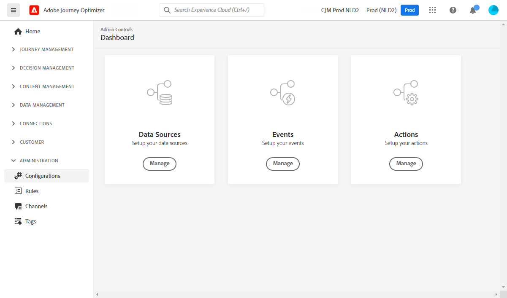

# Kom igång med datatekniker {#data-engineer}

Som **dataarkitekt** eller **datatekniker** konfigurerar och underhåller du kundprofildata och andra datakällor som används för upplevelser som orkestreras av [!DNL Journey Optimizer]. Detta innefattar att integrera alla era kund- och affärsdata - oavsett om de kommer från webb, CRM eller offlinekällor - i en enhetlig helhetsbild av kunden. Ni kan modellera kundprofildata och affärsdata i scheman, konfigurera källkopplingar för datainhämtning och säkerställa smidiga dataflöden för att möjliggöra kundinsikter och engagemang i realtid. Du kan börja arbeta med [!DNL Adobe Journey Optimizer] när [systemadministratören](administrator.md) har gett dig åtkomst och förberett miljön.

>[!NOTE]
>
>Läs mer om **dataöverföring** i [Adobe Experience Platform-dokumentationen](https://experienceleague.adobe.com/docs/experience-platform/ingestion/home.html?lang=sv-SE){target="_blank"}.

## Konfigurationssteg för viktiga data

Så här skapar du en grund för Journey Optimizer:

1. **Skapa identitetsnamnutrymmen**. I Adobe [!DNL Journey Optimizer] länkar **Identiteter** konsumenter över olika enheter och kanaler, vilket resulterar i ett identitetsdiagram. Det länkade identitetsdiagrammet används för att personalisera upplevelser baserat på interaktioner över alla era affärskontaktytor. Läs mer om identiteter och identitetsnamnutrymmen [på den här sidan](../../audience/get-started-identity.md).

   Konfigurera dessutom **extra identifierare** för att aktivera samma profil för att ange flera resinstanser baserat på sekundära identifierare som order-ID eller boknings-ID. Läs mer om [ytterligare identifierare](../../building-journeys/supplemental-identifier.md).

1. **Skapa scheman** och aktivera dem för profiler. Ett schema är en uppsättning regler som representerar och validerar datastrukturen och dataformatet. På en hög nivå ger scheman en abstrakt definition av ett objekt i verkligheten (till exempel en person) och ger en översikt över vilka data som ska inkluderas i varje instans av objektet (till exempel förnamn, efternamn, födelsedag o.s.v.).

   * För standardresor och -kampanjer: Använd [XDM-scheman](../../data/get-started-schemas.md)
   * För samordnade kampanjer: Skapa [relationsscheman](../../orchestrated/gs-schemas.md) för att aktivera segmentering för flera enheter

1. **Skapa datauppsättningar** och aktivera dem för profiler. En datauppsättning är en lagrings- och hanteringskonstruktion för en datamängd, vanligtvis en tabell, som innehåller ett schema (kolumner) och fält (rader). Datauppsättningar innehåller också metadata som beskriver olika aspekter av de data som lagras. När en datauppsättning har skapats kan du mappa den till ett befintligt schema och lägga till data i det. Läs mer om datauppsättningar [på den här sidan](../../data/get-started-datasets.md).

   För avancerade scenarier förbereder du **datauppsättningar för körningssökningar** för att förbättra körningen med realtidsdata från postdatamängder. Lär dig mer om [datasökning](../../building-journeys/dataset-lookup.md).

1. **Konfigurera källanslutningar**. Med Adobe Journey Optimizer kan data hämtas från externa källor samtidigt som du kan strukturera, märka och förbättra inkommande data med hjälp av plattformstjänster. Du kan importera data från en mängd olika källor, till exempel Adobe-program, molnbaserade lager, databaser och många andra. Läs mer om Source-anslutningar [på den här sidan](../get-started-sources.md).

1. **Skapa testprofiler**. Testprofiler krävs när [testläget](../../building-journeys/testing-the-journey.md) används i en resa och när du [förhandsgranskar och testar meddelanden](../../content-management/preview-test.md) innan du skickar iväg dem. Steg för att skapa testprofiler finns detaljerade [på den här sidan](../../audience/creating-test-profiles.md).

1. **Konfigurera beräknade attribut** (valfritt). Skapa härledda attribut från profildata för att förenkla segmentering och personalisering. Beräknade attribut beräknar automatiskt komplexa mätvärden som&quot;totalt antal inköp under de senaste 90 dagarna&quot; eller&quot;genomsnittligt ordervärde&quot;. Läs mer om [beräknade attribut](../../audience/computed-attributes.md).

Om du dessutom vill kunna skicka meddelanden under resor måste du konfigurera **[!UICONTROL Data Sources]**, **[!UICONTROL Events]** och **[!UICONTROL Actions]**. Läs mer [i det här avsnittet](../../configuration/about-data-sources-events-actions.md).

* Med konfigurationen **Data Source** kan du definiera en anslutning till ett system för att hämta ytterligare information som ska användas på dina resor. Läs mer om datakällor [i det här avsnittet](../../datasource/about-data-sources.md).

* **Med händelser** kan du utlösa dina resor åt gången för att skicka meddelanden i realtid till den person som flyger in på resan. I händelsekonfigurationen konfigurerar du de händelser som förväntas under resorna. Data för inkommande händelser normaliseras enligt Adobes upplevelsedatamodell (XDM). Händelser kommer från API:er för direktuppspelning av inmatning för autentiserade och oautentiserade händelser (t.ex. Adobe Mobile SDK-händelser). Läs mer om händelserna [i det här avsnittet](../../event/about-events.md).

* [!DNL Journey Optimizer] har inbyggda meddelandefunktioner: du kan skapa dina meddelanden under en resa och utforma ditt innehåll. Om du använder ett tredjepartssystem för att skicka meddelanden, till exempel Adobe Campaign, skapar du en **anpassad åtgärd**. Läs mer om åtgärder [i det här avsnittet](../../action/action.md).

## Övervaka och analysera resedata

När resorna är klara kan du ställa frågor om steg i kundresan i Data Lake för att övervaka prestanda, felsöka problem och analysera kundbeteenden. Använd SQL-frågor för att analysera:

* Mönster för inträde och utträde
* Felfrekvenser och orsaker till ignorering
* Prestanda för målgruppsexportjobb
* Mätvärden för anpassade åtgärder
* Reseförekomsttillstånd och flaskhalsar

Utforska färdiga [frågeexempel för reseanalys](../../reports/query-examples.md) för att komma igång med dataanalys och felsökning.

## Håll dig uppdaterad

Håll dig à jour med de senaste funktionerna i Journey Optimizer och förbättringarna:

* **[Versionsinformation](../../rn/release-notes.md)**: Granska nya funktioner, förbättringar och korrigeringar som släpps varje månad
* **[Dokumentationsuppdateringar](../../rn/documentation-updates.md)**: Spåra senaste ändringar av dokumentationen, inklusive nya sidor och uppdaterat innehåll
* **[Produktmeddelanden](../../rn/releases.md#staying-informed)**: Lär dig hur du prenumererar på e-post- och produktaviseringar för Journey Optimizer-uppdateringar, inklusive nya funktioner, underhållsfönster och viktiga systemändringar
