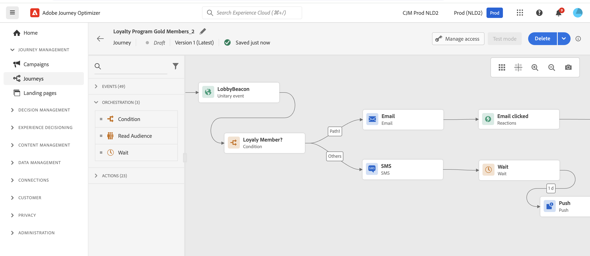

# Kom igång med marknadsförare {#get-started-marketers}

Som **marknadsförare** eller **affärsadministratör** kan du utforma kundresor för att leverera personliga, sammanhangsbaserade upplevelser till kunder. Ni kan skapa och hantera alla de olika komponenterna i dessa personaliserade resor, inklusive e-post och push-meddelanden, erbjudanden och beslutskomponenter för att på ett intelligent sätt personalisera meddelandeinnehåll. Journey Optimizer ger en enhetlig användarupplevelse där man kan implementera hela användningen från början till slut på ett och samma ställe. Du kan börja arbeta med [!DNL Adobe Journey Optimizer] när [systemadministratören](administrator.md) och [datateknikern](data-engineer.md) har gett dig åtkomst och förberett din miljö.

## Kom igång med grunderna

Journey Optimizer sammanför kundinsikter i realtid, modern flerkanalsmarknadsföring och intelligent beslutsfattande i en enda applikation. Skapa personaliserade, sammankopplade kundupplevelser via e-post, SMS, push, web push, in-app, webb, direktreklam, innehållskort med mera.

Journey Optimizer erbjuder två kraftfulla orkestreringsmetoder:

* **Resor**: Ett-till-ett-engagemang i realtid där varje kund går igenom i sin egen takt, triggas av beteende eller händelser
* **Samordnade kampanjer**: Komplexa gruppkampanjer i flera steg i stor skala där målgrupperna samverkar via arbetsflöden - perfekt för varumärkesinitierade kampanjer som säsongskampanjer, produktlanseringar eller kontobaserad kommunikation

Arbeta med dina [administratörer](administrator.md) för att få åtkomst och med [datatekniker](data-engineer.md) för att konfigurera målgrupper, data och relationsscheman för avancerad segmentering.

Så här börjar du med att skapa upplevelser:

1. **Skapa målgrupper**. Bygg målgrupper genom segmentdefinitioner, ladda upp CSV-filer eller använd målgruppskomposition. Journey Optimizer erbjuder flera sätt att inrikta sig på rätt kunder. Läs mer om [målgrupper](../../audience/about-audiences.md) och [att skapa segmentdefinitioner](../../audience/creating-a-segment-definition.md).

1. **Skapa innehåll**. Skapa övertygande budskap i alla kanaler, inklusive e-post, SMS, push, web push, in-app, webb, direktreklam och innehållskort:
   * Använd **AI-assistenten** för att generera e-postinnehåll, ämnesrader och bilder baserat på varumärkesriktlinjerna. [Läs mer om generering av AI-innehåll](../../content-management/gs-generative.md)
   * **Anpassa meddelanden** med kunddata, dynamiskt innehåll och villkorslogik. [Läs om personalisering](../../personalization/personalize.md)
   * **Iterera kontextdata** om du vill visa dynamiska listor från händelser, anpassade åtgärder och datauppsättningssökningar. [Lär dig mer om att iterera sammanhangsberoende data](../../personalization/iterate-contextual-data.md)
   * Skapa återanvändbara **innehållsmallar** och **fragment** för att upprätthålla varumärkets enhetlighet. [Arbeta med mallar](../../content-management/content-templates.md)
   * Leverera permanenta, icke-påträngande **innehållskort** i mobilappar och på webbplatser. Till skillnad från push-meddelanden förblir innehållskort synliga tills de stängs. [Lär dig mer om innehållskort](../../content-card/create-content-card.md)
   * Hantera resurser med **Adobe Experience Manager Assets**-integrering. [Läs om resurser](../../integrations/assets.md)

   

1. **Lägg till erbjudanden och beslut**. Leverera det bästa erbjudandet till varje kund vid rätt tidpunkt med hjälp av AI-styrda beslut. Använd Decisioning för att personalisera push, SMS och andra kanaler. Lär dig mer om [Beslutshantering](../../offers/get-started/starting-offer-decisioning.md) och [Experience Decision](../../experience-decisioning/gs-experience-decisioning.md).

   

1. **Testa och validera**. Förhandsgranska och testa innehållet innan du skickar:
   * Använd **testprofiler** för att förhandsgranska personalisering och kontrollera återgivning på olika enheter
   * Testa med **exempeldata** från CSV-/JSON-filer
   * Förhandsgranska **e-poståtergivning** för vanliga e-postklienter
   * Kör **A/B-tester och experiment** för att optimera innehållsvariationer. Använd multiväpnad bandit-experimenterande för att automatiskt tilldela mer trafik till vinnande variationer i realtid. [Lär dig mer om experiment](../../content-management/content-experiment.md)
   * Ställ in **arbetsflöden för godkännande** för kampanjer och resor (kräver ytterligare licens). [Läs om godkännanden](../../test-approve/gs-approval.md)

   Lär dig hur du [testar och validerar meddelanden](../../content-management/preview-test.md).

1. **Skapa kundresor**. Skapa personaliserade upplevelser i realtid med hjälp av arbetsytan. Använd **Journey Agent** i AI Assistant för att skapa resor från meddelanden på naturligt språk. [Läs om Journey Agent](../ai-features.md#journey-agent)

   * Utlös resor med **händelser** (kundåtgärder) eller **målgrupper** (grupputskick)
   * Lägg till **villkor** för att skapa anpassade sökvägar baserat på kunddata
   * Använd den enhetliga **åtgärdsaktiviteten** för alla kanalåtgärder (e-post, push, SMS med flera). [Läs mer om åtgärdsaktiviteten](../../building-journeys/journey-action.md)
   * Lägg till aktiviteten för **innehållsbeslut** för att integrera personaliserade erbjudanden direkt i ditt kundflöde. [Läs mer om beslutsaktiviteten för innehåll](../../building-journeys/content-decision.md)
   * Använd **vänteaktiviteter** för att skapa perfekt timing mellan meddelanden
   * Skicka meddelanden över **flera kanaler** inom en resa
   * Använd **påfyllnadssändning** för att leverera meddelanden i kontrollerade batchar (begränsad tillgänglighet för resor)
   * Använd **A/B-testning** och optimera sändningstider för att maximera engagemanget
   * Använd **datauppslagssökning** för att berika resor med realtidsdata från Adobe Experience Platform. [Lär dig mer om datauppsättningssökning](../../building-journeys/dataset-lookup.md)
   * Utnyttja **kompletterande identifierare** så att samma profil kan ange flera resesförekomster (t.ex. olika order eller bokningar). [Läs om ytterligare identifierare](../../building-journeys/supplemental-identifier.md)

   

   Lär dig hur du [utformar och kör resor](../../building-journeys/journey-gs.md) och utforskar [användningsexempel för resor](../../building-journeys/jo-use-cases.md). Förstå [villkor för in-/utträde](../../building-journeys/entry-exit-criteria-guide.md) för att styra profilflödet.

1. **Starta samordnade kampanjer**. Utforma komplexa flerstegskampanjer i stor skala med en visuell arbetsyta:

   * Bygg **on demand-målgrupper** direkt med relationsfrågor för att koppla kunddata till konton, inköp, prenumerationer och andra enheter
   * Skapa **segmentering för flera enheter** för exakt målgruppsanpassning (t.ex. &quot;kunder med prenumerationer som upphör om 30 dagar&quot; eller &quot;konton med nyligen gjorda värdefulla köp&quot;)
   * Få **synlighet före sändning** med korrekt antal målgrupper innan du startar
   * Utforma **flerstegsarbetsflöden** för säsongskampanjer, produktlanseringar, lojalitetserbjudanden eller kontobaserad marknadsföring
   * Schemalägg kampanjkörningar direkt, vid specifika tidpunkter eller i återkommande tidsplaner (varje dag, varje vecka, varje månad)
   * Bearbeta målgrupper i **gruppläge** där alla profiler sammanförs genom arbetsflödet
   * Använd **påfyllnadssändning** för att leverera meddelanden i kontrollerade batchar för bättre leverans och inläsningskontroll

   Lär dig hur du [kommer igång med orkestrerade kampanjer](../../orchestrated/gs-orchestrated-campaigns.md) och förstår när du ska [använda kampanjer eller resor](../../orchestrated/orchestrated-campaigns-faq.md).

1. **Övervaka och optimera**. Spåra prestanda och förbättra resultaten över tid:
   * Övervaka **direktresan** och identifiera flaskhalsar
   * Analysera **leveransfrekvenser och interaktionsmått för**-meddelanden
   * Använd **rapportinstrumentpaneler** med Customer Journey Analytics-integrering
   * Spåra **konvertering** och affärsmässiga konsekvenser
   * Hantera **meddelandefrekvens och prioritering** med konflikthanteringsregler för att förhindra överkommunikation
   * Använd **tysta timmar** (tidsbaserade undantag) för att undvika att skicka under vissa perioder. [Lär dig mer om konflikthantering](../../conflict-prioritization/gs-conflict-prioritization.md) och [tysta timmar](../../conflict-prioritization/quiet-hours.md)

   Lär dig [övervaka prestanda](../../reports/report-gs-cja.md).

## Bästa tillvägagångssätt för framgång

### Skapa innehåll

* **Börja med mallar**: Använd fördefinierade mallar och innehållsfragment för att snabba upp skapandet och upprätthålla konsekvensen
* **Testa tidigt, testa ofta**: Förhandsgranska alltid innehåll på olika enheter och använd testprofiler för att validera personaliseringen
* **Utnyttja AI på ett klokt sätt**: Använd AI Assistant för inledande utkast och variationer, men granska och förfina alltid för din varumärkesröst
* **Behåll det enkelt**: Tydliga, kortfattade meddelanden med starka uppmaningar att agera fungerar bättre än komplexa layouter

### Resedesign

* **Definiera tydliga mål**: Upprätta framgångsmått innan du skapar din resa
* **Mappa kundupplevelsen**: Visa hela kundresan innan implementering
* **Använd vänteaktiviteter strategiskt**: Ge kunderna tid att engagera innan de skickar uppföljningar
* **Planera strategier för att avsluta**: Definiera när och varför kunderna ska avsluta kundresan
* **Testa i utkastläge**: Verifiera reselogik med torr körning innan aktivering

[Lär dig de bästa sätten att få resan att fungera](../../building-journeys/entry-exit-criteria-guide.md#best-practices)

### Kampanjsamordning

* **Välj rätt metod**: [Jämför resetyper](../../building-journeys/journey.md#journey-types) för upplevelser som triggas av beteenden i realtid eller [kampanjtyper](../../campaigns/get-started-with-campaigns.md#campaign-types) för schemalagda gruppkampanjer
* **Definiera tydliga kampanjmål**: Upprätta mål innan du utformar flerstegsarbetsflöden
* **Börja med pilotmålgrupper**: Validera antal och segmenteringslogik före skalförändring
* **Utnyttja relationsdata**: Använd segmentering för flera enheter för att koppla kunddata till konton, inköp och prenumerationer för exakt målinriktning
* **Behåll segmenteringen enkelt**: Optimera prestanda och genomskinlighet med tydliga, underhållbara regler
* **Använd konsekvent namngivning**: Gör kampanjhanteringen enklare med tydliga namnkonventioner

### Målgruppsanpassning

* **Segmentera noggrant**: Skapa specifika, åtgärdbara målgruppssegment baserat på tydliga kriterier
* **Uppdatera regelbundet**: Se till att målgrupperna hålls uppdaterade genom att ställa in lämpliga utvärderingsscheman
* **Balansstorlek och precision**: Målgrupper som är tillräckligt stora för statistisk signifikans men tillräckligt specifika för relevans
* **Använd anrikningsattribut**: Utnyttja beräknade attribut och anrikningsdata för djupare personalisering

### Frekvenshantering

* **Respektera kundens preferenser**: Följ avanmälningarna och kommunikationsinställningarna
* **Ange frekvensgränser**: Använd regeluppsättningar för att förhindra meddelandetrötthet över kanaler
* **Koordinera kampanjer**: Använd konflikthantering för att se till att kunderna får rätt meddelande vid rätt tidpunkt
* **Övervaka engagemang**: Håll utkik efter tecken på trötthet (neka öppningsfrekvens, öka antalet prenumerationer)

[Läs mer om frekvensbegränsning](../../conflict-prioritization/channel-capping.md)

## Utforska användningsexempel

Ta del av praktiska exempel som demonstrerar Journey Optimizer funktioner:

**Användningsexempel på resan** (realtid, en-till-en):

* **Välkomstserie**: Ta in nya kunder med personaliserade flerstegsresor. [Visa användningsfall](https://experienceleague.adobe.com/sv/docs/journey-optimizer-learn/tutorials/use-cases/customer-onboarding)
* **Övergiven kundvagnsåterställning**: Engagera kunder som lämnat artiklar i kundvagnen igen. [Visa användningsfall](https://experienceleague.adobe.com/sv/docs/journey-optimizer-learn/tutorials/use-cases/abandoned-cart)
* **Händelsestyrda meddelanden**: Svara på kundåtgärder i realtid
* **Födelsedagskampanjer**: Skicka personaliserade födelsedagsmeddelanden som utlösts av profildatum
* **Produktrekommendationer**: Föreslå relevanta produkter baserat på bläddring och inköpshistorik

**Samordnade kampanjanvändningsfall** (batch, en-till-många):

* **Säsongskampanjer**: Starta samordnade kampanjer i olika kundsegment (t.ex. semesterförsäljning, skolstartsförsäljning)
* **Produktlanseringar**: Nu kommer nya produkter att visas för riktade målgrupper med sekvensmeddelanden
* **Lojalitetsprogram erbjuder**: Belöna värdefulla kunder med nivåindelade erbjudanden baserat på inköpshistorik
* **Kontobaserad marknadsföring**: Målkonton med specifika egenskaper och relaterade kontakter
* **Prenumerationsförnyelser**: Nå kunder med prenumerationer som snart går ut med hjälp av multientitetsfrågor
* **Återengagemangskampanjer**: Vinn inaktiva kunder med målinriktade erbjudanden i gruppläge. [Visa användningsfall](https://experienceleague.adobe.com/sv/docs/experience-platform/rtcdp/use-cases/personalization-insights-engagement/use-cases-luma)

**Resemönster:**

* [Skicka meddelanden till prenumeranter](../../building-journeys/message-to-subscribers-uc.md): Målprenumerationslistor med personaliserat innehåll
* [Flerkanalsmeddelanden](../../building-journeys/journeys-uc.md): Kombinera e-post och push med reaktionshändelser
* [E-postmeddelanden som endast är veckodag](../../building-journeys/weekday-email-uc.md): Schemalägg kommunikation med tidsbaserade villkor

Bläddra i det fullständiga biblioteket för [användningsfall för resan](../../building-journeys/jo-use-cases.md) och läs mer om [samordnade kampanjer](../../orchestrated/gs-orchestrated-campaigns.md).

## Samarbeta mellan roller

Marknadsföringsarbetet samverkar med andra team:

>[!BEGINTABS]

>[!TAB Arbeta med datatekniker]

Samarbeta med [datatekniker](data-engineer.md) om data- och målgruppskonfigurationer:

* Begär nya beräknade attribut för personalisering och segmentering
* Koordinera relationsscheman för orkestrerade kampanjer
* Ge återkoppling om målgruppens kvalitet och datakvalitet
* Justera mot datakrav för flera enheter för avancerad segmentering

>[!TAB Arbeta med utvecklare]

Samarbeta med [utvecklare](developer.md) om händelsespårning och implementering:

* Justera vilka användarinteraktioner som ska utlösa resthändelser
* Testa mobil- och webbimplementeringar före start
* Validera spårning för innehållsprestanda och användarengagemang
* Felsöka problem med meddelandeleverans eller personalisering

>[!TAB Arbeta med administratörer]

Samarbeta med [administratörer](administrator.md) om åtkomst och konfigurationer:

* Begär kanalkonfigurationer för era kampanjer och resor
* Bekräfta licensåtkomst för orkestrerade kampanjer och andra funktioner
* Rapportera problem med behörigheter eller åtkomst
* Koordinera för nya funktioner i aktiverings- och testmiljöer

>[!ENDTABS]

## Nästa steg

1. **Start small**: Skapa en enkel välkomstresa eller kampanj med ett enda meddelande för att lära dig plattformen
2. **Utnyttja AI**: Använd AI Assistant för att ställa frågor och snabba upp skapandet av innehåll
3. **Gå med i communityn**: Anslut till andra Journey Optimizer-användare i [Experience League Community](https://experienceleaguecommunities.adobe.com/t5/journey-optimizer/ct-p/journey-optimizer?profile.language=sv){target="_blank"}
4. **Utforska självstudiekurser**: Titta på stegvisa videor om [Experience League](https://experienceleague.adobe.com/docs/journey-optimizer-learn/tutorials/overview.html?lang=sv-SE){target="_blank"}
