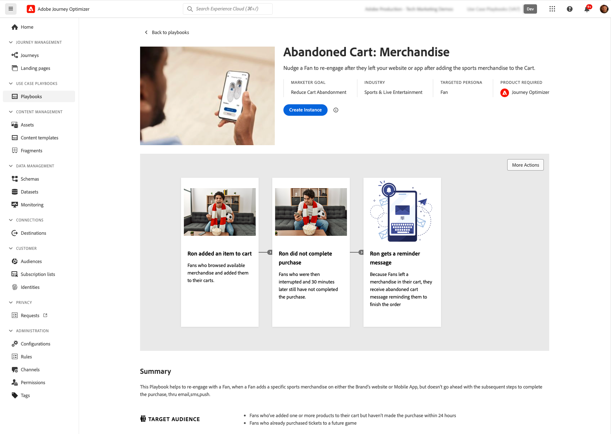

# Spelböcker med användningsexempel {#playbooks}

>[!PREREQUISITES]
>
>Följande konfigurationssteg krävs innan du arbetar med Använd fallspelningsböcker. Detaljerad information om varje steg finns i dokumentationen för Use Case Playbooks [Get started](https://experienceleague.adobe.com/docs/experience-platform/use-case-playbooks/playbooks/get-started.html){target="_blank"}.
>
>* Skapa en sandlåda
>* Konfigurera användarbehörigheter
>* Konfigurera Journey Optimizer-kanalkonfigurationer för e-post-, push- och SMS-meddelanden

Använd fallspelsböcker är fördefinierade arbetsflöden som åtgärdar vanliga användningsfall som du kan utföra med Adobe Experience Platform och Journey Optimizer.

{width="85%"}

Varje spelbok innehåller en omfattande översikt som innehåller avsikter, mål, målinriktade personligheter och resurser som behövs för att implementera den. Dessutom finns det en mindmap i varje spelbok som visuellt representerar verkliga kundkontaktytor som är kopplade till spelboken.

{width="85%"}

Om du vill få åtkomst till spelböcker går du till menyn **[!UICONTROL Playbooks]** som finns i den vänstra navigeringslisten. Biblioteket innehåller flera spelböcker som har implementerats med Adobe Journey Optimizer. Om du enkelt vill komma åt dem använder du de filter som finns bredvid sökfältet. En omfattande lista över Journey Optimizer spelböcker finns i [Use Case Playbooks-dokumentationen](https://experienceleague.adobe.com/docs/experience-platform/use-case-playbooks/playbooks/playbooks-list.html){target="_blank"}.

{width="85%"}

När du har valt den spelbok som bäst passar dina behov kan du aktivera den. Detta skapar en instans av spelboken och genererar automatiskt de resurser som behövs för att stödja ditt specifika användningsfall. Resurserna innehåller Journey Optimizer-resurser som resor, meddelanden och Adobe Experience Platform-resurser som scheman eller segment.

>[!NOTE]
>
>Syftet med de här objekten är att hjälpa dig att förstå alla resurser som behövs för att implementera ditt specifika användningsfall. De innehåller inga data och skapas i utvecklingssandlådor.

Om du vill implementera ditt användningssätt kan du navigera till varje objekt för att anpassa det efter dina behov. Du kan också dela URL:en för spelningsbokens instanssida mellan ditt team för att samarbeta vid implementeringen av användningsexemplet.

Dessutom kan du importera spelboksresurser till andra sandlådor. På så sätt kan du justera de genererade resurserna mot dina befintliga resurser och se till att de är kompatibla med dina data, om du redan har konfigurerat dina egna scheman, fält och fältgrupper. De här stegen beskrivs i [Använd fallspelningsböcker](https://experienceleague.adobe.com/docs/experience-platform/use-case-playbooks/playbooks/data-awareness.html){target="_blank"}.
