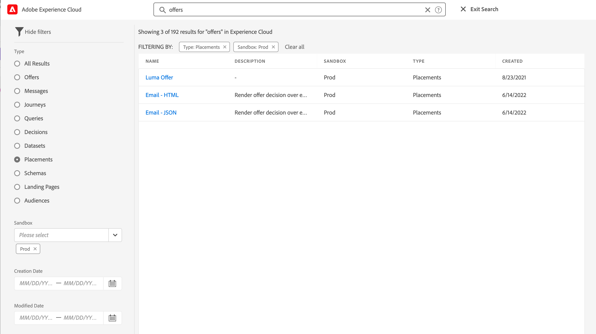
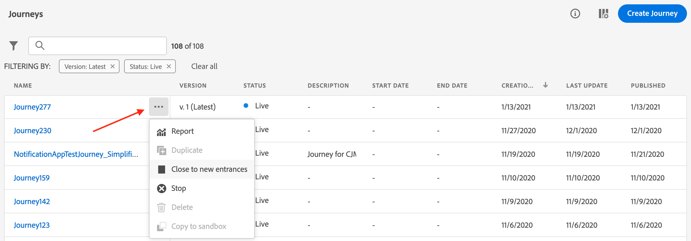

# Söka, filtrera, ordna {#search-filter-organize}

## Sök {#unified-search}

I Adobe Journey Optimizer-gränssnittet kan du använda den enhetliga sökfunktionen i Adobe Experience Cloud i mitten av det övre fältet för att hitta resurser, resor, datauppsättningar med mera i dina sandlådor.

Börja skriva in innehåll för att visa de bästa resultaten. Hjälpartiklar om de angivna nyckelorden visas också i resultaten.

Tryck på **Retur** för att få tillgång till alla resultat och filtrera efter affärsobjekt.

## Filterlistor {#filter-lists}

I de flesta av listorna använder du sökfältet för att hitta specifika objekt och definiera filtervillkor.

Du kommer åt filter genom att klicka på filterikonen högst upp till vänster i en lista. Med filtermenyn kan du filtrera de element som visas enligt olika villkor: du kan välja att endast visa element av en viss typ eller status, de element som du har skapat eller de som har ändrats under de senaste 30 dagarna. Alternativen varierar beroende på sammanhanget.

Dessutom kan du använda enhetliga taggar för att filtrera en lista beroende på vilka taggar som tilldelats ett objekt. För närvarande finns det taggar för resor och kampanjer. [Lär dig arbeta med taggar](#tags)

>[!NOTE]
>
>Observera att kolumner som visas kan personaliseras med hjälp av konfigurationsknappen längst upp till höger i listorna. Personalisering sparas per användare.

I listorna kan du utföra grundläggande åtgärder för varje element. Du kan till exempel skapa dubbletter eller radera en post.

## Arbeta med enhetliga taggar {#tags}

>[!CONTEXTUALHELP]
>id="ajo_campaigns_tags"
>title="Taggar"
>abstract="I det här fältet kan du tilldela enhetliga Adobe Experience Platform-taggar till din kampanj. På så sätt kan ni enkelt klassificera dem och förbättra sökningen från kampanjlistan."

Med Adobe Experience Platform [enhetliga taggar](https://experienceleague.adobe.com/docs/experience-platform/administrative-tags/overview.html) kan du enkelt klassificera dina Journey Optimizer-objekt och förbättra sökningen från listorna.

Genom att lägga till meningsfulla taggar till målgrupper i Journey Optimizer kan ni senare filtrera och söka efter målgrupper enklare. Taggar kan även användas för att ordna målgrupper i relevanta, sökbara mappar, skapa personaliserade erbjudanden och upplevelser och använda dem i regler för upplevelsebeslut.

### Lägga till taggar i ett objekt {#add-tags}

I fältet **[!UICONTROL Tags]** kan du definiera taggar för objektet. Taggar är tillgängliga för följande objekt:

* [Kampanjer](../campaigns/create-campaign.md)
* [Beslutsobjekt](../experience-decisioning/items.md)
* [Fragment](../content-management/fragments.md)
* [Resor](../building-journeys/journey-properties.md)
* [Landningssidor](../landing-pages/create-lp.md)
* [Prenumerationslistor](../landing-pages/subscription-list.md)
* [Mallar](../content-management/content-templates.md)
* [Kanalkonfigurationer](../configuration/channel-surfaces.md#channel-config-tags)

Du kan antingen markera en befintlig tagg eller skapa en ny. Följ stegen nedan för att göra det.

1. Börja skriva namnet på den önskade taggen och/eller markera den i listan.

   

   >[!NOTE]
   >
   > Taggar är inte skiftlägeskänsliga.

1. Om taggen som du söker efter inte är tillgänglig klickar du på **[!UICONTROL Create ""]** för att definiera en ny tagg. Den läggs automatiskt till i det aktuella objektet och blir tillgänglig för alla andra objekt.

   

1. Listan med de markerade eller skapade taggarna visas under fältet **[!UICONTROL Tags]**. Du kan definiera så många taggar som behövs.

>[!NOTE]
> 
> Om du duplicerar eller skapar en ny version av ett objekt behålls taggarna.

### Filtrera på taggar {#filter-on-tags}

I varje objektlista visas en dedikerad kolumn så att du enkelt kan se dina taggar.

Ett filter är också tillgängligt för att endast visa objekt med vissa taggar.

Du kan lägga till eller ta bort taggar från alla typer av resor och kampanjer (live, draft, etc.). Det gör du genom att klicka på ikonen **[!UICONTROL More actions]** bredvid objektet och välja **[!UICONTROL Edit tags]**.

### Hantera taggar {#manage-tags}

Administratörer kan ta bort taggar och ordna dem efter kategorier med hjälp av menyn **[!UICONTROL Tags]** under **[!UICONTROL ADMINISTRATION]**. Läs mer om tagghantering i [dokumentationen för enhetliga taggar](https://experienceleague.adobe.com/docs/experience-platform/administrative-tags/ui/managing-tags.html).

>[!NOTE]
>
> Taggar som skapas direkt från fältet **[!UICONTROL Tags]** i Journey Optimizer läggs automatiskt till i den inbyggda kategorin&quot;Ej kategoriserad&quot;.
