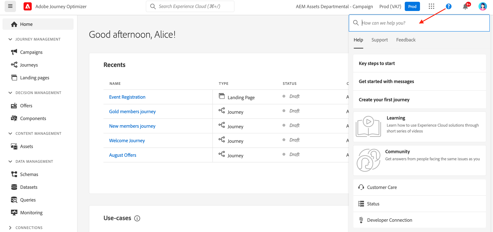

# Användargränssnitt {#cjm-user-interface}

Om du vill få tillgång till [!DNL Adobe Journey Optimizer] ansluter du till [Adobe Experience Cloud](https://experience.adobe.com) med din Adobe ID och väljer [!DNL Journey Optimizer].

De viktigaste begreppen när du bläddrar i användargränssnittet är vanliga i Adobe Experience Platform. Mer information finns i [Adobe Experience Platform-dokumentationen](https://experienceleague.adobe.com/docs/experience-platform/landing/platform-ui/ui-guide.html#adobe-experience-platform-ui-guide){target="_blank"}.

>[!NOTE]
>
>* Vilka komponenter och funktioner som är tillgängliga i din miljö beror på dina [behörigheter](../administration/permissions.md) och ditt [licenspaket](https://helpx.adobe.com/legal/product-descriptions/adobe-journey-optimizer.html){target="_blank"}. Fråga din Adobe Customer Success Manager eller din Adobe-representant om du har några frågor.
>
>* Den här dokumentationen uppdateras ofta för att återspegla de senaste ändringarna i produktanvändargränssnittet. Vissa skärmbilder kan dock skilja sig något från användargränssnittet.
>

## Vänster navigering {#left-nav}

Bläddra bland länkarna till vänster för att komma åt [!DNL Journey Optimizer]-funktioner.

>[!NOTE]
>
>Tillgängliga funktioner kan variera beroende på dina behörigheter och licensavtal.

Nedan finns en fullständig lista över tjänster och funktioner som är tillgängliga i den vänstra navigeringen samt länkar till tillhörande hjälpsidor.

### Startsida {#left-nav-home}

Startsidan för [!DNL Journey Optimizer] innehåller nyckellänkar och resurser som ska startas.

Listan **[!UICONTROL Recents]** innehåller genvägar till nyligen skapade händelser och resor. Den här listan visar datum och status för när de skapades och ändrades.

Bläddra bland användningsexempel i produkten för att börja skapa resurser och meddelanden. [Läs mer](#in-product-use-cases).

Använd länkarna längst ned på startsidan för att lära dig hur du börjar med [!DNL Journey Optimizer]. [Läs mer](#find-help-and-support).

### [!UICONTROL JOURNEY MANAGEMENT] {#left-nav-journey}

Bygg kampanjer och resor från det här avsnittet.

* **[!UICONTROL Campaigns]** - Skapa, konfigurera och orkestrera kampanjer för att leverera engångsinnehåll till en viss målgrupp via olika kanaler. [Läs mer](../campaigns/get-started-with-campaigns.md)

* **[!UICONTROL Journeys]** - Skapa, konfigurera och samordna dina kundresor: kombinera händelser, samordning och åtgärdsaktiviteter för att skapa flerstegsscenarier för flera kanaler. [Läs mer](../building-journeys/journey-gs.md#jo-build)

* **[!UICONTROL Reports]** - Journey Optimizer rapportering är helt integrerad med Customer Journey Analytics funktioner, vilket standardiserar rapporteringen på båda plattformarna och förbättrar datakonsekvensen och tillförlitligheten. Denna smidiga integrering mellan Journey Optimizer och Customer Journey Analytics ger en tydligare bild av prestandamätningarna, så att användarna kan fatta mer välgrundade beslut. [Läs mer](../reports/report-gs-cja.md)

### [!UICONTROL DECISION MANAGEMENT] {#left-nav-decision}

Skapa erbjudanden och komponenter från det här avsnittet.

* **[!UICONTROL Offers]** - Använd dina senaste källor och datauppsättningar från den här menyn. Använd det här avsnittet för att skapa erbjudanden. [Läs mer](../offers/offer-library/creating-personalized-offers.md)

* **[!UICONTROL Components]** - Skapa placeringar, regler och taggar. [Läs mer](../offers/offer-library/key-steps.md)

### [!UICONTROL CONTENT MANAGEMENT] {#left-nav-content}

Skapa och hantera innehåll från det här avsnittet.

* **[!UICONTROL Assets]** - [!DNL Adobe Experience Manager Assets] är en central databas med resurser som du kan använda för att fylla i dina meddelanden. [Läs mer](../integrations/assets.md)

* **[!UICONTROL Content templates]** - Skapa fristående mallar för att enkelt återanvända anpassat innehåll i Journey Optimizer kampanjer och resor för en snabbare och bättre designprocess. [Läs mer](../content-management/content-templates.md)

* **[!UICONTROL Fragments]** - Skapa och hantera fragment för att underlätta e-postdesignprocessen: skapa anpassade innehållsblock som kan användas för att snabbt sammanställa e-postinnehåll. [Läs mer](../content-management/fragments.md)

* **[!UICONTROL Landing pages]** - Skapa, utforma, testa och publicera landningssidor: skicka länkar till onlineformulär där användarna kan välja att inte ta emot meddelanden eller prenumerera på vissa tjänster. [Läs mer](../landing-pages/get-started-lp.md)

### [!UICONTROL DATA MANAGEMENT] {#left-nav-data}

Hantera data från det här avsnittet.

* **[!UICONTROL Schemas]** - Använd Adobe Experience Platform för att skapa och hantera XDM-scheman (Experience Data Model) på en interaktiv visuell arbetsyta som kallas Schemaredigeraren. [Läs mer](../data/get-started-schemas.md)

* **[!UICONTROL Datasets]** - Alla data som importeras till Adobe Experience Platform lagras i Data Lake som datauppsättningar. En datauppsättning är en lagrings- och hanteringskonstruktion för en datamängd, vanligtvis en tabell, som innehåller ett schema (kolumner) och fält (rader). [Läs mer](../data/get-started-datasets.md)

* **[!UICONTROL Queries]** - Använd Adobe Experience Platform Query Service för att skriva och köra frågor, visa frågor som har körts tidigare och få åtkomst till frågor som har sparats av användare i din organisation. [Läs mer](../data/get-started-queries.md)

* **[!UICONTROL Monitoring]** - Använd den här menyn för att övervaka din datainmatning i Adobe Experience Platform användargränssnitt. Läs mer i [Adobe Experience Platform-dokumentation](https://experienceleague.adobe.com/docs/experience-platform/ingestion/quality/monitor-data-ingestion.html){target="_blank"}

### [!UICONTROL CONNECTIONS] {#left-nav-connections}

Hantera dataanslutningar med andra appar och moln i det här avsnittet.

* **[!UICONTROL Sources]** - Använd den här menyn om du vill importera data från en mängd olika källor, till exempel Adobe-program, molnbaserade lagringsplatser, databaser och annat. Du kan strukturera, etikettera och förbättra inkommande data. [Läs mer](get-started-sources.md)

* **[!UICONTROL Destinations]** - Använd den här menyn för att skapa en liveanslutning med molnlagringsplatser för att exportera innehållet i dina datauppsättningar. [Läs mer](../data/export-datasets.md)

### [!UICONTROL CUSTOMER] {#left-nav-customers}

Hantera era målgrupper och profildata från det här avsnittet.

* **[!UICONTROL Audiences]** - Skapa och hantera Experience Platform-målgrupper och använd dem på dina resor. [Läs mer](../audience/about-audiences.md)

* **[!UICONTROL Subscription lists]** - I [!DNL Journey Optimizer] samlas kunder som har anmält sig till en prenumerationstjänst in i en prenumerationslista. [Läs mer](../landing-pages/subscription-list.md)

* **[!UICONTROL Profiles]** - Kundprofilen i realtid skapar en helhetsbild av alla dina enskilda kunder och kombinerar data från flera kanaler, inklusive online-, offline-, CRM- och tredjepartsdata. [Läs mer](../audience/get-started-profiles.md)

* **[!UICONTROL Identities]** - Adobe Experience Platform Identity Service hanterar identifieringen av dina kunder i realtid av olika enheter, kanaler och nära nog alla kanaler i det som kallas identitetsdiagram inom Adobe Experience Platform. [Läs mer](../audience/get-started-identity.md)

### [!UICONTROL PRIVACY] {#left-nav-privacy}

Styr din sekretesshantering och dina förfrågningar från det här avsnittet.

* **[!UICONTROL Policies]** - Med Adobe Experience Platform kan du etikettera dina fält och skapa marknadsföringsåtgärder för varje kanal. Sedan definierar ni en styrningspolicy som är kopplad till en etikett och en marknadsföringsåtgärd. [Läs mer](../action/action-privacy.md)

* **[!UICONTROL Requests]** - Sekretessbegäranden hanteras i Adobe Experience Platform Privacy Service. Det innehåller ett RESTful-API och ett användargränssnitt som hjälper dig att hantera kunddataförfrågningar. [Läs mer](../privacy/requests.md)

* **[!UICONTROL Audit]** - Bläddra till det här avsnittet för att kontrollera aktivitetsloggar. [Läs mer](../privacy/audit-logs.md)

* **[!UICONTROL Data Lifecycle]** - I det här avsnittet kan du konfigurera och schemalägga datalivscykelåtgärder och se till att posterna underhålls på rätt sätt. [Läs mer](../privacy/data-hygiene.md)

### [!UICONTROL ADMINISTRATION] {#left-nav-admin}

* **[!UICONTROL Configurations]** - Använd den här menyn för att konfigurera [händelser](../event/about-events.md), [datakällor](../datasource/about-data-sources.md) och [åtgärder](../action/action.md) att använda på dina resor.

  Du kan även komma åt avsnittet **Rapportering** för att konfigurera rapportering för kampanjexperiment och webb/mobil. [Läs mer](../reports/reporting-configuration.md)

* **[!UICONTROL Business rules]** - Använd det här avsnittet om du vill skapa affärsregler för flera kanaler för att styra hur ofta användare tar emot ett meddelande eller deltar i en resa. [Läs mer](../conflict-prioritization/rule-sets.md)

* **[!UICONTROL Alerts]** - Med användargränssnittet kan du visa en historik över mottagna aviseringar baserat på mätvärden som visas av Adobe Experience Platform observability Insights. I gränssnittet kan du även visa, aktivera och inaktivera tillgängliga varningsregler. [Läs mer](../reports/alerts.md)

* **[!UICONTROL Sandboxes]** - Adobe Experience Platform tillhandahåller sandlådor som partitionerar en enda instans till separata virtuella miljöer för att utveckla och utveckla program för digitala upplevelser. I [!DNL Journey Optimizer] kan du dessutom använda funktioner för paketexport och import för att kopiera objekt som resor, innehållsmallar eller fragment över flera sandlådor. [Läs mer](../administration/sandboxes.md)

* **[!UICONTROL Channels]** - Använd det här avsnittet för att konfigurera dina kanaler, inklusive underdomäner, konfigurationer och leveransinställningar. [Läs mer](../configuration/get-started-configuration.md)

* **[!UICONTROL Tags]** - Med enhetliga taggar kan du enkelt klassificera dina resor och kampanjer för att förbättra sökningen från listorna. [Läs mer](../start/search-filter-categorize.md#work-with-unified-tags)

## Användningsexempel inifrån produkten {#in-product-uc}

Från startsidan för [!DNL Adobe Journey Optimizer] tillhandahåller produktanvändningsexempel snabba indata för att skapa testprofiler eller dina första kundresor.

+++ **Tillgängliga användningsexempel**

Exempel:

* **Skapa testprofiler** om du vill skapa testprofiler med vår CSV-mall för att testa personaliserade meddelanden och resor. Lär dig hur du implementerar det här användningsfallet [på den här sidan](../audience/creating-test-profiles.md#use-case-1).
* **Skicka ett födelsedagsmeddelande till kunder** för att automatiskt skicka ett e-postmeddelande och önska dina kunder en viss födelsedag. (kommer snart)
* **Skicka e-post till nya kunder** för att enkelt skicka upp till två e-postmeddelanden till dina nyregistrerade kunder. (kommer snart)
* **Skicka push-meddelanden till importerad lista över kunder** för att snabbt skicka ett push-meddelande till en lista över kunder som importerats från en CSV-fil. (kommer snart)

+++

Klicka på länken **[!UICONTROL View details]** om du vill veta mer om de olika användningsexemplen.

Klicka på knappen **[!UICONTROL Begin]** om du vill köra ett användningsfall.

Du kommer åt körda användningsfall från knappen **[!UICONTROL View library]**.

## Hitta hjälp och support {#find-help}

Få åtkomst till Adobe Journey Optimizer hjälpsidor från startsidans nedre del.

Använd ikonen **Hjälp** för att få åtkomst till hjälpsidor, kontakta support och dela feedback. Du kan söka efter hjälpartiklar och videoklipp i sökfältet.

På varje sida använder du sammanhangsberoende hjälpknappar för att lära dig mer om en funktion och bläddra till dokumentationen för **[!DNL Adobe Experience League]**.

## Meddelanden i produkten {#in-product-notifications}

Du kan aktivera **varningar i produkten och e-postmeddelanden** om flera händelser som kan vara av intresse för dig: fel som upptäcks av systemet, godkännandebegäranden och/eller [!DNL Journey Optimizer] produktreleaser.

Följ stegen nedan för att aktivera de här meddelandena.

1. Navigera till [!DNL Adobe Experience Cloud] **[!UICONTROL Preferences]**.
1. Under **[!UICONTROL Notifications]**, sök efter **[!UICONTROL Journey Optimizer]**.
1. Aktivera meddelanden i appen och/eller e-post efter behov:

   * **[!UICONTROL Alerts]**: När ett fel inträffar kan du få systemmeddelanden för de aviseringar du prenumererar på. [Läs mer](../reports/alerts.md)
   * **[!UICONTROL Approvals]**: Du meddelas när någon begär att du ska godkänna ett objekt eller få åtkomst till ett objekt.
   * **[!UICONTROL New releases]**: Du har informerats om nya [!DNL Journey Optimizer]-produktversioner.

{width="70%" align="left"}

## AI-assistenten {#ai-assistant}

AI Assistant är en gränssnittsfunktion som du kan använda för att navigera bland och förstå Adobe koncept och få driftsinsikter för just din miljö. Det finns i flera Adobe Experience Cloud-produkter, inklusive Adobe Journey Optimizer.

Du öppnar AI Assistant genom att klicka på ikonen i det övre fältet. AI-assistenten visas till höger på skärmen.

Lär dig hur du kommer åt och använder AI-assistenten [på den här sidan](ai-assistant.md).

## Språkinställningar {#language-pref}

Användargränssnittet finns på följande språk:

* Engelska
* Franska
* Tyska
* Italienska
* Spanska
* Portugisiska (Brasilien)
* Japanska
* Koreanska
* Traditionell kinesiska
* Förenklad kinesiska

Standardspråket för gränssnittet avgörs av det språk du föredrar i användarprofilen.

+++ **Så här ändrar du språk**

Så här byter du språk:

1. Klicka på **Inställningar** i din avatar högst upp till höger.
   
1. Klicka sedan på det språk som visas under din e-postadress
1. Välj önskat språk och klicka på **Spara**. Du kan välja ett andra språk om komponenten som du använder inte är lokaliserad på ditt första språk.
   

+++

## Läs mer {#more}

Ska vi börja med [!DNL Journey Optimizer]? Erfaren användare med specifika frågor? Administratör för din företagsinstans? [Gå din egen väg för att nå dina mål snabbare](quick-start.md)!

<!--CONTEXTUAL HELP TO DISPATCH IN DOCS ONCE FEATURE LIVE-->

<!--ORCHESTRATED CAMPAIGNS - Overview page-->

<!--OVERVIEW TAB ORCHESTRATED CAMPAIGNS SKU only-->

>[!CONTEXTUALHELP]
>id="ajo_oc_campaign_ovv_1"
>title="Kampanjsamordning"
>abstract="Dela, kombinera, berika och hantera relationsdata för att definiera er målgrupp"

>[!CONTEXTUALHELP]
>id="ajo_oc_campaign_ovv_2"
>title="Utnyttja data för flera enheter"
>abstract="Läs om hur samordnade kampanjer kan utnyttja relationsdatauppsättningar för att förbättra data för segmentering och personalisering"

>[!CONTEXTUALHELP]
>id="ajo_oc_campaign_ovv_3"
>title="Ad hoc-segmentering och exakt antal"
>abstract="Bygg segmentet steg för steg med exakta räkningar"

>[!CONTEXTUALHELP]
>id="ajo_oc_campaign_ovv_4"
>title="Tillgängliga kanaler"
>abstract="E-post, SMS, push-meddelanden, direktreklam"

<!--OVERVIEW TAB ORCHESTRATED CAMPAIGNS + JOURNEYS SKU -->

>[!CONTEXTUALHELP]
>id="ajo_oc_jo_camppaign_ovv_1"
>title="Guidat användargränssnitt för att skapa och skicka en kampanj"
>abstract="Ange en eller flera åtgärder med en kanal, välj en målgrupp, ange ett innehåll, definiera ett schema så är du redo att skicka"

>[!CONTEXTUALHELP]
>id="ajo_oc_jo_camppaign_ovv_2"
>title="Tillgängliga kanaler"
>abstract="E-post, SMS, push-meddelanden, In-app, webb, kodbaserade upplevelser"

<!--OVERVIEW TAB ORCHESTRATED CAMPAIGNS - API triggered tab -->

>[!CONTEXTUALHELP]
>id="ajo_oc_api_camppaign_ovv_1"
>title="Kampanjer utlösta av Transactional API"
>abstract="Utlösa meddelanden i realtid via API-anrop"

>[!CONTEXTUALHELP]
>id="ajo_oc_api_camppaign_ovv_2"
>title="Marknadsföringsmeddelanden"
>abstract="Kampanjinnehåll (kräver deltagande, enligt affärsregler)"

>[!CONTEXTUALHELP]
>id="ajo_oc_api_camppaign_ovv_3"
>title="Transaktionsmeddelanden"
>abstract="Tjänstrelaterat innehåll (bekräftelse, varningar, som inte kräver godkännande av marknadsföringen)"

>[!CONTEXTUALHELP]
>id="ajo_oc_api_camppaign_ovv_4"
>title="Tillgängliga kanaler"
>abstract="E-post, SMS, push-meddelanden"

<!--APPROVAL POLICIES-->

>[!CONTEXTUALHELP]
>id="ajo_campaigns_edit_disabled"
>title="Redigera inaktiverat"
>abstract="Redigera inaktiverat (kampanjer)"

>[!CONTEXTUALHELP]
>id="ajo_journey_edit_disabled"
>title="Redigera inaktiverat"
>abstract="Redigera inaktiverat (resor)"

>[!CONTEXTUALHELP]
>id="ajo_approval_policy_approval_status"
>title="Godkännandestatus"
>abstract="Godkännandestatus"

>[!CONTEXTUALHELP]
>id="ajo_campaigns_approve"
>title="Godkänn"
>abstract="Godkänn (kampanjer)"

>[!CONTEXTUALHELP]
>id="ajo_journey_approve"
>title="Godkänn"
>abstract="Godkänn (resor)"

>[!CONTEXTUALHELP]
>id="ajo_journey_simulation"
>title="Simulera din resa"
>abstract="Journey Simulation gör att du kan validera dina resor och se hur de fungerar innan de aktiveras. Den använder data från en tränad modell för att tillhandahålla siffror över hela resan för att se hur resan kommer att fungera i ett verkligt scenario."

<!-- WEBHOOKS -->

>[!CONTEXTUALHELP]
>id="ajo_channels_feedback_webhook_settings"
>title="Aktivera webhooks"
>abstract="Gör det möjligt för webbhooks att få realtidsfeedback om hur dina meddelanden fungerar. Innan du aktiverar det här alternativet bör du kontrollera att du har konfigurerat en webkrok på menyn **Administration** / **Kanaler** / **Feedback Webkrok** ."

>[!CONTEXTUALHELP]
>id="ajo_channels_feedback_webhook_settings_create"
>title="Feedback Webhooks"
>abstract="Med hjälp av feedback-webhooks kan ni få realtidsfeedback om körningsstatus för meddelanden som skickas med transaktionsutlösta API-kampanjer. Endast en webbkrokkonfiguration per kombination av organisation + sandlåda tillåts."

>[!CONTEXTUALHELP]
>id="ajo_channels_feedback_webhook_settings_configuration"
>title="Grundkonfiguration"
>abstract="I det här avsnittet anger du ett beskrivande namn som identifierar webkroken och markerar de kanaler som den här webbokroken ska få feedback för (e-post och/eller SMS). Ange HTTPS-slutpunkten där feedback-händelser måste skickas i fältet Webkroks-URL."

>[!CONTEXTUALHELP]
>id="ajo_channels_feedback_webhook_settings_authentication"
>title="Autentisering"
>abstract="Om din slutpunkt kräver JWT-autentisering väljer du **JWT-autentisering** i listan och anger nödvändig information."

>[!CONTEXTUALHELP]
>id="ajo_channels_feedback_webhook_settings_header_parameters"
>title="Huvudparametrar"
>abstract="I det här avsnittet kan du konfigurera ytterligare anpassade rubriker som ska skickas med varje webkrok-begäran."
