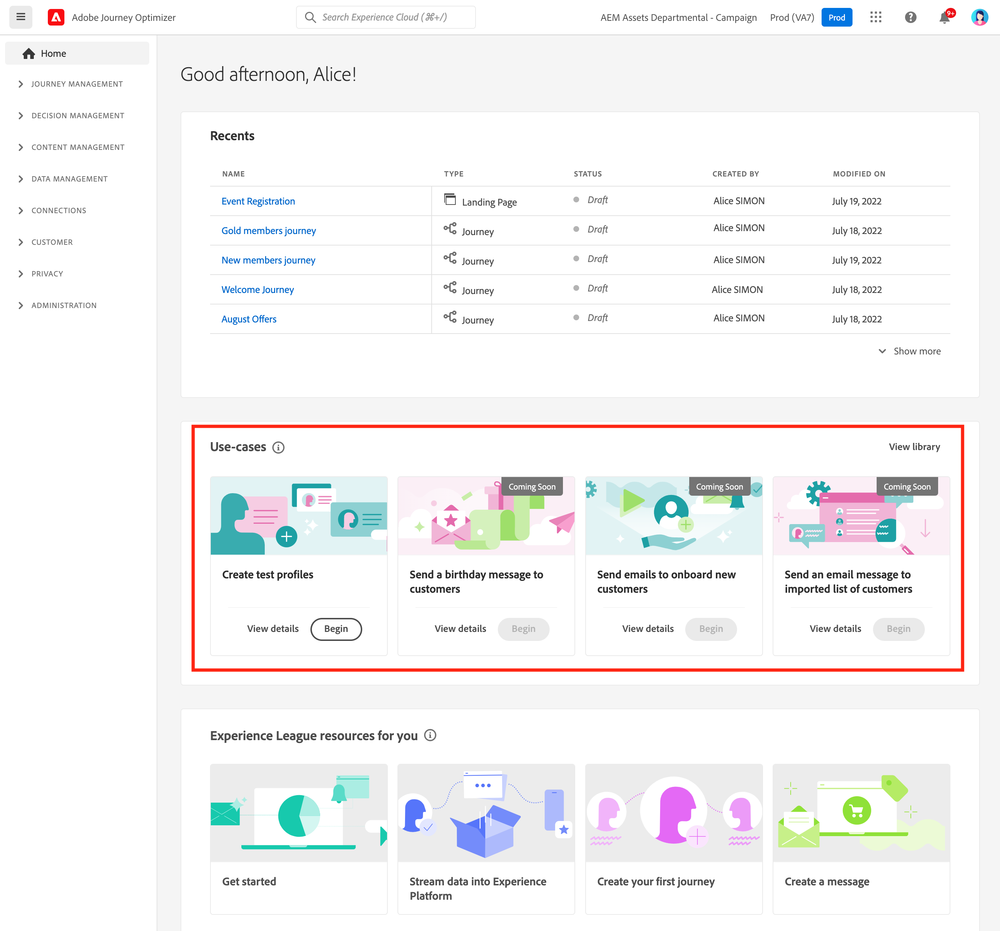

# Användargränssnitt {#cjm-user-interface}

För åtkomst till  [!DNL Adobe Journey Optimizer], ansluta till [Adobe Experience Cloud](https://experience.adobe.com) med din Adobe ID, och [!DNL Journey Optimizer].

De viktigaste begreppen när du bläddrar i användargränssnittet är vanliga i Adobe Experience Platform. Se [Adobe Experience Platform-dokumentation](https://experienceleague.adobe.com/docs/experience-platform/landing/platform-ui/ui-guide.html#adobe-experience-platform-ui-guide){target="_blank"} för mer information.

Vilka komponenter och funktioner som är tillgängliga i användargränssnittet beror på din [behörigheter](../administration/permissions.md) och [licensieringspaket](https://helpx.adobe.com/legal/product-descriptions/adobe-journey-optimizer.html){target="_blank"}. Fråga din Adobe Customer Success Manager för alla frågor.

>[!NOTE]
>
>Den här dokumentationen uppdateras ofta för att återspegla de senaste ändringarna i produktanvändargränssnittet. Vissa skärmbilder kan dock skilja sig något från användargränssnittet.

## Vänster navigering {#left-nav}

Bläddra bland länkarna till vänster för att komma åt dem [!DNL Journey Optimizer] funktioner.

>[!NOTE]
>
>Tillgängliga funktioner kan variera beroende på dina behörigheter och licensavtal.

Nedan finns en fullständig lista över tjänster och funktioner som är tillgängliga i den vänstra navigeringen samt länkar till tillhörande hjälpsidor.

### Start {#left-nav-home}

[!DNL Journey Optimizer] startsidan innehåller viktiga länkar och resurser att starta.

The **[!UICONTROL Recents]** listan innehåller genvägar till nyligen skapade händelser och resor. Den här listan visar datum och status för när de skapades och ändrades.

Bläddra bland användningsexempel i produkten för att börja skapa resurser och meddelanden. [Läs mer](#in-product-use-cases).

Använd länkarna längst ned på startsidan för att lära dig hur du börjar med [!DNL Journey Optimizer]. [Läs mer](#find-help-and-support).

### [!UICONTROL JOURNEY MANAGEMENT] {#left-nav-journey}

Bygg kampanjer och resor från det här avsnittet.

* **[!UICONTROL Campaigns]** - Skapa, konfigurera och samordna kampanjer för att leverera engångsinnehåll till en viss målgrupp via olika kanaler. [Läs mer](../campaigns/get-started-with-campaigns.md)

* **[!UICONTROL Journeys]** - Skapa, konfigurera och samordna era kundresor: kombinera händelser, samordning och åtgärder för att skapa flerstegsscenarier för flera kanaler. [Läs mer](../building-journeys/journey-gs.md#jo-build)

* **[!UICONTROL Landing pages]** - Skapa, utforma, testa och publicera landningssidor: skicka länkar till onlineformulär där användarna kan välja att inte ta emot meddelanden eller prenumerera på specifika tjänster. [Läs mer](../landing-pages/get-started-lp.md)

### [!UICONTROL DECISION MANAGEMENT] {#left-nav-offers}

Skapa erbjudanden och komponenter från det här avsnittet.

* **[!UICONTROL Offers]** - Använd de senaste källorna och datauppsättningarna på den här menyn. Använd det här avsnittet för att skapa erbjudanden. [Läs mer](../offers/offer-library/creating-personalized-offers.md)

* **[!UICONTROL Components]** - Skapa placeringar, regler och taggar. [Läs mer](../offers/offer-library/key-steps.md)

### [!UICONTROL CONTENT MANAGEMENT] {#left-nav-content}

Skapa och hantera innehåll från det här avsnittet.

* **[!UICONTROL Assets]** - [!DNL Adobe Experience Manager Assets Essentials] är en central databas med resurser som du kan använda för att fylla i dina meddelanden. [Läs mer](../content-management/assets-essentials.md)

* **[!UICONTROL Content templates]** - Skapa fristående mallar för att enkelt återanvända anpassat innehåll i Journey Optimizer kampanjer och resor för en snabbare och förbättrad designprocess. [Läs mer](../email/content-templates.md)

* **[!UICONTROL Fragments]** - Skapa och hantera fragment för att underlätta e-postdesignprocessen: skapa anpassade innehållsblock som kan användas för att snabbt sammanställa e-postinnehåll. [Läs mer](../email/fragments.md)

### [!UICONTROL DATA MANAGEMENT] {#left-nav-data}

Hantera data från det här avsnittet.

* **[!UICONTROL Schemas]** - Använd Adobe Experience Platform för att skapa och hantera XDM-scheman (Experience Data Model) på en interaktiv visuell arbetsyta som kallas Schemaredigeraren. [Läs mer](../data/get-started-schemas.md)

* **[!UICONTROL Datasets]** - Alla data som importeras till Adobe Experience Platform lagras i Data Lake som datauppsättningar. En datauppsättning är en lagrings- och hanteringskonstruktion för en datamängd, vanligtvis en tabell, som innehåller ett schema (kolumner) och fält (rader). [Läs mer](../data/get-started-datasets.md)

* **[!UICONTROL Queries]** - Använd Adobe Experience Platform Query Service för att skriva och köra frågor, visa frågor som körts tidigare och få åtkomst till frågor som sparats av användare i organisationen. [Läs mer](../data/get-started-queries.md)

* **[!UICONTROL Monitoring]** - Använd den här menyn för att övervaka dataanvändningen i Adobe Experience Platform användargränssnitt. Läs mer i [Adobe Experience Platform-dokumentation](https://experienceleague.adobe.com/docs/experience-platform/ingestion/quality/monitor-data-ingestion.html){target="_blank"}

### [!UICONTROL CONNECTIONS] {#left-nav-connections}

Hantera dataanslutningar med andra appar och moln i det här avsnittet.

* **[!UICONTROL Sources]** - Använd den här menyn för att importera data från en mängd olika källor, till exempel Adobe-program, molnbaserade lagringsplatser, databaser och mycket annat. Du kan strukturera, etikettera och förbättra inkommande data. [Läs mer](get-started-sources.md)

* **[!UICONTROL Destinations]** - Använd den här menyn för att skapa en direktanslutning till molnlagringsplatser för att exportera innehållet i dina datauppsättningar. [Läs mer](../data/export-datasets.md)

### [!UICONTROL CUSTOMER] {#left-nav-customers}

Hantera era målgrupper och profildata från det här avsnittet.

* **[!UICONTROL Audiences]** - Skapa och hantera målgrupper i Experience Platform och använd dem på era resor. [Läs mer](../audience/about-audiences.md)

* **[!UICONTROL Subscription lists]** - in [!DNL Journey Optimizer], samlas kunder som har valt att gå med i en prenumerationstjänst in i en prenumerationslista. [Läs mer](../landing-pages/subscription-list.md)

* **[!UICONTROL Profiles]** - Kundprofil i realtid skapar en helhetsbild av varje enskild kund och kombinerar data från flera kanaler, inklusive online-, offline-, CRM- och tredjepartsdata. [Läs mer](../audience/get-started-profiles.md)

* **[!UICONTROL Identities]** - Adobe Experience Platform Identity Service hanterar identifieringen av era kunder i realtid, oavsett enhet, kanal och i det närmaste, i det som kallas identitetsdiagram inom Adobe Experience Platform. [Läs mer](../audience/get-started-identity.md)

### [!UICONTROL PRIVACY] {#left-nav-privacy}

Styr din sekretesshantering och dina förfrågningar från det här avsnittet.

* **[!UICONTROL Policies]** - Med Adobe Experience Platform kan ni sätta etiketter på era fält och skapa marknadsföringsåtgärder för varje kanal. Sedan definierar ni en styrningspolicy som är kopplad till en etikett och en marknadsföringsåtgärd. [Läs mer](../action/action-privacy.md)

* **[!UICONTROL Requests]** - Förfrågningar om Provacy hanteras i Adobe Experience Platform Privacy Service. Det innehåller ett RESTful-API och ett användargränssnitt som hjälper dig att hantera kunddataförfrågningar. [Läs mer](../privacy/requests.md)

* **[!UICONTROL Audit]** - Bläddra till det här avsnittet för att kontrollera aktivitetsloggar. [Läs mer](../privacy/audit-logs.md)

* **[!UICONTROL Data hygiene]** - I det här avsnittet kan du konfigurera och schemalägga dataåtgärder för hygienen, så att dina register bevaras på rätt sätt. [Läs mer](../privacy/data-hygiene.md)

### [!UICONTROL ADMINISTRATION] {#left-nav-admin}

* **[!UICONTROL Configurations]** - Använd den här menyn för att konfigurera [Händelser](../event/about-events.md), [Datakällor](../datasource/about-data-sources.md)och [Åtgärder](../action/action.md) att använda på era resor.

  Du kan även komma åt **Rapportering** för att konfigurera rapportering för kampanjexperiment. [Läs mer](../campaigns/reporting-configuration.md)

* **[!UICONTROL Rules]** - Använd det här avsnittet om du vill skapa regler för flerkanalsfrekvens för att styra hur ofta användarna får ett meddelande eller deltar i en resa. [Läs mer](../configuration/frequency-rules.md)

* **[!UICONTROL Alerts]** - Med användargränssnittet kan du visa en historik över mottagna aviseringar baserat på mätvärden som visas av Adobe Experience Platform Observability Insights. I gränssnittet kan du även visa, aktivera och inaktivera tillgängliga varningsregler. [Läs mer](../reports/alerts.md)

* **[!UICONTROL Sandboxes]** - Adobe Experience Platform tillhandahåller sandlådor som partitionerar en instans i separata virtuella miljöer för att utveckla och utveckla program för digitala upplevelser. Bläddra i det här avsnittet för att hantera dina sandlådor. [Läs mer](../administration/sandboxes.md)

* **[!UICONTROL Channels]** - Använd det här avsnittet för att konfigurera dina kanaler, inklusive undermappar, ytor och leveransinställningar. [Läs mer](../configuration/get-started-configuration.md)

* **[!UICONTROL Tags]** - Med enhetliga taggar kan ni enkelt klassificera era resor och kampanjer för att förbättra sökningen från listorna. [Läs mer](../start/search-filter-categorize.md#work-with-unified-tags)

## Användningsexempel inifrån produkten {#in-product-uc}

Från [!DNL Adobe Journey Optimizer] startsida, produktanvändningsexempel är en snabb inmatning för att skapa testprofiler eller era första kundresor.

Exempel:

* **Skapa testprofiler**, för att skapa testprofiler med vår CSV-mall för att testa personaliserade meddelanden och resor. Lär dig implementera det här användningsexemplet [på den här sidan](../audience/creating-test-profiles.md#use-case-1).
* **Skicka ett födelsedagsmeddelande till kunder**, för att automatiskt skicka ett e-postmeddelande och önska dina kunder en viss födelsedag. (kommer snart)
* **Skicka e-post till nya kunder**, för att enkelt skicka upp till två e-postmeddelanden till dina nyregistrerade kunder. (kommer snart)
* **Skicka push-meddelanden till importerad lista över kunder**, för att snabbt skicka ett push-meddelande till en lista över kunder som importerats från en CSV-fil. (kommer snart)

Om du vill veta mer om varje användningsfall klickar du på **[!UICONTROL View details]** länk.

Om du vill köra ett användningsfall klickar du på **[!UICONTROL Begin]** -knappen.

Du kan få åtkomst till körda användningsfall från **[!UICONTROL View library]** -knappen.

## Hitta hjälp och support {#find-help}

Få åtkomst till Adobe Journey Optimizer hjälpsidor från startsidans nedre del.

Använd **Hjälp** -ikon för att få tillgång till hjälpsidor, kontakta support och dela feedback. Du kan söka efter hjälpartiklar och videoklipp i sökfältet.

På varje sida använder du sammanhangsberoende hjälpknappar för att lära dig mer om en funktion och för att bläddra till **[!DNL Adobe Experience League]** dokumentation.

## Språkinställningar {#language-pref}

Användargränssnittet finns på följande språk:

* Engelska
* Franska
* Tyska
* Italienska
* Spanska
* Portugisiska (Brasilien)
* Japanska
* Koreanska
* Traditionell kinesiska
* Förenklad kinesiska

Standardspråket för gränssnittet avgörs av det språk du föredrar i användarprofilen.

Så här byter du språk:

* Klicka **Inställningar** från din avatar, längst upp till höger.
  
* Klicka sedan på det språk som visas under din e-postadress
* Välj önskat språk och klicka på **Spara**. Du kan välja ett andra språk om komponenten som du använder inte är lokaliserad på ditt första språk.
  