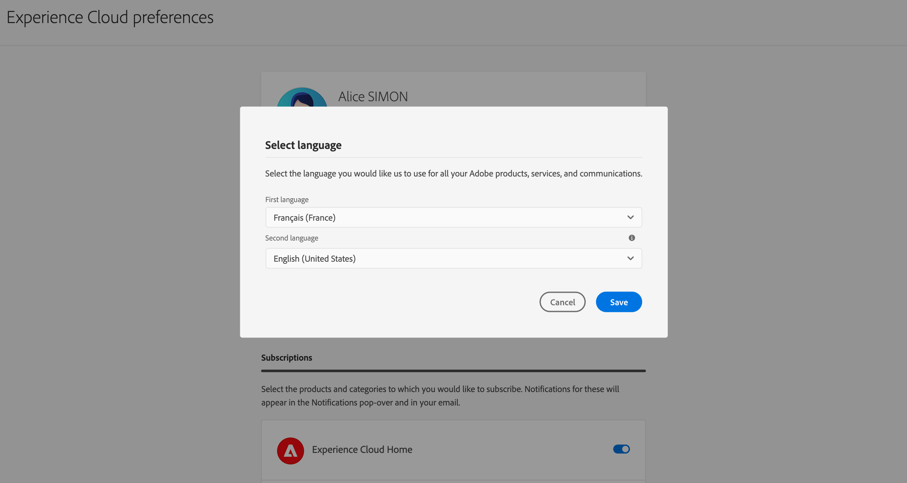

# Användargränssnitt {#cjm-user-interface}

Anslut till [Adobe Experience Cloud](http://experience.adobe.com) och bläddra till [!DNL Journey Optimizer].

De viktigaste begreppen när du bläddrar i användargränssnittet är vanliga i Adobe Experience Platform. Se [Adobe Experience Platform-dokumentation](https://experienceleague.adobe.com/docs/experience-platform/landing/platform-ui/ui-guide.html#adobe-experience-platform-ui-guide){target=&quot;_blank&quot;} om du vill ha mer information.

Vilka komponenter och funktioner som är tillgängliga i användargränssnittet beror på [behörigheter](../administration/permissions.md) och [licensieringspaket](https://helpx.adobe.com/legal/product-descriptions/adobe-journey-optimizer.html){target=&quot;_blank&quot;}. Fråga din Adobe Customer Success Manager för alla frågor.

>[!NOTE]
>
>Den här dokumentationen uppdateras ofta för att återspegla de senaste ändringarna i produktanvändargränssnittet. Vissa skärmbilder kan dock skilja sig något från användargränssnittet.

## Vänster navigering {#left-nav}

Bläddra bland länkarna till vänster för att komma åt dem [!DNL Journey Optimizer] funktioner.

>[!NOTE]
>
>Tillgängliga funktioner kan variera beroende på dina behörigheter och licensavtal.

Nedan finns en fullständig lista över tjänster och funktioner som är tillgängliga i den vänstra navigeringen samt länkar till tillhörande hjälpsidor.

**Start**

[!DNL Journey Optimizer] startsidan innehåller viktiga länkar och resurser att starta. The **[!UICONTROL Recents]** listan innehåller genvägar till nyligen skapade händelser och resor. Den här listan visar datum och status för när de skapades och ändrades.

**[!UICONTROL JOURNEY MANAGEMENT]**

* **[!UICONTROL Journeys]** - Skapa, konfigurera och samordna era kundresor. [Läs mer](../building-journeys/journey-gs.md#jo-build)

* **[!UICONTROL Landing pages]** - Skapa, utforma, testa och publicera landningssidor. [Läs mer](../landing-pages/get-started-lp.md)

**[!UICONTROL DECISION MANAGEMENT]**

* **[!UICONTROL Offers]** - Använd de senaste källorna och datauppsättningarna på den här menyn. Använd det här avsnittet för att skapa nya erbjudanden. [Läs mer](../offers/offer-library/creating-personalized-offers.md)

* **[!UICONTROL Components]** - Skapa placeringar, regler och taggar. [Läs mer](../offers/offer-library/key-steps.md)

**[!UICONTROL CONTENT MANAGEMENT]**

* **[!UICONTROL Assets]** - [!DNL Adobe Experience Manager Assets Essentials] är en central databas med resurser som du kan använda för att fylla i dina meddelanden. [Läs mer](../design/assets-essentials.md)

**[!UICONTROL DATA MANAGEMENT]**

* **[!UICONTROL Schemas]** - Använd Adobe Experience Platform för att skapa och hantera XDM-scheman (Experience Data Model) på en interaktiv visuell arbetsyta som kallas Schemaredigeraren. [Läs mer](get-started-schemas.md)

* **[!UICONTROL Datasets]** - Alla data som importeras till Adobe Experience Platform lagras i Data Lake som datauppsättningar. En datauppsättning är en lagrings- och hanteringskonstruktion för en datamängd, vanligtvis en tabell, som innehåller ett schema (kolumner) och fält (rader). [Läs mer](get-started-datasets.md)

* **[!UICONTROL Queries]** - Använd Adobe Experience Platform Query Service för att skriva och köra frågor, visa frågor som körts tidigare och få åtkomst till frågor som sparats av användare i organisationen. [Läs mer](get-started-queries.md)

* **[!UICONTROL Monitoring]** - Använd den här menyn för att övervaka dataanvändningen i Adobe Experience Platform användargränssnitt. [Läs mer](https://experienceleague.adobe.com/docs/experience-platform/ingestion/quality/monitor-data-ingestion.html){target=&quot;_blank&quot;}

**[!UICONTROL CONNECTIONS]**

* **[!UICONTROL Sources]** - Använd den här menyn för att importera data från en mängd olika källor - som Adobe-program, molnbaserade lagringsplatser, databaser med mera - samt strukturera, etikettera och förbättra inkommande data. [Läs mer](get-started-sources.md)

**[!UICONTROL CUSTOMER]**

* **[!UICONTROL Segments]** - Skapa och hantera definitioner av segment i Experience Platform och utnyttja dem på era resor. [Läs mer](../segment/about-segments.md)

* **[!UICONTROL Profiles]** - Kundprofil i realtid skapar en helhetsbild av varje enskild kund och kombinerar data från flera kanaler, inklusive online-, offline-, CRM- och tredjepartsdata. [Läs mer](../segment/get-started-profiles.md)

* **[!UICONTROL Identities]** - Adobe Experience Platform Identity Service hanterar identifieringen av era kunder i realtid, oavsett enhet, kanal och i det närmaste, i det som kallas identitetsdiagram inom Adobe Experience Platform. [Läs mer](../segment/get-started-identity.md)

**[!UICONTROL ADMINISTRATION]**

* **[!UICONTROL Journey Administration]** - Använd den här menyn för att konfigurera [händelser](../event/about-events.md), [datakällor](../datasource/about-data-sources.md) och [funktionsmakron](../action/action.md) att använda på era resor.

* **[!UICONTROL Sandboxes]** - Adobe Experience Platform tillhandahåller sandlådor som partitionerar en instans i separata virtuella miljöer för att utveckla och utveckla program för digitala upplevelser. [Läs mer](../administration/sandboxes.md)

* **[!UICONTROL Alerts]** - Med användargränssnittet kan du visa en historik över mottagna aviseringar baserat på mätvärden som visas av Adobe Experience Platform Observability Insights. I gränssnittet kan du även visa, aktivera och inaktivera tillgängliga varningsregler. [Läs mer](https://experienceleague.adobe.com/docs/experience-platform/observability/alerts/overview.html){target=&quot;_blank&quot;}

## Användningsexempel inifrån produkten {#in-product-uc}

Utnyttja [!DNL Adobe Journey Optimizer] exempel från startsidan och ge några snabba indata för att skapa en kundresa.

Exempel:

* **Skapa testprofiler**, för att skapa testprofiler med vår CSV-mall för att testa personaliserade meddelanden och resor. Lär dig implementera det här användningsexemplet [på den här sidan](../segment/creating-test-profiles.md#use-case-1).
* **Skicka ett födelsedagsmeddelande till kunder**, för att automatiskt skicka ett e-postmeddelande och önska dina kunder en viss födelsedag. (kommer snart)
* **Skicka e-post till nya kunder**, för att enkelt skicka upp till två e-postmeddelanden till dina nyregistrerade kunder. (kommer snart)
* **Skicka push-meddelanden till importerad lista över kunder**, för att snabbt skicka ett push-meddelande till en lista över kunder som importerats från en CSV-fil. (kommer snart)

Klicka **[!UICONTROL View details]** om du vill veta mer om de olika användningsexemplen.

Klicka på **[!UICONTROL Begin]** för att starta användningsfallet.

Du kan få åtkomst till körda användningsfall från **[!UICONTROL View use case library]** -knappen.

## Tillgänglighet{#accessibility}

Tillgänglighetsfunktionerna i [!DNL Adobe Journey Optimizer] ärvs från Adobe Experience Platform:

* Tangentbordstillgänglighet
* Färgkontrast
* Bekräfta att du fyllt i samtliga obligatoriska fält

[Läs mer](https://experienceleague.adobe.com/docs/experience-platform/accessibility/features.html){target=&quot;_blank&quot;} i Adobe Experience Platform-dokumentationen.

Du kan använda dessa vanliga kortkommandon i [!DNL Journey Optimizer]:

| Åtgärd | Genväg |
| --- | --- |
| Växla mellan element, avsnitt och menygrupper i användargränssnittet | Tabb |
| Gå bakåt mellan element, avsnitt och menygrupper i användargränssnittet | Skift+Tabb |
| Flytta inom avsnitt för att ange fokus till enskilda element | Pil |
| Markera eller rensa ett element som är i fokus | Enter eller mellanslagstangenten |
| Avbryt en markering, komprimera en ruta eller stänga en dialogruta | Esc |

[Läs mer](https://experienceleague.adobe.com/docs/experience-platform/accessibility/custom.html){target=&quot;_blank&quot;} i Adobe Experience Platform-dokumentationen.

Du kan använda dessa kortkommandon i vissa delar av Journey Optimizer:

<table>
  <thead>
    <tr>
      <th>Gränssnittselement</th>
      <th>Åtgärd</th>
      <th>Genväg</th>
    </tr>
  </thead>
  <tr>
    <td>Förteckning över resor, åtgärder, datakällor eller händelser</td>
    <td>Skapa en resa, en åtgärd, en datakälla eller en händelse</td>
    <td>C</td>
  </tr>
  <tr>
    <td rowspan="3">Researbetsyta med utkaststatus</td>
    <td>Lägg till en aktivitet från den vänstra paletten vid den första tillgängliga positionen, uppifrån och ned</td>
    <td>Dubbelklicka på aktiviteten</td>
  </tr>
  <tr>
    <td>Välj alla aktiviteter</td>
    <td>Ctrl + A (Windows) Cmd + A (Mac)</td>
  </tr>
  <tr>
    <td>Ta bort de valda aktiviteterna</td>
    <td>Ta bort eller Backsteg och bekräfta sedan borttagningen genom att ange</td>
  </tr>
  <tr>
  <td rowspan="3">

Konfigurationsruta för dessa element:

<ul>
  <li>Aktivitet under en resa</li>
  <li>Händelse</li>
  <li>Datakälla</li>
  <li>Åtgärd</li>
</ul>

</td>
    <td>Flytta till nästa fält som ska konfigureras</td>
    <td>Tabb</td>
  </tr>
  <tr>
    <td>Spara ändringar och stäng konfigurationsfönstret</td>
    <td>Retur</td>
  </tr>
  <tr>
    <td>Ignorera ändringar och stäng konfigurationsfönstret</td>
    <td>Esc</td>
  </tr>
  <tr>
    <td rowspan="4">Resa i testläge</td>
    <td>Aktivera eller inaktivera testläget</td>
    <td>T</td>
  </tr>
  <tr>
    <td>Utlösa en händelse i en händelsebaserad resa</td>
    <td>E</td>
  </tr>
  <tr>
    <td>

Utlös en händelse i en segmentbaserad resa för vilken **[!UICONTROL Single profile at a time]** alternativ är aktiverat

</td>
    <td>P</td>
  </tr>
  <tr>
    <td>Visa testloggarna</td>
    <td>L</td>
  </tr>
<!-- //Ajouter ce raccourci quand il marchera (actuellement, le raccourci Ctrl/Cmd+F du navigateur a priorité sur celui de AJO).//
  <tr>
    <td>Page with a search bar</td>
    <td>Select the search bar</td>
    <td>Ctrl/Command + F</td>
  </tr>
-->
  <tr>
    <td>Textfält</td>
    <td>Markera all text i det markerade fältet</td>
    <td>Ctrl + A (Windows) Cmd + A (Mac)</td>
  </tr>
  <tr>
    <td rowspan="2">Popup-fönster</td>
    <td>Spara ändringarna eller bekräfta åtgärden</td>
    <td>Retur</td>
  </tr>
  <tr>
    <td>Stäng fönstret</td>
    <td>Esc</td>
  </tr>
  <tr>
    <td>Enkel uttrycksredigerare</td>
    <td>Markera och lägga till ett fält</td>
    <td>Dubbelklicka på ett fält</td>
  </tr>
  <tr>
    <td>Bläddra bland XDM-fält</td>
    <td>Markera alla fält i en nod</td>
    <td>Markera den överordnade noden</td>
  </tr>
  <tr>
    <td>Förhandsgranska nyttolast</td>
    <td>Välj nyttolast</td>
    <td>Ctrl + A (Windows) Cmd + A (Mac)</td>
  </tr>
</table>

## Hitta hjälp och support {#find-help}

Få åtkomst till Adobe Journey Optimizer hjälpsidor från startsidans nedre del.

Använd **Hjälp** ikon för att få tillgång till hjälpsidor, kontakta support och dela feedback. Du kan söka efter hjälpartiklar och videoklipp i sökfältet.

## Webbläsare som stöds {#browsers}

Adobe [!DNL Journey Optimizer] -gränssnittet är utformat för att fungera optimalt i den senaste versionen av Google Chrome. Du kan ha problem med att använda vissa funktioner i äldre versioner eller i andra webbläsare.

## Språkinställningar {#language-pref}

Användargränssnittet finns för närvarande på följande språk:

* Engelska
* Franska
* Tyska

Standardspråket för gränssnittet avgörs av det språk du föredrar i användarprofilen.

Så här byter du språk:

* Klicka **Inställningar** från din avatar, längst upp till höger.
   
* Klicka sedan på det språk som visas under din e-postadress
* Välj önskat språk och klicka på **Spara**. Du kan välja ett andra språk om komponenten som du använder inte är lokaliserad på ditt första språk.
   

## Sökning{#unified-search}

Var som helst från Adobe Journey Optimizer-gränssnittet kan du använda sökfunktionen för enhetliga Adobe Experience Cloud i mitten av det övre fältet för att hitta resurser, resor, datauppsättningar med mera i dina sandlådor.

Börja skriva in innehåll för att visa de bästa resultaten. Hjälpartiklar om de angivna nyckelorden visas också i resultaten.

Tryck **Retur** för att få tillgång till alla resultat och filtrera efter affärsobjekt.

## Filterlistor{#filter-lists}

I de flesta av listorna kan du söka efter ett visst objekt och välja filtervillkor.

Du kommer åt filter genom att klicka på filterikonen högst upp till vänster i listan. Med filtermenyn kan du filtrera de visade elementen enligt olika villkor. Du kan välja att endast visa element av en viss typ eller status, de element du har skapat eller de element som har ändrats under de senaste 30 dagarna. Alternativen varierar beroende på sammanhanget.

I listan över resor kan du filtrera resorna efter status, typ och version från **[!UICONTROL Status and version filters]**. Typen kan vara: **[!UICONTROL Unitary event]**, **[!UICONTROL Segment qualification]**, **[!UICONTROL Read segment]**, **[!UICONTROL Business event]** eller **[!UICONTROL Burst]**. Du kan välja att endast visa resor som använder en specifik händelse, fältgrupp eller åtgärd från **[!UICONTROL Activity filters]** och **[!UICONTROL Data filters]**. The **[!UICONTROL Publication filters]** gör att du kan välja ett publiceringsdatum eller en användare. Du kan till exempel välja att visa de senaste versionerna av direktresor som publicerades igår. [Läs mer](../building-journeys/using-the-journey-designer.md).

>[!NOTE]
>
>Observera att kolumner som visas kan personaliseras med hjälp av konfigurationsknappen längst upp till höger i listorna. Personalisering sparas per användare.

Använd **[!UICONTROL Last update]** och **[!UICONTROL Last update by]** kolumner för att kontrollera när den senaste uppdateringen av dina resor gjordes och vem som sparade den.

I konfigurationsrutorna Händelse, Datakälla och Åtgärd visas **[!UICONTROL Used in]** fältet visar antalet resor som använder den aktuella händelsen, fältgruppen eller åtgärden. Du kan klicka på knappen **[!UICONTROL View journeys]** för att visa en lista över motsvarande resor.

I listorna kan du utföra grundläggande åtgärder för varje element. Du kan till exempel skapa dubbletter eller radera en post.

