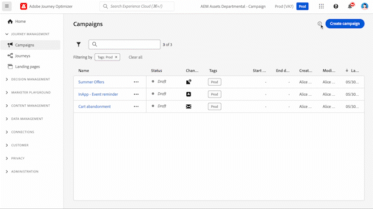

# Navigera i gränssnittet {#user-interface}

Om du vill få tillgång till Adobe Journey Optimizer loggar du in på [Adobe Experience Cloud](https://experience.adobe.com) med din Adobe ID och väljer sedan [!DNL Journey Optimizer].

>[!NOTE]
>
>* Vilka komponenter och funktioner som är tillgängliga i din miljö beror på dina [behörigheter](../administration/permissions.md) och [licenspaket](https://helpx.adobe.com/se/legal/product-descriptions/adobe-journey-optimizer.html){target="_blank"}.
>* Dokumentationen uppdateras ofta. Vissa skärmbilder kan skilja sig något från gränssnittet.

## Snabbdemo {#quick-tour}

Journey Optimizer gränssnitt består av fyra huvudområden:

1. **Vänster navigering** - Få tillgång till alla funktioner som är ordnade efter funktion
2. **Övre fältet** - Universell sökning, hjälp, meddelanden och inställningar
3. **Startsida** - Snabb åtkomst till senaste objekt och användbara resurser
4. **Huvudarbetsyta** - Där du skapar och hanterar ditt innehåll

## Vänster navigering {#left-nav}

I den vänstra navigeringen ordnas Journey Optimizer-funktioner i funktionskategorier. Vilka menyalternativ som är tillgängliga beror på dina behörigheter och din licens.

### Huvudavsnitt {#main-sections}

**Hem** - Din startpunkt med snabb åtkomst till nyligen skapade objekt och användbara resurser

**Resehantering** - Skapa och hantera kundupplevelser
* **Kampanjer** - Skapa engångs- eller schemalagda meddelanden till specifika målgrupper. [Kom igång med kampanjer](../campaigns/get-started-with-campaigns.md)
* **Resor** - Bygg flerstegskunderna kundupplevelser i flera kanaler. [Skapa din första resa](../building-journeys/journey-gs.md)
* **Rapporter** - Analysera prestanda med integrerade Customer Journey Analytics-rapporter. [Visa rapportdokumentation](../reports/campaign-global-report-cja.md)

**Beslutshantering** - Hantera personaliserade erbjudanden. [Läs om beslutshantering](../offers/get-started/starting-offer-decisioning.md)
* **Erbjudanden** - Skapa och hantera personaliserade erbjudanden
* **Komponenter** - Konfigurera ersättningar, regler och taggar för erbjudanden

**Innehållshantering** - Skapa och ordna innehåll
* **Assets** - Centraliserad databas för bilder och media. [Hantera resurser](../integrations/assets.md)
* **Innehållsmallar** - Återanvändbara meddelandemallar för kampanjer och resor. [Skapa mallar](../content-management/content-templates.md)
* **Fragment** - Innehållsblock som kan användas i flera meddelanden. [Arbeta med fragment](../content-management/fragments.md)
* **Landningssidor** - Webbformulär för prenumerationer och inställningar. [Utforma landningssidor](../landing-pages/get-started-lp.md)

**Datahantering** - Hantera din datamängd. [Läs om scheman och datauppsättningar](../data/get-started-schemas.md)
* **Scheman** - Definiera datastruktur
* **Datauppsättningar** - Lagra och hantera datainsamlingar
* **Frågor** - Skriv och kör frågor
* **Övervakning** - Spåra datainmatning

**Anslutningar** - Integrera med andra system
* **Källor** - Infoga data från externa system. [Konfigurera källor](get-started-sources.md)
* **Destinationer** - Exportera data till molnlagring. [Konfigurera mål](../data/export-datasets.md)

**Kund** - Hantera målgrupper och profiler
* **Publiker** - Skapa och hantera kundsegment. [Arbeta med målgrupper](../audience/about-audiences.md)
* **Prenumerationslistor** - Hantera anmälningslistor. [Hantera prenumerationer](../landing-pages/subscription-list.md)
* **Profiler** - Visa enhetliga kundprofiler. [Utforska profiler](../audience/get-started-profiles.md)
* **Identiteter** - Hantera identitetsupplösning. [Lär dig mer om identiteter](../audience/get-started-identity.md)

**Sekretess** - Kontrollera sekretess och efterlevnad. [Sekretessöversikt](../privacy/get-started-privacy.md)
* **Principer** - Definiera datastyrningsprinciper
* **Begäranden** - Hantera sekretessförfrågningar (GDPR, CCPA)
* **Granskning** - Granska aktivitetsloggar. [Visa granskningsloggar](../privacy/audit-logs.md)
* **Datalifecycle** - Konfigurera datalagring

**Administration** - Konfigurera systeminställningar. [Översikt över åtkomstkontroll](../administration/permissions-overview.md)
* **Konfigurationer** - Konfigurera händelser, datakällor och åtgärder. [Konfigurera kanaler](../configuration/get-started-configuration.md)
* **Affärsregler** - Kontrollera meddelandefrekvens och reseinmatning. [Konfigurera affärsregler](../conflict-prioritization/rule-sets.md)
* **Varningar** - Visa och hantera systemvarningar. [Övervaka aviseringar](../reports/alerts.md)
* **Sandlådor** - Hantera miljöer och kopiera objekt mellan sandlådor. [Arbeta med sandlådor](../administration/sandboxes.md)
* **Kanaler** - Konfigurera kanalinställningar och leveransbarhet
* **Taggar** - Ordna och kategorisera innehåll

## Funktioner på översta raden {#top-bar}

### Universell sökning {#search}

Använd sökikonen för att snabbt hitta resor, kampanjer, resurser och andra objekt i Journey Optimizer. Skriv nyckelord för att se relevanta resultat från alla delar av plattformen.

### Hjälp och support {#help}

Klicka på ikonen **Hjälp** för att:
* Sök i hjälpartiklar och videoklipp
* Använd sammanhangsberoende hjälp för den aktuella sidan
* Kontakta Adobe support
* Dela feedback

### Meddelanden {#notifications}

Aktivera meddelanden i produkten och e-postmeddelanden för att hålla dig informerad om:
* **Varningar** - Systemfel och prestandaproblem
* **Godkännanden** - Begäranden som kräver din granskning
* **Nya versioner** - Produktuppdateringar och nya funktioner

Så här konfigurerar du meddelanden:

1. Klicka på din profilikon och välj **[!UICONTROL Preferences]**
2. Under **[!UICONTROL Notifications]**, sök efter **[!UICONTROL Journey Optimizer]**
3. Aktivera de meddelandetyper som du vill ta emot

{width="60%" align="center"}

### Språkinställningar {#language}

Gränssnittet finns på engelska, franska, tyska, italienska, spanska, portugisiska (Brasilien), japanska, koreanska, kinesiska (traditionell) och förenklad kinesiska.

Så här byter du språk:

1. Klicka på **Inställningar** på profilmenyn
2. Välj önskat språk
3. Välj ett andra språk som reservspråk
4. Klicka på **Spara**

## Hemsida {#home-page}

Hemsidan innehåller följande:

* **Senaste** - genvägar till nyligen skapade händelser, resor, kampanjer och andra objekt
* **Använd fall** - Fördefinierade scenarier som hjälper dig att komma igång snabbt (skapa testprofiler, skicka födelsedagskalendrar osv.)
* **Resurser** - Länkar till dokumentation, självstudiekurser och support

### Exempel på produktanvändning {#use-cases}

Snabbstarta-arbetsflöden som hjälper dig att utföra vanliga uppgifter:

* **Skapa testprofiler** - Generera testprofiler med CSV-mallar
* **Skicka födelsedagsmeddelanden** - Skicka födelsedagsmeddelanden automatiskt (kommer snart)
* **Bädda in nya kunder** - välkomstserie för nya kunder (kommer snart)
* **Skicka push-meddelanden till importerade listor** - Snabba push-meddelanden från CSV-data (kommer snart)

Klicka på **[!UICONTROL View details]** om du vill veta mer om varje användningsfall eller på **[!UICONTROL Begin]** om du vill börja.

## AI-assistenten {#ai-assistant}

AI Assistant ger omedelbar hjälp och driftsinsikter. Klicka på ikonen AI-assistenten i det övre fältet för att:
* Få svar på produktfunktioner
* Få operativa insikter om era resor
* Navigera mellan koncept och metodtips

[Läs mer om AI Assistant](ai-features.md#ai-assistant)

## Relaterade ämnen {#related-topics}

* [Välj utbildningsväg efter roll](quick-start.md)
* [Söka, filtrera och kategorisera innehåll](search-filter-categorize.md)
* [Så här fungerar Journey Optimizer](understanding-ajo.md)
* [Tillgänglighetsfunktioner](accessibility.md)

<!--CONTEXTUAL HELP TO DISPATCH IN DOCS ONCE FEATURE LIVE-->

<!--ORCHESTRATED CAMPAIGNS - Overview page-->

<!--OVERVIEW TAB ORCHESTRATED CAMPAIGNS SKU only-->

>[!CONTEXTUALHELP]
>id="ajo_oc_campaign_ovv_1"
>title="Kampanjsamordning"
>abstract="Dela, kombinera, berika och hantera relationsdata för att definiera er målgrupp"

>[!CONTEXTUALHELP]
>id="ajo_oc_campaign_ovv_2"
>title="Utnyttja data för flera enheter"
>abstract="Läs om hur samordnade kampanjer kan utnyttja relationsdatauppsättningar för att förbättra data för segmentering och personalisering"

>[!CONTEXTUALHELP]
>id="ajo_oc_campaign_ovv_3"
>title="Ad hoc-segmentering och exakt antal"
>abstract="Bygg segmentet steg för steg med exakta räkningar"

>[!CONTEXTUALHELP]
>id="ajo_oc_campaign_ovv_4"
>title="Tillgängliga kanaler"
>abstract="E-post, SMS, push-meddelanden, direktreklam"

<!--OVERVIEW TAB ORCHESTRATED CAMPAIGNS + JOURNEYS SKU -->

>[!CONTEXTUALHELP]
>id="ajo_oc_jo_camppaign_ovv_1"
>title="Guidat användargränssnitt för att skapa och skicka en kampanj"
>abstract="Ange en eller flera åtgärder med en kanal, välj en målgrupp, ange ett innehåll, definiera ett schema så är du redo att skicka"

>[!CONTEXTUALHELP]
>id="ajo_oc_jo_camppaign_ovv_2"
>title="Tillgängliga kanaler"
>abstract="E-post, SMS, push-meddelanden, In-app, webb, kodbaserade upplevelser"

<!--OVERVIEW TAB ORCHESTRATED CAMPAIGNS - API triggered tab -->

>[!CONTEXTUALHELP]
>id="ajo_oc_api_camppaign_ovv_1"
>title="Kampanjer utlösta av Transactional API"
>abstract="Utlösa meddelanden i realtid via API-anrop"

>[!CONTEXTUALHELP]
>id="ajo_oc_api_camppaign_ovv_2"
>title="Marknadsföringsmeddelanden"
>abstract="Kampanjinnehåll (kräver deltagande, enligt affärsregler)"

>[!CONTEXTUALHELP]
>id="ajo_oc_api_camppaign_ovv_3"
>title="Transaktionsmeddelanden"
>abstract="Tjänstrelaterat innehåll (bekräftelse, varningar, som inte kräver godkännande av marknadsföringen)"

>[!CONTEXTUALHELP]
>id="ajo_oc_api_camppaign_ovv_4"
>title="Tillgängliga kanaler"
>abstract="E-post, SMS, push-meddelanden"

<!--APPROVAL POLICIES-->

>[!CONTEXTUALHELP]
>id="ajo_campaigns_edit_disabled"
>title="Redigera inaktiverat"
>abstract="Redigera inaktiverat (kampanjer)"

>[!CONTEXTUALHELP]
>id="ajo_journey_edit_disabled"
>title="Redigera inaktiverat"
>abstract="Redigera inaktiverat (resor)"

>[!CONTEXTUALHELP]
>id="ajo_approval_policy_approval_status"
>title="Godkännandestatus"
>abstract="Godkännandestatus"

>[!CONTEXTUALHELP]
>id="ajo_campaigns_approve"
>title="Godkänn"
>abstract="Godkänn (kampanjer)"

>[!CONTEXTUALHELP]
>id="ajo_journey_approve"
>title="Godkänn"
>abstract="Godkänn (resor)"

>[!CONTEXTUALHELP]
>id="ajo_journey_simulation"
>title="Simulera din resa"
>abstract="Journey Simulation gör att du kan validera dina resor och se hur de fungerar innan de aktiveras. Den använder data från en tränad modell för att tillhandahålla siffror över hela resan för att se hur resan kommer att fungera i ett verkligt scenario."

<!-- WEBHOOKS -->

>[!CONTEXTUALHELP]
>id="ajo_channels_feedback_webhook_settings"
>title="Aktivera webhooks"
>abstract="Gör det möjligt för webbhooks att få realtidsfeedback om hur dina meddelanden fungerar. Innan du aktiverar det här alternativet bör du kontrollera att du har konfigurerat en webkrok på menyn **Administration** / **Kanaler** / **Feedback Webkrok** ."

>[!CONTEXTUALHELP]
>id="ajo_channels_feedback_webhook_settings_create"
>title="Feedback Webhooks"
>abstract="Med hjälp av feedback-webhooks kan ni få realtidsfeedback om körningsstatus för meddelanden som skickas med transaktionsutlösta API-kampanjer. Endast en webbkrokkonfiguration per kombination av organisation + sandlåda tillåts."

>[!CONTEXTUALHELP]
>id="ajo_channels_feedback_webhook_settings_configuration"
>title="Grundkonfiguration"
>abstract="I det här avsnittet anger du ett beskrivande namn som identifierar webkroken och markerar de kanaler som den här webbokroken ska få feedback för (e-post och/eller SMS). Ange HTTPS-slutpunkten där feedback-händelser måste skickas i fältet Webkroks-URL."

>[!CONTEXTUALHELP]
>id="ajo_channels_feedback_webhook_settings_authentication"
>title="Autentisering"
>abstract="Om din slutpunkt kräver JWT-autentisering väljer du **JWT-autentisering** i listan och anger nödvändig information."

>[!CONTEXTUALHELP]
>id="ajo_channels_feedback_webhook_settings_header_parameters"
>title="Huvudparametrar"
>abstract="I det här avsnittet kan du konfigurera ytterligare anpassade rubriker som ska skickas med varje webkrok-begäran."
