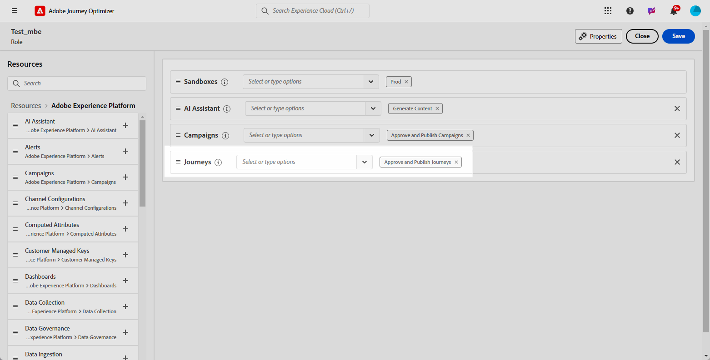
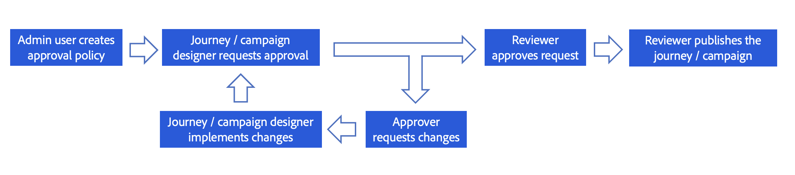
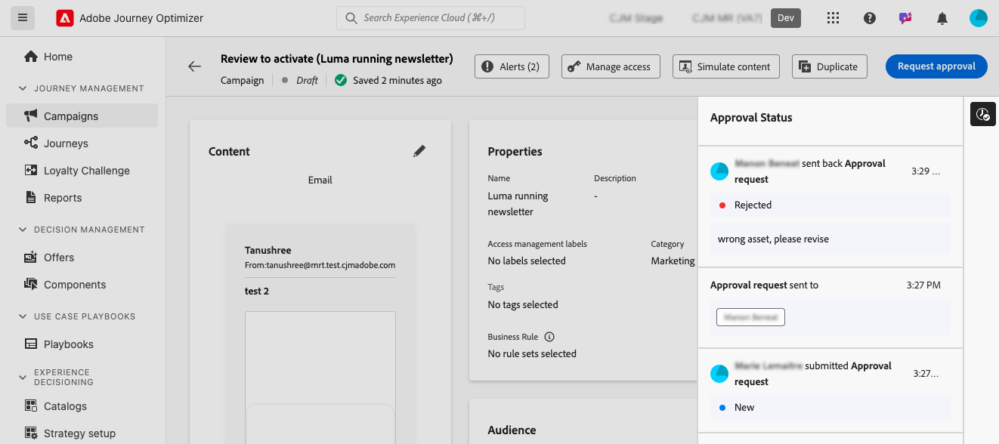

# Kom igång med godkännande av resor och kampanjer {#send-proofs}

## Kom igång med godkännandepolicyer {#gs}

Med Journey Optimizer kan ni skapa en godkännandeprocess som gör det möjligt för marknadsföringsteamen att se till att kampanjer och resor granskas och signeras av lämpliga intressenter innan de publiceras.

Godkännandeprofiler inför ett strukturerat arbetsflöde direkt i användargränssnittet, vilket eliminerar behovet av externa medier som e-post eller uppgiftshanteringsverktyg och säkerställer att alla godkännanden hanteras och spåras centralt.

Dessutom ger den här funktionen bättre kontroll över publiceringen av era resor och kampanjer: Med godkännandeprocessen inbäddad i Journey Optimizer förblir kampanjer och resor i ett &quot;låst&quot; läge under granskningen, vilket säkerställer att inga ändringar eller oavsiktliga aktiveringar sker innan alla nödvändiga godkännanden har införts.

## Förhandskrav {#prerequisites}

Innan du startar kontrollerar du att behörigheterna nedan har konfigurerats.

För att få åtkomst till godkända och publicerade resor och kampanjer måste användarna beviljas behörigheterna **Godkänn och publicera kampanjer** och **Godkänn och publicera resor**. [Läs mer](../administration/permissions.md)

+++  Lär dig hur du tilldelar godkännanderelaterade behörigheter

1. Gå till fliken **Roller** i produkten **Behörigheter** och välj önskad **roll**.

1. Klicka på **Redigera** om du vill ändra behörigheterna.

1. Lägg till resursen **Kampanjer** och välj sedan **Godkänn och publicera kampanjer** i listrutan.

   {zoomable="yes"}

1. Lägg till resursen **Resurser** och välj sedan **Godkänn och publicera resor** i listrutan.

   {zoomable="yes"}

1. Klicka på **Spara** om du vill använda ändringarna.

Alla användare som redan har tilldelats den här rollen får sina behörigheter automatiskt uppdaterade.

1. Om du vill tilldela den här rollen till nya användare går du till fliken **Användare** på kontrollpanelen **Roller** och klickar på **Lägg till användare**.

1. Ange användarens namn, e-postadress eller välj i listan och klicka sedan på **Spara**.

1. Om användaren inte har skapats tidigare, se [den här dokumentationen](https://experienceleague.adobe.com/en/docs/experience-platform/access-control/abac/permissions-ui/users).

Användaren får ett e-postmeddelande med instruktioner om hur du kommer åt instansen.

+++

## Översikt över godkännandeprocessen {#process}

Den globala godkännandeprocessen är följande:

{zoomable="yes"}

1. **Inställningar för godkännandeprofiler**

   En administratörsanvändare skapar en policy för godkännande, som definierar villkoren som ska gälla för resor eller kampanjer. Du kan till exempel skapa en godkännandeprincip som kräver att alla schemalagda kampanjer som skapas av en viss användare ska godkännas innan de aktiveras. [Lär dig hur du skapar godkännandeprofiler](approval-policies.md)

1. **Kampanj/resa skickas för godkännande**

   Kampanjskaparna skapar en resa eller kampanj och skickar in den för godkännande. Kampanjen/resan försätts i läget&quot;Under granskning&quot;, där inga ändringar kan göras om inte begäran avbryts. [Lär dig hur du begär godkännande](request-approval.md)

   >[!NOTE]
   >
   >Kampanjer och resor behöver endast skickas in för godkännande om det finns en godkännandepolicy. Om ingen sådan policy gäller kan skaparen publicera kampanjen eller resan direkt utan att kräva godkännande.

1. **Granska och godkänn**

   Godkännaren/godkännarna som definieras i den godkännandepolicy som gäller för resan eller kampanjen får ett meddelande(n). De kan granska resan eller kampanjinnehållet, målgruppen och inställningarna. Om ändringar behövs begär godkännaren dem och returnerar kampanjen till&quot;Utkast&quot; för revisioner. Om de är redo kan de aktivera och lansera resan eller kampanjen. [Lär dig hur du granskar och godkänner en begäran](review-approve-request.md)

## Övervaka godkännandebegäranden {#monitor}

Du kan övervaka alla begäranden om godkännande och ändring som har skickats in för en viss resa eller kampanj. Det gör du genom att klicka på ikonen **[!UICONTROL Show Audit Trail]** som finns i det övre högra avsnittet på arbetsytan för resan eller på granskningsskärmen för kampanjer.

## Ytterligare resurser

* **[Skapa godkännandeprinciper](approval-policies.md)** - Lär dig hur du ställer in godkännandeprinciper för att framtvinga granskningsarbetsflöden för kampanjer och resor.
* **[Begär godkännande](request-approval.md)** - Lär dig hur du skickar in innehåll för godkännande och spårar godkännandestatus.
* **[Granska och godkänn begäranden](review-approve-request.md)** - Lär dig hur du granskar, godkänner eller avvisar godkännandebegäranden som godkännare.
* **[Simulera med exempelindata](simulate-sample-input.md)** - Lär dig hur du testar och validerar innehåll med exempelprofildata.
