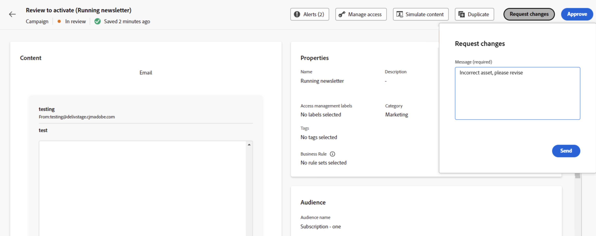

# Granska och godkänn en begäran {#approve-requests}

Om en policy för godkännande gäller för en resa eller kampanj måste den skickas in för godkännande för att kunna publiceras. För att göra detta skickar den som skapat resan/kampanjen en begäran till den eller de godkännare som definierats i godkännandeprincipen och resan/kampanjen får statusen **[!UICONTROL In review]**.

Om du har valts som godkännare meddelas du via ett e-postmeddelande och en Journey Optimizer-avisering, som du kommer åt när du klickar på klockikonen till höger på skärmen, på fliken **[!UICONTROL Requests]**.

Om du vill granska resan/kampanjen öppnar du den i e-postmeddelandet eller varningen och kontrollerar dess inställningar som målgrupp, innehåll eller inställningar.
När du är klar kan du antingen [godkänna och publicera resan/kampanjen](#approve) eller [begära ändringar innan du aktiverar den](#changes).

>[!NOTE]
>
>Att granska en kampanj är ett skrivskyddat steg: du kan visualisera alla dess inställningar men inte utföra någon åtgärd på den.
>
>Innan du granskar en resa eller kampanj måste du se till att du har de behörigheter som krävs.

## Godkänn och publicera en resa/kampanj {#approve}

Om en resa eller kampanj är klar att publiceras kan du godkänna den genom att klicka på knappen **[!UICONTROL Approve]**.

Klicka på **[!UICONTROL Approve and activate]** i det fönster som visas för att göra resan/kampanjen offentlig.

## Begär ändringar av en resa/kampanj {#changes}

Om ändringar behövs i en resa eller kampanj som skickats för godkännande, kan du skicka en begäran till den som skapat filen så att han/hon gör de ändringar som behövs.

Klicka på knappen **[!UICONTROL Request changes]** om du vill göra det. I rutorna som öppnas anger du ett meddelande med detaljerad information om din begäran och klickar på **[!UICONTROL Send]** för att skicka din begäran.

När begäran har skickats meddelas den som skapat resan/kampanjen via ett e-postmeddelande och en avisering från Journey Optimizer. Kampanjen återgår till statusen Utkast. När ändringarna har integrerats kan den som skapat resan/kampanjen skicka in den på nytt för godkännande.

>[!NOTE]
>
> Om du inte får något meddelande om godkännande via ett e-postmeddelande måste du uppdatera dina prenumerationsinställningar i dina Experience Cloud-profiler. [Läs mer](https://experienceleague.adobe.com/sv/docs/core-services/interface/features/account-preferences)
