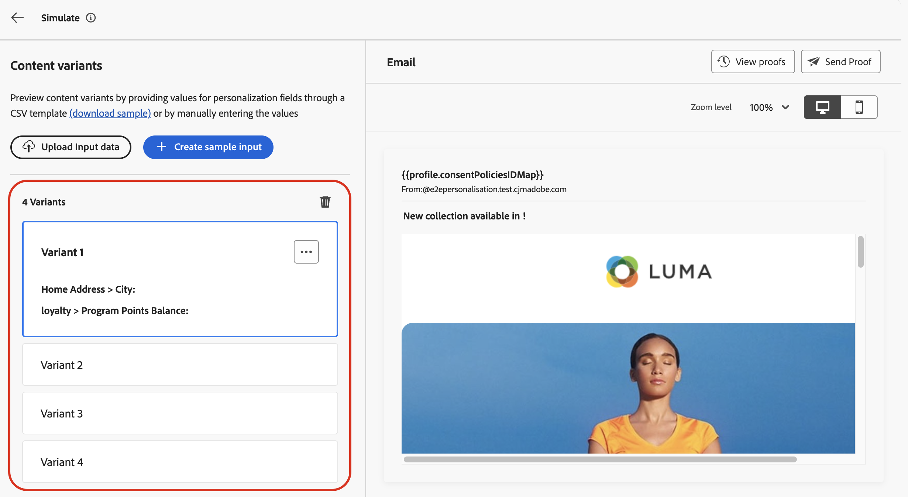
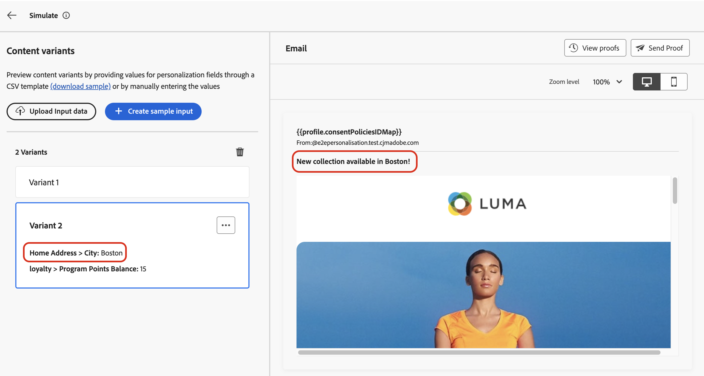

# Simulera innehållsvariationer {#custom-profiles}

>[!CONTEXTUALHELP]
>id="ajo_simulate_sample_profiles"
>title="Simulera med exempelindata"
>abstract="På den här skärmen kan du testa olika varianter av ditt innehåll genom att ange värden för personaliseringsfält via en CSV- eller JSON-mall, eller genom att ange värdena manuellt."

Med [!DNL Journey Optimizer] kan du förhandsgranska olika varianter av ditt innehåll med exempelindata som har överförts från en CSV- eller JSON-fil eller lagts till manuellt.

Alla attribut som används i ditt innehåll för personalisering identifieras automatiskt av systemet och kan användas för dina tester för att skapa flera varianter. En variant refererar till en version av innehållet med olika värden för dess attribut.

>[!NOTE]
>
>Varianter fungerar bara som testningssyften för det aktuella innehållet. De lagras inte i Adobe Experience Platform utan i webbläsaren, vilket innebär att de inte visas när du loggar ut eller när du arbetar från en annan enhet.

## Skyddsritningar och begränsningar {#limitations}

Innan du börjar testa ditt innehåll med exempelindata bör du tänka på följande skyddsutkast och krav.

* **Kanaler** - Simulera innehållsvariationer är tillgängligt för:

   * meddelandekanalerna för e-post, SMS och push,
   * alla inkommande kanaler (webb, kodbaserad upplevelse, In-app, innehållskort).

* **Funktioner som stöds** - Innehållsvariationer kan användas med [!DNL Journey Optimizer] flerspråkigt innehåll och funktioner för innehållsexperiment. På så sätt kan du testa meddelanden på flera språk och optimera innehåll genom att experimentera.

  Du kan också använda innehållsvariationer för att testa innehållsmallarna.

  >[!NOTE]
  >
  >För tillfället är inte inkorgsåtergivning och skräppostrapporter tillgängliga i den aktuella upplevelsen. Om du vill använda de här funktionerna väljer du knappen **[!UICONTROL Simulate content]** i ditt innehåll för att komma åt det tidigare användargränssnittet.

* **Attribut** - Både profil- och kontextuella attribut stöds.

* **Datatyper** - Endast följande datatyper stöds när du anger data för dina varianter: tal (heltal och decimal), sträng, boolesk och datumtyp. Alla andra datatyper kommer att visa ett fel.

* **Antal varianter** - Du kan lägga till upp till 30 varianter för att testa ditt innehåll, antingen med hjälp av en fil eller manuellt.

## Lägga till och förhandsgranska innehållsvariationer

Om du vill skapa variationer för ditt innehåll och förhandsgranska dem klickar du på knappen **[!UICONTROL Simulate content]** och väljer **[!UICONTROL Simulate content variations]**.


De viktigaste stegen för att testa ditt innehåll är följande:

1. **Lägg till varianter** - Lägg till upp till 30 varianter med exempelindata, antingen genom att överföra en fil eller genom att lägga till data manuellt. [Lär dig hur du lägger till varianter](#profiles)
1. **Förhandsgranska innehållsvariationer** - Kontrollera förhandsvisningen av ditt innehåll med olika varianter. [Lär dig förhandsgranska ditt innehåll](#preview)
1. **Skicka e-postkorrektur** - Skicka upp till 10 korrektur till e-postadresser med olika varianter för e-postinnehåll. [Lär dig skicka korrektur](#proofs)

### Lägg till varianter {#profiles}

När du får tillgång till upplevelsen av innehållsvariationer identifieras alla anpassningsfält som används i ditt innehåll automatiskt och visas i en lista med tomma varianter.

Om ditt e-postmeddelande till exempel innehåller två anpassningsfält,&quot;Ort&quot; och&quot;Balans för programpunkter&quot;, visas de i listan. Till att börja med anges inga värden och inget anpassat innehåll visas i förhandsgranskningsfönstret.



Så här redigerar du värdet för en variant:

1. Klicka på ellipsknappen bredvid varianten.
1. Välj **[!UICONTROL Edit]** om du vill ange anpassade värden för varje personaliseringsfält.
1. Förhandsgranskningsfönstret uppdateras och visar hur innehållet återges med de angivna värdena.

Lägga till en ny variant:

1. Klicka på knappen **[!UICONTROL Create sample input]**.
1. En ny tom variant visas som innehåller alla identifierade anpassningsfält.
1. Redigera den nya varianten efter behov.


Du kan också överföra en fil med fördefinierade varianter och värden för att snabba upp processen.

1. Klicka på **[!UICONTROL Download sample]** om du vill hämta en filmall.
1. Välj ett filformat: CSV, JSON eller JSONLINES.
1. Öppna mallfilen och fyll i önskade värden för respektive profilattribut. Mallen innehåller en kolumn för varje profilattribut som används i ditt innehåll för personalisering.

   Exempel på JSON-syntax:

   ```
   {
   "profile": {
       "attributes": {
       "person": {
           "name": {
               "lastName": "Doe",
               "firstName": "John"
               }
           }
       }
   }
   }
   ```

1. När filen är klar klickar du på **[!UICONTROL Upload Input Data]** för att läsa in den.
1. Efter överföring läggs en ny variant till i listan för varje post i filen.

   

När du har lagt till varianter kan du använda dem för att förhandsgranska ditt innehåll i den högra rutan och för att skicka e-postkorrektur.

### Förhandsgranska innehållsvariationer {#preview}

Om du vill förhandsgranska ditt innehåll med hjälp av en variant väljer du den relevanta varianten i listan för att uppdatera innehållet i förhandsvisningsrutan med den information som har angetts för varianten.

I exemplet nedan har vi lagt till två varianter för e-postämnesraden:

| Val för variant 1 | Val för variant 2 |
|----------|-------------|
|  |  |

För flerspråkigt innehåll och experiment finns en listruta där du kan växla mellan olika språkvarianter eller behandlingar.


Du kan när som helst ta bort en variant med hjälp av ellipsknappen i det övre högra hörnet och välja **[!UICONTROL Remove]**. Om du vill redigera information för en variant klickar du på ellipsknappen och väljer **[!UICONTROL Edit]**.

### Skicka korrektur {#proofs}

Med Journey Optimizer kan du skicka korrektur till e-postadresser samtidigt som du personifierar en eller flera varianter som du har lagt till på simuleringsskärmen. Stegen är följande:

1. Kontrollera att varianter har lagts till för att testa ditt innehåll och klicka på knappen **[!UICONTROL Send Proof]**.

1. I fältet **[!UICONTROL Recipients]** anger du den e-postadress som du vill skicka korrekturet till och klickar sedan på **[!UICONTROL Add]**. Upprepa åtgärden för att skicka korrekturet till ytterligare e-postadresser. Du kan lägga till upp till 10 korrekturmottagare.

1. I skärmens nedre del väljer du den variant som du vill använda i korrekturet. Du kan välja flera varianter. I så fall kommer e-postmeddelandet att innehålla så många korrektur som de valda varianterna.

   Om du vill ha mer information om en variant väljer du länken **[!UICONTROL View profile details]**. På så sätt kan du visa information som har angetts i föregående fönster för de olika varianterna.

   

1. Klicka på knappen **[!UICONTROL Send Proof]** för att börja skicka korrekturet.

1. Om du vill spåra korrekturet klickar du på knappen **[!UICONTROL View proofs]** på skärmen för att simulera innehåll.


