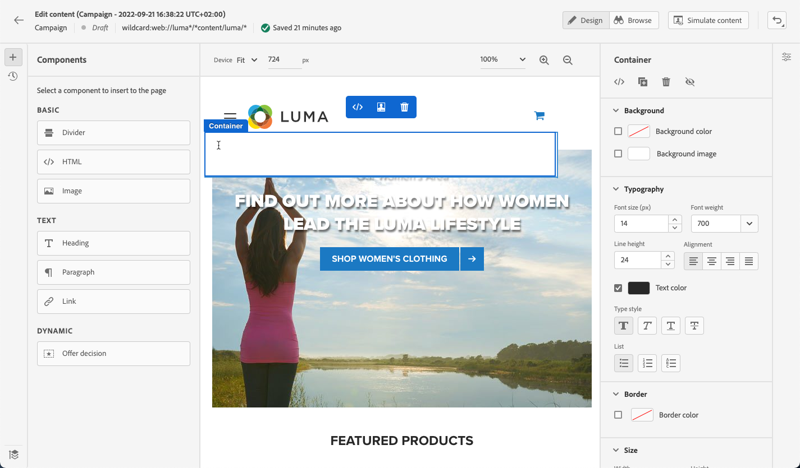

# Skapa webbsidor {#author-web}

>[!BEGINSHADEBOX]

Vad du hittar i den här dokumentationen:

* [Kom igång med webbkanalen](get-started-web.md)
* [Skapa webbupplevelser](create-web.md)
* **[Skapa webbsidor](author-web.md)**
* [Hjälptillägg för visuell redigering](visual-editing-helper.md)
* [Webbrapportering](web-report.md)

>[!ENDSHADEBOX]

I [!DNL Journey Optimizer] webbredigering drivs av webbläsartillägget Adobe Experience Cloud Visual Helper chrome. [Läs mer](visual-editing-helper.md)

För att kunna komma åt och skriva webbsidor i [!DNL Journey Optimizer] -användargränssnittet, följ de krav som anges i [det här avsnittet](create-web.md#prerequesites).

## Redigera webbsidesinnehåll {#edit-web-content}

>[!CONTEXTUALHELP]
>id="ajo_web_url_to_edit_surface"
>title="Bekräfta den URL som ska redigeras"
>abstract="Bekräfta webbadressen till den specifika webbsida som ska användas för att redigera innehållet som ska användas på den webbyta som definieras ovan. Webbsidan måste implementeras med Adobe Experience Platform Web SDK."
>additional-url="https://experienceleague.adobe.com/docs/platform-learn/implement-web-sdk/overview.html" text="Läs mer"

>[!CONTEXTUALHELP]
>id="ajo_web_url_to_edit_rule"
>title="Ange den URL som ska redigeras"
>abstract="Ange URL-adressen till en viss webbsida som ska användas för att redigera innehållet som ska användas på alla sidor som matchar regeln. Webbsidan måste implementeras med Adobe Experience Platform Web SDK."
>additional-url="https://experienceleague.adobe.com/docs/platform-learn/implement-web-sdk/overview.html" text="Läs mer"

<!--Confirm the URL to use for authoring content on the surface. Typically the Authoring URL will be the surface URL itself, but you may include extra parameters if required. The page must include the Adobe Experience Platform Web SDK.-->

När du har skapat en webbåtgärd från kampanjen kan du redigera innehållet med webbdesignern. För att göra detta, följ nedanstående steg.

>[!CAUTION]
>
>Ska öppnas i [!DNL Journey Optimizer]måste webbsidan implementeras med [Adobe Experience Platform Web SDK](https://experienceleague.adobe.com/docs/platform-learn/implement-web-sdk/overview.html){target="_blank"}.

1. Från **[!UICONTROL Action]** fliken för kampanjen, välj **[!UICONTROL Edit content]** för att börja skapa webbkampanjer.

1. Om du har skapat en sidmatchningsregel måste du ange en URL som matchar den här regeln. Ändringarna tillämpas på alla sidor som matchar regeln.

   >[!NOTE]
   >
   >Om du angav en enda URL som webbyta fylls URL:en som ska anpassas redan i.

   

1. Innehållet på sidan visas.

   >[!CAUTION]
   >
   >Webbsidan måste innehålla [Adobe Experience Platform Web SDK](https://experienceleague.adobe.com/docs/platform-learn/implement-web-sdk/overview.html){target="_blank"}.

1. Klicka **[!UICONTROL Open web designer]** för att redigera den. [Läs mer](author-web.md)

   

1. Webbdesignern visas.

   

1. Markera ett element på arbetsytan, till exempel bild, knapp, stycke, text, behållare, rubrik, länk osv. och använda:

   * Den sammanhangsbaserade menyn där du kan redigera innehåll, layout, infoga länkar eller personalisering, osv.

      

   * Ikonerna ovanför den högra panelen för att redigera, duplicera, ta bort eller dölja varje element.

      

   * Den högra panelen som ändras dynamiskt enligt det valda elementet. Du kan till exempel redigera bakgrunden, typografin, kanten, storleken, positionen, mellanrummet, effekterna eller textbundna format för ett element.

      

## Använda innehållskomponenter {#content-components}

>[!CONTEXTUALHELP]
>id="ajo_web_designer_components"
>title="Lägga till innehållskomponenter på webbsidan"
>abstract="Du kan lägga till ett antal komponenter på webbsidan och redigera dem efter behov."

1. Från **[!UICONTROL Components]** till vänster kan du lägga till följande komponenter på webbsidan och redigera dem efter behov:

   * [Delare](../email/content-components.md#divider)
   * [HTML](../email/content-components.md#HTML)
   * [Bild](../email/content-components.md#image)
   * Rubrik - Att använda den här komponenten påminner om att använda **[!UICONTROL Text]** i e-postdesignern. [Läs mer](../email/content-components.md#text)
   * Stycke - Att använda den här komponenten påminner om att använda **[!UICONTROL Text]** i e-postdesignern. [Läs mer](../email/content-components.md#text)
   * Länk - Lär dig hur du definierar länkformat i [det här avsnittet](../email/styling-links.md)
   * [Beslut om erbjudandet](../email/add-offers-email.md)

   

1. Hovra på sidan och klicka på **[!UICONTROL Insert before]** eller **[!UICONTROL Insert after]** om du vill lägga till komponenten i ett befintligt element på sidan.

   

1. Redigera komponentinnehållet efter behov från behållaren som visas för den här komponenten.

   

1. Justera de format som visas i dialogrutan **[!UICONTROL Container]** till höger, t.ex. bakgrund, textfärg, kant, storlek, position. beroende på den markerade komponenten.

   

## Navigera i webbdesignern

### Använd vägbeskrivningar

1. Markera ett element på arbetsytan.

1. Klicka på **[!UICONTROL Expand/Collapse Breadcrumbs]** på skärmens nedre vänstra sida för att snabbt visa information om det markerade elementet.

   

1. När du håller muspekaren över vägbeskrivningarna markeras motsvarande element i redigeraren.

1. Med den kan du enkelt navigera till alla överordnade, jämställda eller underordnade element i den visuella redigeraren.

### Växla till bläddringsläge {#browse-mode}

>[!CONTEXTUALHELP]
>id="ajo_web_designer_browse"
>title="Använda bläddringsläget"
>abstract="I det här läget kan du navigera till den exakta sidan från den markerade ytan som du vill anpassa."

Du kan växla från standardinställningen **[!UICONTROL Design]** till **[!UICONTROL Browse]** läge med den dedikerade knappen.

Från **[!UICONTROL Browse]** kan du navigera till den exakta sidan från den markerade ytan som du vill anpassa.

Det är särskilt användbart när du hanterar sidor som är bakom autentisering eller som inte är tillgängliga från början på en viss URL. Du kan till exempel autentisera, navigera till din kontosida eller till kundvagnssidan och sedan växla tillbaka till **[!UICONTROL Design]** för att utföra ändringarna på den önskade sidan.

### Ändra enhetsstorlek

Du kan ändra enhetsstorleken till en fördefinierad storlek som exempelvis **[!UICONTROL Tablet]** eller **[!UICONTROL Mobile landscape]** eller definiera en anpassad storlek. Ange önskat antal pixlar för att definiera en anpassad storlek.

Du kan också ändra zoomfokus - från 25 % till 400 %.

## Hantera ändringar {#manage-modifications}

>[!CONTEXTUALHELP]
>id="ajo_web_designer_modifications"
>title="Hantera enkelt alla ändringar"
>abstract="I den här rutan kan du navigera och hantera alla justeringar och format som du har lagt till på webbsidan."

Du kan enkelt hantera alla komponenter, justeringar och format som du har lagt till på webbsidan.

1. Välj **[!UICONTROL Modifications]** för att visa motsvarande ruta till vänster.

   

1. Du kan granska alla ändringar du har gjort på sidan.

1. Markera en oönskad ändring och klicka på ikonen Ta bort för att ta bort den.

   

   >[!CAUTION]
   >
   >Var försiktig när du tar bort en åtgärd eftersom den kan påverka efterföljande åtgärder.

1. Du kan även avbryta och göra om åtgärder med **[!UICONTROL Undo/Redo]** överst till höger på skärmen.

   

   Klicka och håll ned knappen för att växla mellan **[!UICONTROL Undo]** och **[!UICONTROL Redo]** alternativ. Klicka sedan på själva knappen för att utföra den önskade åtgärden.

## Lägg till personalisering och erbjudanden

Om du vill lägga till personalisering markerar du en behållare och väljer personaliseringsikonen på den snabbmenyrad som visas. Lägg till ändringarna med uttrycksredigeraren. [Läs mer](../personalization/personalization-build-expressions.md)

Använd **[!UICONTROL Offer decision]** komponent som ska infogas [erbjudanden](../offers/get-started/starting-offer-decisioning.md) till dina webbsidor. Processen är densamma som när [lägga till ett erbjudande i ett e-postmeddelande](../email/add-offers-email.md). Det kommer att utnyttja Beslutshantering för att välja det bästa erbjudandet att leverera till era kunder.

## Testa webbkampanjen {#test-web-campaign}

>[!CONTEXTUALHELP]
>id="ajo_web_designer_preview"
>title="Förhandsgranska webbupplevelsen"
>abstract="Få en simulering av hur webbupplevelsen kommer att se ut."

Följ stegen nedan för att visa en förhandsvisning av den ändrade webbupplevelsen.

>[!CAUTION]
>
>Du måste ha testprofiler tillgängliga för att simulera vilka erbjudanden som ska levereras till dem. Lär dig hur [skapa testprofiler](../segment/creating-test-profiles.md).

1. Från antingen **[!UICONTROL Edit content]** för webbdesignern väljer **[!UICONTROL Simulate content]**.

   

1. Klicka **[!UICONTROL Manage test profiles]** om du vill välja en eller flera testprofiler.
1. En förhandsgranskning av den ändrade webbsidan visas.

   

1. Du kan också kopiera test-URL:en för att klistra in den i valfri webbläsare eller öppna den i standardwebbläsaren.
