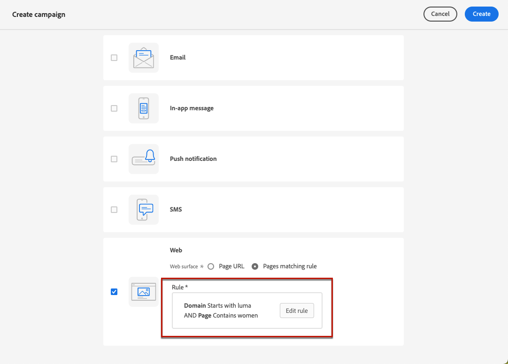

# Skapa webbupplevelser {#create-web}

>[!BEGINSHADEBOX]

Vad du hittar i den här dokumentationen:

* [Kom igång med webbkanalen](get-started-web.md)
* **[Skapa webbupplevelser](create-web.md)**
* [Skapa webbsidor](author-web.md)
* [Hjälptillägg för visuell redigering](visual-editing-helper.md)
* [Webbrapportering](web-report.md)

>[!ENDSHADEBOX]

[!DNL Journey Optimizer] gör att ni kan personalisera den webbupplevelse ni levererar till era kunder via inkommande webbkampanjer.

>[!CAUTION]
>
>Ingår [!DNL Journey Optimizer] kan du bara skapa webbupplevelser med **kampanjer**.

## Förutsättningar {#prerequesites}

För att kunna komma åt och skriva webbsidor i [!DNL Journey Optimizer] följer du kraven nedan:

* Om du vill lägga till ändringar på webbplatsen måste du implementera [Adobe Experience Platform Web SDK](https://experienceleague.adobe.com/docs/platform-learn/implement-web-sdk/overview.html){target="_blank"} på er webbplats.

* Så här öppnar du [!DNL Journey Optimizer] webbdesignern måste ladda ned [Adobe Experience Cloud Visual Editing Helper](https://chrome.google.com/webstore/detail/adobe-experience-cloud-vi/kgmjjkfjacffaebgpkpcllakjifppnca){target="_blank"} webbläsartillägg i Chrome. [Läs mer](visual-editing-helper.md)

>[!CAUTION]
>
>Google Chrome är för närvarande den enda webbläsaren som stöder redigering av webbsidor i [!DNL Journey Optimizer].

För att webbupplevelsen ska kunna levereras på rätt sätt måste följande inställningar definieras:

* I [Adobe Experience Platform Data Collection](https://experienceleague.adobe.com/docs/experience-platform/edge/datastreams/overview.html){target="_blank"}kontrollerar du att du har en datastream definierad, till exempel under **[!UICONTROL Adobe Experience Platform]** den tjänst du har båda **[!UICONTROL Edge Segmentation]** och **[!UICONTROL Adobe Journey Optimizer]** aktiverade alternativ.

   Detta säkerställer att Journey Optimizer inkommande händelser hanteras korrekt av Adobe Experience Platform Edge. [Läs mer](https://experienceleague.adobe.com/docs/experience-platform/edge/datastreams/configure.html){target="_blank"}

   

   >[!NOTE]
   >
   >The **[!UICONTROL Adobe Journey Optimizer]** kan bara aktiveras när **[!UICONTROL Edge Segmentation]** är redan aktiverat.

* I [Adobe Experience Platform](https://experienceleague.adobe.com/docs/experience-platform/profile/home.html?lang=sv){target="_blank"}, make sure you have one merge policy with the **[!UICONTROL Active-On-Edge Merge Policy]** option enabled. To do this, select a policy under the **[!UICONTROL Customer]** > **[!UICONTROL Profiles]** > **[!UICONTROL Merge Policies]** Experience Platform menu. [Learn more](https://experienceleague.adobe.com/docs/experience-platform/profile/merge-policies/ui-guide.html#configure){target="_blank"}

   Den här sammanfogningsprincipen används av [!DNL Journey Optimizer] inkommande kanaler för att korrekt aktivera och publicera inkommande kampanjer. [Läs mer](https://experienceleague.adobe.com/docs/experience-platform/profile/merge-policies/ui-guide.html){target="_blank"}

   

## Skapa en webbkampanj {#create-web-campaign}

>[!CONTEXTUALHELP]
>id="ajo_web_surface"
>title="Definiera en webbyta"
>abstract="En webbyta kan matcha en eller flera sidor, vilket gör att du kan leverera innehållsändringar på en eller flera webbsidor."

>[!CONTEXTUALHELP]
>id="ajo_web_surface_rule"
>title="Bygg en sidmatchningsregel"
>abstract="En sidmatchningsregel gör det möjligt att ange flera URL:er som matchar samma regel som mål, t.ex. om du vill använda ändringarna på en hjältebanderoll på en hel webbplats eller lägga till en toppbild som visas på alla produktsidor på en webbplats."

Följ stegen nedan för att börja skapa en webbupplevelse genom en kampanj.

1. Skapa en kampanj. [Läs mer](../campaigns/create-campaign.md)

1. Välj **[!UICONTROL Web]** åtgärd.

   

1. Definiera en webbyta.

   >[!NOTE]
   >
   >En webbyta är en webbegenskap som identifieras av en URL där innehållet levereras. Den kan matcha en eller flera sidors URL-adresser så att du kan leverera ändringar för en eller flera webbsidor.

   Du kan antingen ange en **[!UICONTROL Page URL]** om du bara vill tillämpa ändringarna på en sida.

   

1. Du kan också skapa en **[!UICONTROL Pages matching rule]** om du vill ha flera URL-adresser som matchar samma regel, till exempel om du vill använda ändringarna på en hjältebanner på en hel webbplats eller lägga till en översta bild som visas på alla produktsidor på en webbplats.

   Om du vill göra det väljer du **[!UICONTROL Pages matching rule]** och klicka **[!UICONTROL Create rule]**.

   

1. Definiera villkor för **[!UICONTROL Domain]** och **[!UICONTROL Page]** fält.

   Om du till exempel vill redigera element som visas på alla sidor på Lumas webbplats för kvinnor väljer du **[!UICONTROL Domain]** > **[!UICONTROL Starts with]** > `luma` och **[!UICONTROL Page]** > **[!UICONTROL Contains]** > `women`.

   

1. Spara ändringarna. Regeln visas i **[!UICONTROL Create campaign]** skärm.

   

1. När du har definierat webbytan väljer du **[!UICONTROL Create]**. Nu kan du konfigurera kampanjens egenskaper och inställningar.

## Konfigurera webbkampanjen {#configure-web-campaign}

1. I **[!UICONTROL Properties]** kan du redigera kampanjnamnet och lägga till en beskrivning om det behövs.

   

1. Om du vill tilldela etiketter för anpassad eller grundläggande dataanvändning till webbkampanjen väljer du **[!UICONTROL Manage access]** överst på skärmen. [Läs mer om OLAC (Object Level Access Control)](../administration/object-based-access.md)

1. Du kan välja **[!UICONTROL Content experiment]** testa materialbehandlingar med delar av publiken för att avgöra vilken behandling som fungerar bäst med avseende på ett visst mätvärde. [Läs mer](../campaigns/content-experiment.md)

   >[!AVAILABILITY]
   >
   >The **Content Experiment** är för närvarande bara tillgängligt för en uppsättning organisationer (begränsad tillgänglighet). Kontakta din Adobe-representant om du vill ha mer information.

1. Från **[!UICONTROL Action]** fliken för kampanjen, välj **[!UICONTROL Edit content]** för att börja skapa webbkampanjer. [Läs mer](author-web.md)

   

1. Från **[!UICONTROL Audience]** kan du definiera vilka som ska kunna se webbkampanjen. Som standard visas webbkampanjen för alla besökare.

   

   Du kan också välja en viss målgrupp. Använd **[!UICONTROL Select audience]** om du vill visa en lista över tillgängliga Adobe Experience Platform-segment. [Läs mer om segment](../segment/about-segments.md)

   >[!NOTE]
   >
   >För API-utlösta kampanjer måste målgruppen anges via API-anrop. [Läs mer](../campaigns/api-triggered-campaigns.md)

   

1. I **[!UICONTROL Identity namespace]** väljer du det namnutrymme som ska användas för att identifiera individerna från det valda segmentet. [Läs mer om namnutrymmen](../event/about-creating.md#select-the-namespace)

1. Definiera en **[!UICONTROL Schedule]** för webbkampanjen. [Läs mer](../campaigns/create-campaign.md#schedule)

   

   Som standard startar den när den aktiveras manuellt och avslutas när den stoppas manuellt, men du kan också definiera specifika datum och tidpunkter för när ändringarna ska visas.

   

## Aktivera webbkampanjen {#activate-web-campaign}

När du definierat din [webbkampanjsinställningar](#configure-web-campaign) och du har redigerat innehållet efter behov med [webbdesigner](author-web.md)kan ni granska och aktivera webbkampanjen. Följ stegen nedan.

>[!NOTE]
>
>Du kan också förhandsgranska webbkampanjens innehåll innan du aktiverar det. [Läs mer](author-web.md#test-web-campaign)

1. Välj **[!UICONTROL Review to activate]**.

   

1. Granska och redigera vid behov innehåll, egenskaper, yta, målgrupp och schema.

1. Välj **[!UICONTROL Activate]**.

   

   >[!NOTE]
   >
   >När du har klickat **[!UICONTROL Activate]** kan det ta upp till 15 minuter innan webbkampanjer blir tillgängliga live på er webbplats.

Webbkampanjen tar **[!UICONTROL Live]** och nu visas för den valda publiken. Alla mottagare av kampanjen kan se de ändringar du har lagt till på webbplatsen med hjälp av [!DNL Journey Optimizer] webbdesigner.

>[!NOTE]
>
>Om du har definierat ett schema för webbkampanjen har den **[!UICONTROL Scheduled]** status tills startdatumet och starttiden nås.
>
>Om du aktiverar en webbkampanj som påverkar samma sidor som en annan kampanj som redan är aktiv, tillämpas alla ändringar på dina webbsidor.

Läs mer om att aktivera kampanjer i [det här avsnittet](../campaigns/review-activate-campaign.md).

## Stoppa en webbkampanj {#stop-web-campaign}

När en webbkampanj är aktiv kan ni stoppa den för att hindra publiken från att se ändringarna. Följ stegen nedan.

1. Välj en livekampanj i listan.

1. Välj **[!UICONTROL Stop campaign]**.

   

1. De ändringar du har lagt till visas inte längre för den målgrupp du har definierat.

>[!NOTE]
>
>När en webbkampanj har stoppats kan du inte redigera eller aktivera den igen. Du kan bara duplicera den och aktivera den duplicerade kampanjen.
