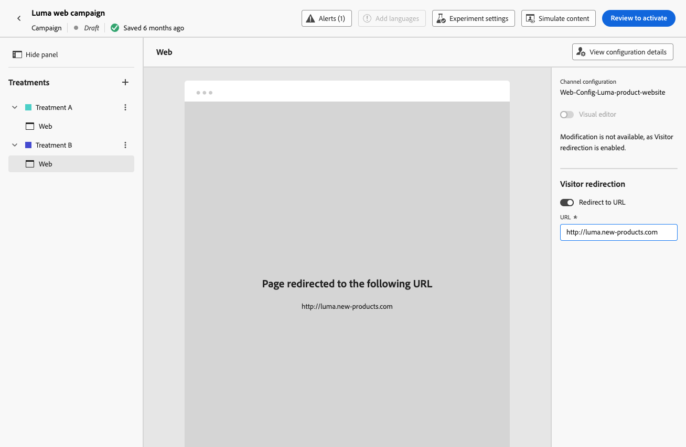

# Skapa webbupplevelser {#create-web}

Med [!DNL Journey Optimizer] kan du anpassa webbupplevelsen som du levererar till dina kunder via inkommande resor eller kampanjer.

## Definiera en webbupplevelse genom en resa eller en kampanj {#create-web-experience}

>[!CONTEXTUALHELP]
>id="ajo_web_surface"
>title="Definiera en webbkonfiguration"
>abstract="En webbkonfiguration kan matcha en eller flera sidor, vilket gör att du kan leverera innehållsändringar på en eller flera webbsidor."

>[!CONTEXTUALHELP]
>id="ajo_web_surface_rule"
>title="Bygg en sidmatchningsregel"
>abstract="En sidmatchningsregel gör det möjligt att ange flera URL:er som matchar samma regel som mål, t.ex. om du vill använda ändringarna på en hjältebanderoll på en hel webbplats eller lägga till en toppbild som visas på alla produktsidor på en webbplats."

Följ stegen nedan för att börja skapa en webbupplevelse genom en kampanj eller en resa.

>[!NOTE]
>
>Om det här är första gången du skapar en webbupplevelse måste du följa de krav som beskrivs i [det här avsnittet](web-prerequisites.md).

>[!BEGINTABS]

>[!TAB Lägg till en webbupplevelse på en resa]

Så här lägger du till en **webbaktivitet** på en resa:

1. [Skapa en resa](../building-journeys/journey-gs.md).

1. Starta din resa med en [Event](../building-journeys/general-events.md)- eller [Read Audience](../building-journeys/read-audience.md)-aktivitet.

1. Dra och släpp en **[!UICONTROL Web]**-aktivitet från **[!UICONTROL Actions]**-delen av paletten.

   

   >[!NOTE]
   >
   >Eftersom **Webben** är en inkommande upplevelseaktivitet, har den en 3-dagars **Wait**-aktivitet. [Läs mer](../building-journeys/wait-activity.md#auto-wait-node)

1. Ange **[!UICONTROL Label]** och **[!UICONTROL Description]** för meddelandet.

1. Välj eller skapa den [webbkonfiguration](web-configuration.md) som ska användas.

   

1. Markera knappen **[!UICONTROL Edit content]** och redigera innehållet efter behov. [Läs mer](#edit-web-content)

1. Slutför vid behov kundresan genom att dra och släppa ytterligare åtgärder eller händelser. [Läs mer](../building-journeys/about-journey-activities.md)

1. När webbupplevelsen är klar kan du slutföra konfigurationen och publicera din resa för att aktivera den. [Läs mer](../building-journeys/publish-journey.md)

Mer information om hur du konfigurerar en resa finns på [den här sidan](../building-journeys/journey-gs.md).

>[!TAB Skapa en webbkampanj]

Följ stegen nedan för att börja skapa en webbupplevelse genom en kampanj.

1. Skapa en kampanj. [Läs mer](../campaigns/create-campaign.md)

1. Välj den typ av kampanj som du vill köra

   * **Schemalagd - marknadsföring**: Kör kampanjen direkt eller på ett angivet datum. Schemalagda kampanjer syftar till att skicka marknadsföringsmeddelanden. De konfigureras och körs från användargränssnittet.

   * **API-utlöst - Markering/transaktion**: Kör kampanjen med ett API-anrop. API-utlösta kampanjer syftar till att skicka antingen marknadsförings- eller transaktionsmeddelanden, dvs. meddelanden som skickas ut efter en åtgärd som utförs av en individ: lösenordsåterställning, kundvagn osv. [Lär dig hur du utlöser en kampanj med API:er](../campaigns/api-triggered-campaigns.md)

1. Slutför stegen för att skapa en webbkampanj, till exempel kampanjegenskaperna, [målgrupp](../audience/about-audiences.md) och [schema](../campaigns/create-campaign.md#schedule).

1. Välj åtgärden **[!UICONTROL Web]**.

1. Välj eller skapa webbkonfigurationen. [Läs mer om webbkonfiguration](web-configuration.md)

   

1. Klicka på knappen **[!UICONTROL Edit content]** om du vill redigera innehållet. [Läs mer](#edit-web-content)

   <!---->

Mer information om hur du konfigurerar en kampanj finns på [den här sidan](../campaigns/get-started-with-campaigns.md).

➡️ [Lär dig hur du skapar en webbkampanj i den här videon](#video)

>[!ENDTABS]

## Redigera webbinnehåll {#edit-web-content}

>[!CONTEXTUALHELP]
>id="ajo_web_url_to_edit_surface"
>title="Bekräfta den URL som ska redigeras"
>abstract="Bekräfta URL-adressen till den specifika webbsidan som ska användas för att redigera innehållet som ska användas i webbkonfigurationen som definieras ovan. Webbsidan måste implementeras med Adobe Experience Platform Web SDK."
>additional-url="https://experienceleague.adobe.com/docs/platform-learn/implement-web-sdk/overview.html" text="Läs mer"

>[!CONTEXTUALHELP]
>id="ajo_web_url_to_edit_rule"
>title="Ange den URL som ska redigeras"
>abstract="Ange URL-adressen till en viss webbsida som ska användas för att redigera innehållet som ska användas på alla sidor som matchar regeln. Webbsidan måste implementeras med Adobe Experience Platform Web SDK."
>additional-url="https://experienceleague.adobe.com/docs/platform-learn/implement-web-sdk/overview.html" text="Läs mer"

När du har [lagt till en webbåtgärd](#create-web-experience) på en resa eller en kampanj kan du redigera innehållet på din webbplats med:

* [webbdesignern](web-visual-editor.md) för att skapa din upplevelse med en visuell redigerare;
* eller [den icke-visuella redigeraren](web-non-visual-editor.md).

Följ stegen nedan för att börja skapa din webbupplevelse.

1. Välj **[!UICONTROL Action]** på fliken **[!UICONTROL Web]** i kampanjen eller **[!UICONTROL Edit content]**-aktiviteten i resan.

   

1. Versionsskärmen visas. Du kan antingen:

   * Klicka på knappen **[!UICONTROL Edit web page]** för att börja skapa ditt innehåll med webbdesignern för en visuell upplevelse. [Läs mer](web-visual-editor.md)

     

   * Avmarkera alternativet **[!UICONTROL Visual editor]** om du vill använda det icke-visuella versionsläget i stället och klicka på **[!UICONTROL Add a modification]** om du vill börja redigera webbinnehållet utan att läsa in den visuella redigeraren. [Läs mer](web-non-visual-editor.md)

     

## Testa webbupplevelsen {#test-web-experience}

>[!CONTEXTUALHELP]
>id="ajo_web_designer_preview"
>title="Förhandsgranska din webbupplevelse"
>abstract="Få en simulering av hur webbupplevelsen kommer att se ut."

När du [har skapat din webbupplevelse](web-visual-editor.md) med webbdesignern kan du använda testprofiler för att förhandsgranska dina ändrade webbsidor. Om du har infogat anpassat innehåll kan du kontrollera hur det här innehållet visas med hjälp av testprofilsdata.

Om du vill göra det klickar du på **[!UICONTROL Simulate content]** på skärmen för att redigera innehåll för resan eller kampanjen och lägger sedan till en testprofil för att kontrollera din webbsida med hjälp av testprofildata.

Du kan även öppna den i standardwebbläsaren eller kopiera test-URL:en och klistra in den i valfri webbläsare. På så sätt kan ni dela länken med teamet och intressenter som kan förhandsgranska den nya webbupplevelsen i vilken webbläsare som helst innan kampanjen blir aktiv.

>[!NOTE]
>
>När du kopierar test-URL:en är det innehåll som visas anpassat för testprofilen som användes när innehållssimuleringen genererades i [!DNL Journey Optimizer].

Detaljerad information om hur du väljer testprofiler och förhandsgranskar innehåll finns i avsnittet [Innehållshantering](../content-management/preview-test.md).

## Omdirigera till URL {#web-redirect-to-url}

>[!CONTEXTUALHELP]
>id="ajo_web_designer_redirect"
>title="Omdirigera till en annan URL"
>abstract="Ange en befintlig URL där du vill dirigera om besökarna på sidan."

När du skapar en webbupplevelse kan du dirigera om besökare till en annan befintlig URL i stället för att skapa en ny variant i webbdesignern.

Om du använder den här kapaciteten kan du köra ett [innehållsexperiment](../content-management/content-experiment.md) där två olika upplevelser jämförs, i stället för att bara ändra några få element på en sida.

Skapa till exempel en webbkampanj med två behandlingar:

* I **Behandling A** kan du skapa en webbupplevelse med webbdesignern för halva målpopulationen.

* I **Behandling B** väljer du alternativet **[!UICONTROL Redirect to URL]** för den andra halvan av målpopulationen. Ange URL-adressen till en sida med en alternativ design som du skapade utanför [!DNL Journey Optimizer].

  

  >[!NOTE]
  >
  >Webbplatsförhandsvisningen visas inte längre och växlingsknappen **[!UICONTROL Visual editor]** är inaktiverad.

När webbkampanjen är live kan du spåra hur den webbupplevelse du skapade i [!DNL Journey Optimizer] fungerar för besökarna på sidan mot dem som omdirigerades till den externa landningssidan. Lär dig hur med rapporten [för experimentella kampanjer](../reports/campaign-global-report-cja-experimentation.md)

## Ge liv åt webbupplevelsen {#web-experience-live}

>[!IMPORTANT]
>
> Om er kampanj omfattas av en policy för godkännande måste ni begära godkännande för att kunna aktivera era webbupplevelser. [Läs mer](../test-approve/gs-approval.md)

När du har definierat webbupplevelsen och redigerat innehållet efter behov kan du aktivera resan eller kampanjen för att göra ändringarna synliga för målgruppen.

Du kan också förhandsgranska webbupplevelseinnehållet innan du publicerar det. [Läs mer](#test-web-experience)

>[!NOTE]
>
>Om du aktiverar en webbresa/kampanj som påverkar samma sidor som en annan resa eller kampanj som redan är aktiv, kommer alla ändringar att tillämpas på dina webbsidor.
>
>Om flera resor eller kampanjer uppdaterar samma element på webbplatsen har den högsta prioriteringen företräde.

### Publicera en webbresa {#activate-web-journey}

Följ stegen nedan för att göra din webbupplevelse levande från en resa.

1. Kontrollera att din resa är giltig och att det inte finns något fel. [Läs mer](../building-journeys/troubleshooting.md#activity-errors)

1. Välj alternativet **[!UICONTROL Publish]** i den övre högra menyn på resan.

   

   >[!NOTE]
   >
   >Läs mer om att publicera resor i [det här avsnittet](../building-journeys/publish-journey.md).

Din webbresa har statusen **[!UICONTROL Live]** och är nu skrivskyddad. Varje mottagare av resan kan se de ändringar du har lagt till på webbplatsen.

>[!NOTE]
>
>När du har klickat på **[!UICONTROL Publish]** kan det ta upp till 15 minuter innan ändringarna blir tillgängliga direkt på webbplatsen.

### Aktivera en webbkampanj {#activate-web-campaign}

När du har definierat inställningarna för webbkampanjen och redigerat innehållet efter behov kan du granska och aktivera webbkampanjen. Följ stegen nedan.

1. Välj **[!UICONTROL Review to activate]** från webbkampanjen.

1. Kontrollera och redigera vid behov innehåll, egenskaper, konfiguration, målgrupp och schema.

1. Välj **[!UICONTROL Activate]**.

   

   >[!NOTE]
   >
   >Läs mer om hur du aktiverar kampanjer i [det här avsnittet](../campaigns/review-activate-campaign.md).

Din webbkampanj har statusen **[!UICONTROL Live]** och är nu synlig för den valda målgruppen. Alla mottagare av kampanjen kan se de ändringar du har lagt till på webbplatsen.

>[!NOTE]
>
>När du har klickat på **[!UICONTROL Activate]** kan det ta upp till 15 minuter innan webbkampanjer blir tillgängliga live på din webbplats.
>
>Om du har definierat ett schema för webbkampanjen har den statusen **[!UICONTROL Scheduled]** tills startdatumet och starttiden nås.

När upplevelsen är klar kan ni övervaka era webbresor och kampanjer. [Läs mer](monitor-web-experiences.md)

## Stoppa en webbresa eller kampanj {#stop-web-experience}

När en webbresa eller kampanj är aktiv kan ni stoppa den för att hindra publiken från att se ändringarna. Följ stegen nedan.

1. Välj en direktresa eller kampanj i respektive lista.

1. Utför lämplig åtgärd utifrån ditt fall:

   * Välj **[!UICONTROL Stop campaign]** på den översta kampanjmenyn.

     

   * Klicka på knappen **[!UICONTROL More]** på den översta menyn på resan och välj **[!UICONTROL Stop]**.

     

1. De ändringar du har lagt till är inte längre synliga för den målgrupp du har definierat.

>[!NOTE]
>
>När en webbresa eller kampanj har stoppats kan du inte redigera eller aktivera den igen. Du kan bara duplicera den och aktivera den duplicerade resan/kampanjen.

## Instruktionsvideo{#video}

I videon nedan visas hur du skapar en webbkampanj, konfigurerar dess egenskaper, granskar och publicerar den.

>[!VIDEO](https://video.tv.adobe.com/v/3418800/?quality=12&learn=on)