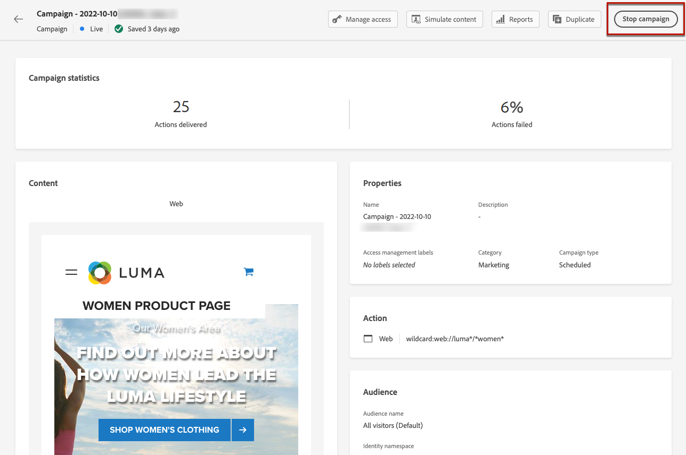

# Skapa webbupplevelser {#create-web}

Med [!DNL Journey Optimizer] kan du anpassa webbupplevelsen som du levererar till dina kunder via inkommande webbkampanjer.

>[!CAUTION]
>
>I [!DNL Journey Optimizer] kan du för närvarande bara skapa webbupplevelser med **kampanjer**.

[Lär dig hur du skapar en webbkampanj i den här videon](#video)

## Skapa en webbkampanj {#create-web-campaign}

>[!CONTEXTUALHELP]
>id="ajo_web_surface"
>title="Definiera en webbkonfiguration"
>abstract="En webbkonfiguration kan matcha en eller flera sidor, vilket gör att du kan leverera innehållsändringar på en eller flera webbsidor."

>[!CONTEXTUALHELP]
>id="ajo_web_surface_rule"
>title="Bygg en sidmatchningsregel"
>abstract="En sidmatchningsregel gör det möjligt att ange flera URL:er som matchar samma regel som mål, t.ex. om du vill använda ändringarna på en hjältebanderoll på en hel webbplats eller lägga till en toppbild som visas på alla produktsidor på en webbplats."

Följ stegen nedan för att börja skapa en webbupplevelse genom en kampanj.

>[!NOTE]
>
>Om det här är första gången du skapar en webbupplevelse måste du följa de krav som beskrivs i [det här avsnittet](web-prerequisites.md).

1. Öppna menyn **[!UICONTROL Campaigns]** och klicka sedan på **[!UICONTROL Create campaign]**.[Läs mer](../campaigns/create-campaign.md)

1. Välj den typ av kampanj som du vill köra

   * **Schemalagd - marknadsföring**: Kör kampanjen direkt eller på ett angivet datum. Schemalagda kampanjer syftar till att skicka marknadsföringsmeddelanden. De konfigureras och körs från användargränssnittet.

   * **API-utlöst - Markering/transaktion**: Kör kampanjen med ett API-anrop. API-utlösta kampanjer syftar till att skicka antingen marknadsförings- eller transaktionsmeddelanden, dvs. meddelanden som skickas ut efter en åtgärd som utförs av en individ: lösenordsåterställning, kundvagn osv.

1. Slutför stegen för att skapa en webbkampanj, till exempel kampanjegenskaperna, [målgrupp](../audience/about-audiences.md) och [schema](../campaigns/create-campaign.md#schedule).

1. Välj åtgärden **[!UICONTROL Web]**.

1. Välj eller skapa en ny konfiguration. [Läs mer om webbkonfiguration](web-configuration.md)

   

Mer information om hur du konfigurerar en kampanj finns på [den här sidan](../campaigns/get-started-with-campaigns.md).

## Testa webbkampanjen {#test-web-campaign}

>[!CONTEXTUALHELP]
>id="ajo_web_designer_preview"
>title="Förhandsgranska din webbupplevelse"
>abstract="Få en simulering av hur webbupplevelsen kommer att se ut."

När du [har skapat din webbupplevelse](edit-web-content.md) med webbdesignern kan du använda testprofiler för att förhandsgranska dina ändrade webbsidor. Om du har infogat anpassat innehåll kan du kontrollera hur det här innehållet visas med hjälp av testprofilsdata.

Det gör du genom att klicka på **[!UICONTROL Simulate content]** på webbkampanjens redigeringsskärm eller webbdesignern och sedan lägga till en testprofil för att kontrollera din webbsida med hjälp av testprofildata.

Du kan även öppna den i standardwebbläsaren eller kopiera test-URL:en och klistra in den i valfri webbläsare. På så sätt kan ni dela länken med teamet och intressenter som kan förhandsgranska den nya webbupplevelsen i vilken webbläsare som helst innan kampanjen blir aktiv.

>[!NOTE]
>
>När du kopierar test-URL:en är det innehåll som visas anpassat för testprofilen som användes när innehållssimuleringen genererades i [!DNL Journey Optimizer].

Detaljerad information om hur du väljer testprofiler och förhandsgranskar innehåll finns i avsnittet [Innehållshantering](../content-management/preview-test.md).

## Aktivera webbkampanjen {#activate-web-campaign}

När du har definierat inställningarna för din [webbkampanj](#configure-web-campaign) och har redigerat ditt innehåll med [webbdesignern](edit-web-content.md#work-with-web-designer) kan du granska och aktivera din webbkampanj. Följ stegen nedan.

<!--
>[!NOTE]
>
>You can also preview your web campaign content before activating it. [Learn more](#test-web-campaign)-->

1. Välj **[!UICONTROL Review to activate]** från webbkampanjen.

1. Kontrollera och redigera vid behov innehåll, egenskaper, konfiguration, målgrupp och schema.

1. Välj **[!UICONTROL Activate]**.

   

   >[!NOTE]
   >
   >När du har klickat på **[!UICONTROL Activate]** kan det ta upp till 15 minuter innan webbkampanjer blir tillgängliga live på din webbplats.

Din webbkampanj har statusen **[!UICONTROL Live]** och är nu synlig för den valda målgruppen. Alla mottagare av kampanjen kan se de ändringar du har lagt till på webbplatsen med hjälp av webbdesignern [!DNL Journey Optimizer].

>[!NOTE]
>
>Om du har definierat ett schema för webbkampanjen har den statusen **[!UICONTROL Scheduled]** tills startdatumet och starttiden nås.
>
>Om du aktiverar en webbkampanj som påverkar samma sidor som en annan kampanj som redan är aktiv, tillämpas alla ändringar på dina webbsidor.

Läs mer om hur du aktiverar kampanjer i [det här avsnittet](../campaigns/review-activate-campaign.md).

## Stoppa en webbkampanj {#stop-web-campaign}

När en webbkampanj är aktiv kan ni stoppa den för att hindra publiken från att se ändringarna. Följ stegen nedan.

1. Välj en livekampanj i listan.

1. Välj **[!UICONTROL Stop campaign]** på den översta menyn.

   

1. De ändringar du har lagt till visas inte längre för den målgrupp du har definierat.

>[!NOTE]
>
>När en webbkampanj har stoppats kan du inte redigera eller aktivera den igen. Du kan bara duplicera den och aktivera den duplicerade kampanjen.

## Instruktionsvideo{#video}

I videon nedan visas hur du skapar en webbkampanj, konfigurerar dess egenskaper, granskar och publicerar den.

>[!VIDEO](https://video.tv.adobe.com/v/3418800/?quality=12&learn=on)