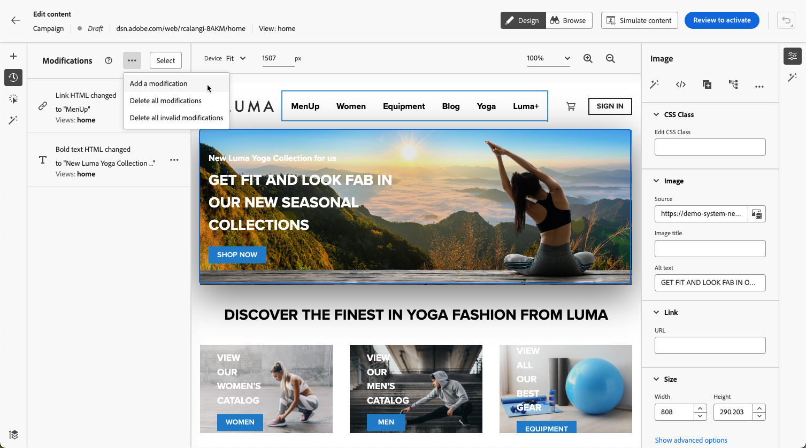

# Hantera webbändringar {#manage-web-modifications}

>[!CONTEXTUALHELP]
>id="ajo_web_designer_modifications"
>title="Hantera enkelt alla ändringar"
>abstract="I den här rutan kan du navigera och hantera alla justeringar och format som du har lagt till på webbsidan."

Du kan enkelt hantera alla komponenter, justeringar och format som du har lagt till på webbsidan. Du kan också lägga till ändringar direkt från den dedikerade rutan.

## Arbeta med rutan Ändringar {#use-modifications-pane}

1. Markera ikonen **[!UICONTROL Modifications]** om du vill visa motsvarande ruta till vänster.

   

1. Du kan granska alla ändringar du har gjort på sidan.

1. Markera en oönskad ändring och klicka på alternativet **[!UICONTROL Delete modification]** från knappen **[!UICONTROL More actions]** för att ta bort den.

   

   >[!CAUTION]
   >
   >Var försiktig när du tar bort en åtgärd eftersom den kan påverka efterföljande åtgärder.

1. Om du redigerar ett [enkelsidigt program](web-spa.md) kan du använda alla ändringar i andra vyer. [Läs mer](web-spa.md#apply-modifications-views)

1. Om du vill ta bort flera ändringar samtidigt klickar du på knappen **[!UICONTROL Select]** ovanpå rutan **[!UICONTROL Modifications]**, markerar de ändringar du vill göra och klickar på ikonen **[!UICONTROL Delete]** .

   

1. Använd knappen **[!UICONTROL More actions]** ovanpå rutan **[!UICONTROL Modifications]** om du vill ta bort alla ändringar samtidigt.

   

1. Du kan också bara ta bort de ogiltiga ändringarna, det vill säga de ändringar som åsidosatts av andra ändringar. Om du till exempel ändrar färgen på en text och sedan tar bort den texten, blir färgändringen ogiltig eftersom texten inte längre finns.

1. Du kan avbryta och göra om åtgärder med knappen **[!UICONTROL Undo/Redo]** längst upp till höger på skärmen.

   

   Klicka och håll ned knappen för att växla mellan alternativen **[!UICONTROL Undo]** och **[!UICONTROL Redo]**. Klicka sedan på själva knappen för att utföra den önskade åtgärden.

## Lägg till ändringar från den dedikerade rutan {#add-modifications}

När du redigerar en sida med webbdesignern kan du lägga till nya ändringar i innehållet direkt från rutan **[!UICONTROL Modifications]**, utan att du behöver markera en komponent och redigera den i webbdesignergränssnittet. Följ stegen nedan.

1. Klicka på knappen **[!UICONTROL Modifications]** i rutan **[!UICONTROL More actions]**.

1. Välj **[!UICONTROL Add a modification]**.

   

1. Välj ändringstyp:

   * **[!UICONTROL CSS Selector]** - [Läs mer](#css-selector)
   * **[!UICONTROL Page `<Head>`]** - [Läs mer](#page-head)

1. Ange ditt innehåll och **[!UICONTROL Save]** dina ändringar.

1. Klicka på knappen **[!UICONTROL More actions]** bredvid din ändring och välj **[!UICONTROL Info]** för att visa informationen.

   

### CSS-väljare {#css-selector}

Följ stegen nedan om du vill lägga till en **CSS-väljartypändring**.

1. Välj **[!UICONTROL CSS Selector]** som ändringstyp.

1. Fältet **[!UICONTROL CSS Element Selector]** hjälper dig att hitta och välja de HTML-element (eller noder i DOM-trädet) som du vill tillämpa ändringarna på. <!--specify the desired CSS element that you want to modify.-->

   

1. Välj en åtgärdstyp (**[!UICONTROL Set Content]** eller **[!UICONTROL Set Attribute]**) och fyll i den information/det innehåll som krävs.

   * **[!UICONTROL Set Content]**: ange innehållet som placeras i elementet som identifieras av fältet **[!UICONTROL CSS Element Selector]**.

   * **[!UICONTROL Set Attribute]**: ange ett attribut som ska associeras med den aktuella CSS-väljaren så att den här väljaren sedan kan identifieras även av det här attributet. Om du vill göra det anger du ett namn i fältet **[!UICONTROL Attribute name]** och ett värde i fältet **[!UICONTROL Content]**. Om attributet redan finns uppdateras värdet. I annat fall läggs ett nytt attribut till med det angivna namnet och värdet.

     

### Sida `<head>` {#page-head}

>[!CONTEXTUALHELP]
>id="ajo_web_designer_head"
>title="Lägg till egen kod"
>abstract="HEAD-elementet är en behållare för metadata och placeras mellan HTML-taggen och BODY-taggen. Lägg bara till SCRIPT- och STYLE-element. Om du lägger till DIV-taggar och andra element kan återstående HEAD-element dyka upp i BODY."

Du kan lägga till anpassad kod med ändringstypen **[!UICONTROL Page `<head>`]**.

Elementet `<head>` är en behållare för metadata (data om data) och placeras mellan taggen `<html>` och taggen `<body>`. I det här fallet väntar koden inte på body- eller page-load-händelser - den körs i början av sidinläsningen.

Elementet `<head>` används ofta för att lägga till JavaScript- eller CSS-kod högst upp på sidan. Väljare för efterföljande visuella åtgärder beror på vilka HTML-element som har lagts till på den här fliken.

Följ stegen nedan om du vill lägga till en **sidtypsändring`<head>`**.

1. Välj **[!UICONTROL Page `<head>`]** som ändringstyp.

   

1. Lägg till din egen kod i rutan **[!UICONTROL Content]**.

   >[!CAUTION]
   >
   >Du kan bara lägga till elementen `<script>` och `<style>` i avsnittet `<head>`. Om du lägger till `<div>`-taggar och andra element kan det leda till att återstående `<head>`-element visas i `<body>`.

1. Klicka på knappen **[!UICONTROL Advanced editing options]**. Anpassningsredigeraren öppnas.

   

   Du kan utnyttja personaliseringsredigeraren [!DNL Journey Optimizer] med alla dess funktioner för personalisering och redigering. [Läs mer](../personalization/personalization-build-expressions.md)

#### Exempel på anpassad kod {#custom-code-examples}

Du kan använda ändringstypen **[!UICONTROL Page `<head>`]** för att:

* Använd JavaScript inline eller länka till en extern JavaScript-fil.

  Om du till exempel vill ändra ett elements färg:

  ```
  <script type="text/javascript">
  document.getElementById("element_id").style.color = "blue";
  </script>
  ```

* Konfigurera en infogad formatmall eller länka till en extern formatmall.

  Så här definierar du en klass för ett övertäckningselement:

  ```
  <style>
  .overlay
  { position: absolute; top:0; left: 0; right: 0; bottom: 0; background: red; }
  </style>
  ```

#### Bästa praxis för anpassad kod {#custom-code-best-practices}

+++ **Radbryt alltid den anpassade koden i ett element.**

Exempel:

```
<script>
// Code goes here
</script>
```

Om några ändringar behövs gör du ändringarna i behållaren.

Om du inte behöver den anpassade koden längre lämnar du den här behållaren tom, men tar inte bort den. Detta säkerställer att andra upplevelseändringar inte påverkas.

+++

+++ **Utför inte document.write-åtgärder i egna kodskript.**

Skript körs asynkront. Detta medför ofta att dokumentet.write-åtgärder visas på fel plats på sidan. Du bör inte använda document.write i skript som skapats med anpassad kod.

+++

+++ **Om du skapar ett element och sedan ändrar det ska du inte ta bort det ursprungliga elementet.**

Varje ändring skapar ett nytt element på panelen **[!UICONTROL Modifications]**. Eftersom den andra åtgärden ändrar element 1 har den åtgärden inte längre något att ändra om du tar bort element 1, så ändringen fungerar inte längre.

+++

+++ **Var försiktig när du använder ändringstypen **[!UICONTROL Page `<head>`]**för två kampanjer som påverkar samma URL.**

Om du använder ändringstypen **[!UICONTROL Page `<head>`]** för två kampanjer som påverkar samma URL, kommer JavaScript att matas in på sidan från båda kampanjerna. [!DNL Journey Optimizer] bestämmer automatiskt ordningen för det levererade innehållet. Kontrollera att koden inte är beroende av placering. Det är upp till dig att se till att det inte finns några konflikter i koden.

+++
