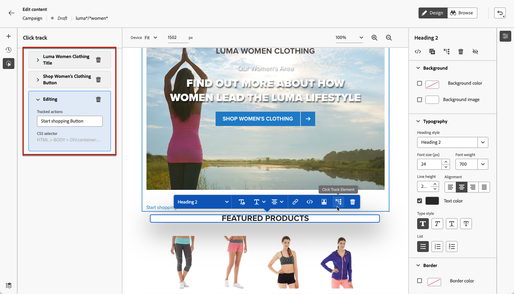

# Övervaka dina webbupplevelser {#monitor-web-experiences}

## Kontrollera webbrapporterna {#check-web-reports}

När webbupplevelsen är aktiv kan du gå till fliken **[!UICONTROL Web]** i [Journey report](../reports/journey-global-report-cja-web.md) och [Campaign report](../reports/campaign-global-report-cja-web.md) för att jämföra element som antalet intryck, klickfrekvens och antal engagemang med webbsidan.

<!--You can check the **[!UICONTROL Web]** tab of the campaign reports. Learn more on the campaign web [live report](../reports/campaign-live-report.md#web-tab) and [global report](../reports/campaign-global-report-cja.md#web).-->

För att ytterligare förbättra övervakningen av webbupplevelsen kan du också spåra klickningarna på ett specifikt element på webbplatsen. Detta gör att du kan visa antalet klick på det elementet i webbrapporterna. [Lär dig hur](#use-click-tracing)

## Använd klickspårning {#use-click-tracking}

Med webbdesignern kan du välja ett element på webbplatsen och spåra klickningarna på det elementet.

Den här informationen kan vara användbar för att förbättra upplevelsen för webbplatsanvändarna. Om till exempel [webbrapporter](../reports/campaign-global-report-cja-web.md) visar att många användare klickar på ett element som egentligen inte går att klicka på, kanske du vill lägga till en länk till det elementet.

1. Markera ett element på sidan och välj **[!UICONTROL Click track element]** på snabbmenyn.

   

   >[!NOTE]
   >
   >Alla objekt, oavsett om de är klickbara eller inte, kan markeras.

1. Motsvarande spårade åtgärd visas automatiskt i rutan **[!UICONTROL Click track]** till vänster.

   

1. Lägg till en meningsfull etikett för att hantera alla dina spårade element och hitta dem enkelt i rapporterna. Fältet **[!UICONTROL CSS selector]** visar information om hur du hittar det valda elementet.

1. Upprepa stegen ovan för att välja så många andra element som behövs för klickspårning. Motsvarande åtgärder visas alla i den vänstra rutan.

   

1. Om du vill ta bort klickspårning på ett element väljer du motsvarande borttagningsikon.

När kampanjen har publicerats kan du kontrollera antalet klickningar för varje element i kampanjwebbrapporten [live](../reports/campaign-live-report.md#web-tab) och [Customer Journey Analytics](../reports/campaign-global-report-cja-web.md).
