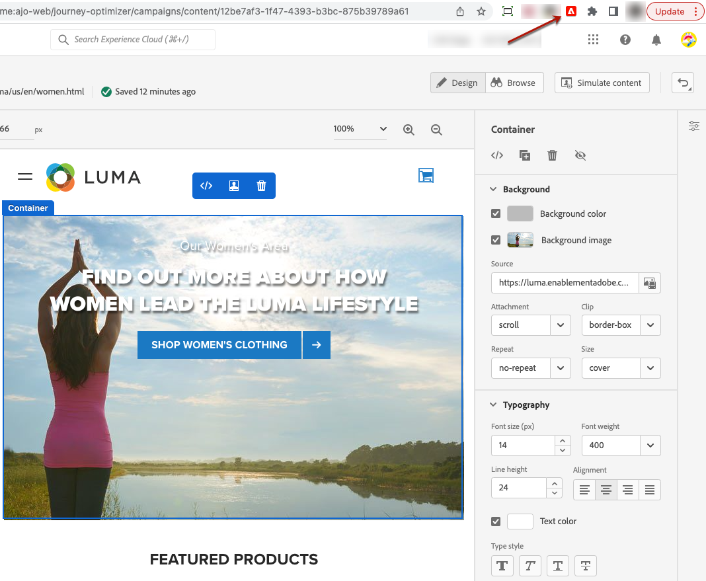

# Hjälptillägg för visuell redigering {#visual-editing-helper}

Med webbläsartillägget Adobe Experience Cloud Visual Editing Helper för Google Chrome kan du snabbt skapa och förhandsgranska dina webbupplevelser genom att läsa in webbplatser i Adobe [!DNL Journey Optimizer] webbdesigner.

>[!NOTE]
>
>Webbkanalsfunktionen är för närvarande endast tillgänglig som betaversion för vissa användare.

## Installera tillägget Hjälp för visuell redigering {#install-visual-editing-helper}

Följ stegen nedan om du vill hämta och installera tillägget för hjälpen för visuell redigering.

1. I Google Chrome Web Store går du till [Adobe Experience Cloud Visual Editing Helper](https://chrome.google.com/webstore/detail/adobe-experience-cloud-vi/kgmjjkfjacffaebgpkpcllakjifppnca){target="_blank"} webbläsartillägg.

1. Klicka på **[!UICONTROL Add to Chrome]** > **[!UICONTROL Add Extension]**.

1. Skapa en webbkanalskampanj i [!DNL Journey Optimizer]. [Lär dig mer](author-web.md#create-web-campaign)

1. Öppna [!DNL Journey Optimizer] webbdesignern för att börja skapa webbupplevelsen. [Läs mer](author-web.md)

1. Kontrollera att webbläsartillägget Visuell redigeringshjälp är aktiverat i webbläsarens verktygsfält genom att klicka på motsvarande ikon.

   

Adobe Experience Cloud Visual Editing Helper aktiveras nu automatiskt när en webbplats öppnas i [!DNL Journey Optimizer] webbdesigner för att skapa.

Tillägget har inga villkorsinställningar och hanterar automatiskt alla inställningar, inklusive cookies för SameSite.

>[!NOTE]
>
>Vissa webbplatser kanske inte öppnas som de ska i [!DNL Journey Optimizer] webbdesignern på grund av någon av följande orsaker:
>
> * Webbplatsen har strikta säkerhetsprinciper.
> * Webbplatsen ligger i en iframe.
> * Kundens QA- eller stage-sajt är inte tillgänglig för omvärlden (webbplatsen är intern).

## Felsökning

När du använder Adobe [!DNL Journey Optimizer] webbdesigner, om du försöker läsa in en webbplats som inte kan läsas in, visas ett meddelande om att du har installerat [Webbläsartillägg för hjälp för visuell redigering](#install-visual-editing-helper).

Om Adobe Experience Platform Web SDK ännu inte är implementerat på webbplatsen visas ett meddelande i webbdesignern som föreslår att du installerar webbläsartillägget Visual Editing och implementerar [Web SDK](https://experienceleague.adobe.com/docs/platform-learn/implement-web-sdk/overview.html){target="_blank"}.

Om webbplatsen inte kan läsas in eller uppför sig oväntat är en möjlig åtgärd att acceptera cookies på webbplatsen i webbläsaren innan du försöker läsa in den i Adobe [!DNL Journey Optimizer].

För sidor som autentiseras, om inloggningssidan inte kan läsas in, eller om du fortfarande inte är inloggad, försöker du logga in först på en annan flik i webbläsaren och sedan läsa in webbplatsen i Adobe [!DNL Journey Optimizer] webbdesigner.
