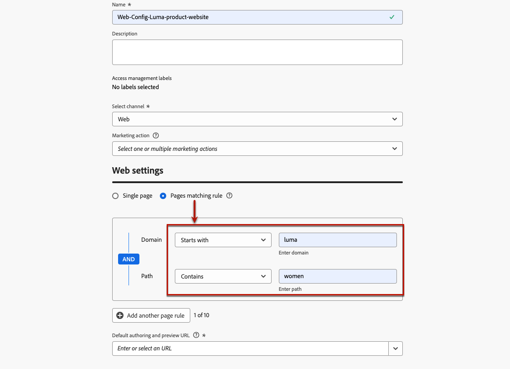

# Skapa webbkanalskonfiguration {#web-configuration}

>[!CONTEXTUALHELP]
>id="ajo_admin_page_rule"
>title="Matchningsregel för sidor"
>abstract="Skapa en regel för sidmatchning för att effektivt hantera och ange en grupp URL:er som delar samma villkor som mål. Med den här regeln kan du konsolidera flera URL:er under en riktlinje, vilket förenklar användningen av konsekventa inställningar och åtgärder på dessa sidor."

>[!CONTEXTUALHELP]
>id="ajo_admin_default_url"
>title="URL för standardredigering och förhandsgranskning"
>abstract="Det här fältet ser till att sidorna som genereras eller matchas av regeln har en angiven URL-adress, vilket är nödvändigt för att både skapa och förhandsgranska innehåll effektivt."

En webbkonfiguration är en webbegenskap som identifieras av en URL där innehållet levereras. Den kan matcha en eller flera sidors URL-adresser så att du kan leverera ändringar för en eller flera webbsidor.

1. Gå till menyn **[!UICONTROL Channels]** > **[!UICONTROL General settings]** > **[!UICONTROL Channel configurations]** och klicka sedan på **[!UICONTROL Create channel configuration]**.

   

1. Ange ett namn och en beskrivning (valfritt) för konfigurationen.

   >[!NOTE]
   >
   > Namn måste börja med en bokstav (A-Z). Det får bara innehålla alfanumeriska tecken. Du kan också använda understreck `_`, punkt `.` och bindestreck `-`.

1. Om du vill tilldela anpassade eller grundläggande dataanvändningsetiketter till konfigurationen kan du välja **[!UICONTROL Manage access]**. [Läs mer om OLAC (Object Level Access Control)](../administration/object-based-access.md).

1. Välj **Webbkanal**.

   

1. Välj **[!UICONTROL Marketing action]** om du vill associera medgivandeprinciper till meddelanden som använder den här konfigurationen. Alla policyer för samtycke som är kopplade till marknadsföringsåtgärden utnyttjas för att ta hänsyn till kundernas preferenser. [Läs mer](../action/consent.md#surface-marketing-actions)

1. Du kan antingen ange **[!UICONTROL Page URL]** om du bara vill tillämpa ändringarna på en sida.

1. Eller så kan du skapa en **[!UICONTROL Pages matching rule]** som mål för flera URL:er som matchar samma regel, till exempel om du vill tillämpa ändringarna på en hjältebanderoll på en hel webbplats eller lägga till en toppbild som visas på alla produktsidor på en webbplats.

   Välj **[!UICONTROL Pages matching rule]** om du vill göra det.

1. Definiera dina villkor för fälten **[!UICONTROL Domain]** och **[!UICONTROL Page]**.

   Om du till exempel vill redigera element som visas på alla sidor med produkter för kvinnor på din Luma-webbplats väljer du **[!UICONTROL Domain]** > **[!UICONTROL Starts with]** > `luma` och **[!UICONTROL Page]** > **[!UICONTROL Contains]** > `women`.

   

1. Om du har skapat en **[!UICONTROL Page matching rule]** måste du ange redigerings- och förhandsgransknings-URL:en **Standard** . Detta steg säkerställer att sidorna som genereras eller matchas av regeln har en angiven URL-adress för både innehållsskapande och förhandsgranskning. Läs mer om reglerna för sidmatchning i [avsnittet nedan](#web-page-matching-rule).

1. Spara ändringarna.

Nu kan du välja din konfiguration när du använder webbkanalen i kampanjer eller resor.

## Sidmatchningsregel {#web-page-matching-rule}

När du skapar en regel som matchar flera sidor så att du kan tillämpa samma innehållsändringar på flera sidor samtidigt, kan du använda olika operatorer i avsnitten **Domän** och **Sökväg** för att skapa önskad regel. Kontrollera tillgängliga operatorer nedan.

Tillgängliga operatorer för att skapa sidmatchningsregler:

* **Domän**

  | Operator  | Beskrivning  | Exempel  |
  |---|---|---|
  | Lika med  | Exakt domänmatchning.  |
  | Börjar med  | Matchar alla domäner (inklusive underdomäner) som börjar med den angivna strängen.  | Exempel: &quot;Börjar med: dev&quot; -> matchar alla domäner och underdomäner som börjar med &quot;dev&quot;, som: dev.example.com, dev.products.example.com, developer.example.com  |
  | Slutar med  | Matchar alla domäner (inklusive underdomäner) som slutar med den angivna strängen.  | Exempel: &quot;Slutar med: example.com&quot; -> matchar alla domäner och underdomäner som slutar med &quot;example.com&quot;, som: stage.example.com, prod.example.com, myexample.com  |
  | Matchning av jokertecken  | Med operatorn &quot;Jokerteckenmatchning&quot; kan användaren definiera en jokerteckenmatchning mitt i strängen, som &quot;dev.*.example.com&quot;. Valideringsreglerna är att värdet måste innehålla ett och endast ett jokertecken (asterisk) när operatorn är&quot;jokerteckenmatchning&quot;.  | Exempel: &quot;Jokerteckenmatchning: dev.*.example.com&quot; -> matchar domäner som: dev.products.example.com, dev.mytest.products.example.com, dev.blog.example.com  |
  | Alla  | Matchar alla domäner - användbart när du testar en viss sökväg över domäner  |

* **Sökväg**

  | | | |
  |-|-|-|
  | Operator  | Beskrivning  | Exempel  |
  | Lika med  | Exakt matchning av sökvägen.  |    |
  | Börjar med  | Matchar alla sökvägar (inklusive delsökvägar) som börjar med den angivna strängen.  |    |
  | Slutar med  | Matchar alla sökvägar (inklusive delsökvägar) som slutar med den sträng som anges.  |    |
  | Alla  | Matchar alla sökvägar - användbart när du riktar in dig på alla sökvägar under en eller flera domäner.  |    |
  | Matchning av jokertecken  | Operatorn &quot;Jokerteckenmatchning&quot; gör att användaren kan definiera ett internt jokertecken i sökvägen, till exempel &quot;/products/*/detail&quot;.  Jokertecknet * i komponenten Path ** matchar alla teckensekvenser tills det första / tecknet påträffas.  /*/ matchar alla teckensekvenser (inklusive delsökvägar)  | Exempel: &quot;Jokerteckenmatchning: /products/*/detail&quot;, matchar alla sökvägar som:  example.com/products/yoga/detail  example.com/products/surf/detail  example.com/products/tennis/detail  example.com/products/yoga/pants/detail   Exempel: &quot;Matchar: /prod*/detail, matchar alla sökvägar som:  example.com/products/detail  example.com/production/detail   matchar inte sökvägar som:  example.com/products/yoga/detail  |
  | Innehåller  | &quot;contains&quot; översätts till ett jokertecken som &quot;mystring&quot; och matchar alla sökvägar som innehåller den här teckensekvensen.  | Exempel: &quot;Innehåller: product&quot;, matchar alla sökvägar som innehåller strängprodukten, som: example.com/products, example.com/yoga/perfproduct, example.com/surf/productdescription, example.com/home/product/page  |

Om ditt användningsfall inte kan modelleras med en regel har du möjlighet att lägga till flera sidregler och du kan använda operatorerna Eller eller Exkludera mellan dem. Exkludera är användbart när en av sidorna som matchar den definierade regeln inte ska ha något mål: till exempel alla exempel&quot;example.com&quot;-sidor som innehåller&quot;product&quot;, exklusive följande sida: `https://example.com/blogs/productinfo`.