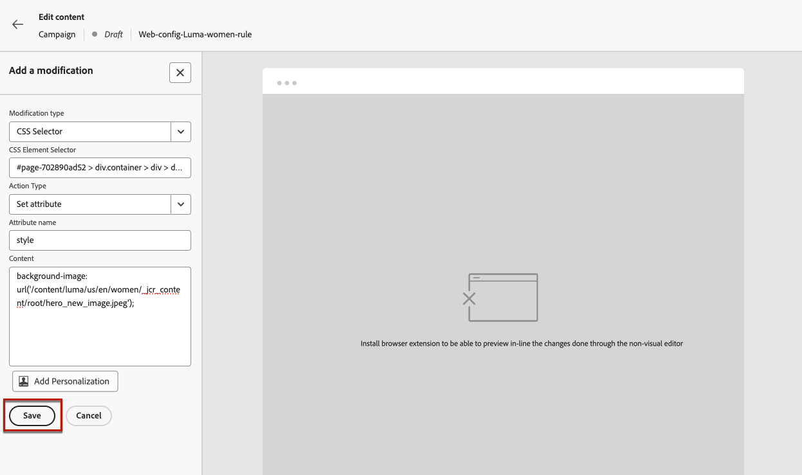

# Använda den icke-visuella webbredigeraren {#web-non-visual-editor}

Förutom den [!DNL Journey Optimizer] visuella [webbdesignern](web-visual-editor.md) kan du även lägga till ändringar på dina webbsidor med en **icke-visuell redigerare** .

Detta kan vara användbart om du inte kan, eller inte tillåts, installera webbläsartillägg som [Adobe Experience Cloud Visual Helper](web-prerequisites.md#visual-authoring-prerequisites) , som krävs för att läsa in sidorna i webbdesignern.

I vissa fall kan det också vara enklare att använda en icke-visuell redigerare för att göra ändringar i en viss CSS-väljare, utan att riskera att ändra andra element på en webbsida eller ändra sidstrukturen.

Följ stegen nedan för att skapa webbupplevelser med den icke-visuella redigeraren.

1. Avmarkera alternativet **[!UICONTROL Visual editor]** på skärmen **[!UICONTROL Edit content]** i resan eller kampanjen.

1. Klicka på **[!UICONTROL Add a modification]** för att börja redigera ditt webbinnehåll.

   

1. Den icke-visuella redigeraren visas. Du kan lägga till den första ändringen i den vänstra rutan.

   

1. Välj ändringstyp i listrutan.

   Det finns två typer. De har olika alternativ. Se länkarna nedan för mer information:

   * **[!UICONTROL CSS Selector]** - [Läs mer](manage-web-modifications.md#css-selector)
   * **[!UICONTROL Page `<head>`]** - [Läs mer](manage-web-modifications.md#page-head)

1. Klicka på knappen **[!UICONTROL Add personalization]**. Anpassningsredigeraren öppnas.

   Du kan utnyttja personaliseringsredigeraren [!DNL Journey Optimizer] med alla dess funktioner för personalisering och redigering. [Läs mer](../personalization/personalization-build-expressions.md)

1. Ange ditt innehåll och **[!UICONTROL Save]** dina ändringar.

   

1. Den första ändringen visas ovanpå rutan **[!UICONTROL Modifications]**.

   Klicka på knappen **[!UICONTROL More actions]** bredvid din ändring och välj **[!UICONTROL Info]** för att visa informationen. Du kan också **[!UICONTROL Delete the modification]** om det behövs.

   

   >[!NOTE]
   >
   >**[!UICONTROL Modifications]**-rutan är densamma som när du använder [webbdesignern](web-visual-editor.md). Alla åtgärder du kan utföra med den beskrivs i [det här avsnittet](manage-web-modifications.md#use-modifications-pane).

1. Klicka på knappen **[!UICONTROL Add]** ovanpå rutan **[!UICONTROL Modifications]** om du vill lägga till ytterligare en ändring och upprepa stegen ovan.

1. Dessutom kan du markera ett element på webbplatsen och spåra klickningarna på det elementet. Om du vill aktivera klickspårning och definiera vilka åtgärder som ska spåras, klickar du på den andra ikonen i den vänstra listen enligt nedan:

   

   Använd knappen **Lägg till komponent** för att välja en ny åtgärd att spåra. Läs mer om hur du använder klickspårning i [det här avsnittet](monitor-web-experiences.md#use-click-tracking).

1. Klicka på pilen längst upp till vänster på skärmen för att bläddra tillbaka till resan eller kampanjutgåvan. Du kan se det aktuella antalet ändringar och lägga till fler.

   

   Du kan också växla till webbdesignern om du vill. Alla ändringar bevaras.
