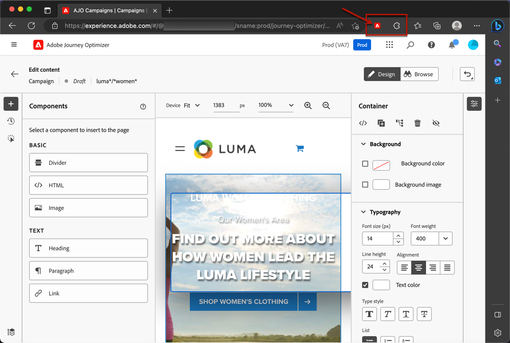

# Förutsättningar och skyddsräcken {#web-prerequisites}

Om du vill kunna komma åt och skapa webbsidor i användargränssnittet för [!DNL Journey Optimizer] följer du kraven nedan:

* Om du vill lägga till ändringar på webbplatsen måste du ha en specifik implementering. [Läs mer](#implementation-prerequisites)

* Om du vill komma åt webbdesignern [!DNL Journey Optimizer] måste du ha ett specifikt webbläsartillägg för Google Chrome installerat. [Läs mer](#visual-authoring-prerequisites)

* För att webbupplevelsen ska kunna levereras på rätt sätt måste du definiera de Adobe Experience Platform-inställningar som anges [här](#delivery-prerequisites).

>[!IMPORTANT]
>
>Webbkampanjer för [!DNL Journey Optimizer] har nya profiler som inte har varit engagerade tidigare i andra kanaler som mål. Detta ökar det totala antalet profiler du kan göra gällande, vilket kan ha kostnadskonsekvenser om det avtalsenliga antalet profiler du har köpt överskrids. Licensvärden för varje paket visas på sidan [Journey Optimizer Product Description](https://helpx.adobe.com/legal/product-descriptions/adobe-journey-optimizer.html){target="_blank"}. Du kan kontrollera antalet profiler som kan användas på kontrollpanelen för [licensanvändning](../audience/license-usage.md).
>

## Krav för implementering {#implementation-prerequisites}

Två typer av implementeringar stöds för att skapa och leverera webbkanalskampanjer på era webbegenskaper:

* Endast på klientsidan - Om du vill lägga till ändringar på webbplatsen måste du implementera [Adobe Experience Platform Web SDK](https://experienceleague.adobe.com/docs/platform-learn/implement-web-sdk/overview.html){target="_blank"} på webbplatsen.

  >[!NOTE]
  >
  >Kontrollera att din [Adobe Experience Platform Web SDK-version](https://experienceleague.adobe.com/en/docs/experience-platform/web-sdk/release-notes){target="_blank"} är 2.16 eller senare.

* Hybridläge - Du kan använda [API:t för AEP Edge Network-servern](https://experienceleague.adobe.com/docs/experience-platform/edge-network-server-api/data-collection/interactive-data-collection.html){target="_blank"} för att begära anpassning på serversidan. Svaret ges till Adobe Experience Platform Web SDK för att återge ändringarna på klientsidan. Läs mer i Adobe Experience Platform [Edge Network Server API-dokumentation](https://experienceleague.adobe.com/docs/experience-platform/edge-network-server-api/overview.html){target="_blank"}. Du kan ta reda på mer om hybridläget och kontrollera några implementeringsexempel i [det här blogginlägget](https://blog.developer.adobe.com/hybrid-personalization-in-the-adobe-experience-platform-web-sdk-6a1bb674bf41){target="_blank"}.

>[!NOTE]
>
>Implementeringen av enbart serversidan stöds för närvarande inte av webbkanalen. Om du bara har en implementering på serversidan för dina webbsidor kan du använda den [kodbaserade upplevelsekanalen](../code-based/get-started-code-based.md) i stället.

<!--If the Adobe Experience Platform Web SDK is not yet implemented on the website, a message displays in the web designer suggesting that you install the Visual Editing Helper browser extension and implement the [Web SDK](https://experienceleague.adobe.com/docs/platform-learn/implement-web-sdk/overview.html){target="_blank"}.-->

## Krav för visuell redigering {#visual-authoring-prerequisites}

<!--In order to rapidly author and preview your web experiences, the Adobe Experience Cloud Visual Editing Helper browser extension for Google Chrome lets you load websites reliably within the Adobe [!DNL Journey Optimizer] web designer.-->

Om du vill kunna öppna, redigera och förhandsgranska dina webbsidor på ett tillförlitligt sätt i webbdesignern [!DNL Journey Optimizer] måste du ha webbläsartillägget [Adobe Experience Cloud Visual Editing Helper](https://chrome.google.com/webstore/detail/adobe-experience-cloud-vi/kgmjjkfjacffaebgpkpcllakjifppnca){target="_blank"} installerat i webbläsaren.

>[!CAUTION]
>
>Google Chrome och Microsoft Edge är för närvarande de enda webbläsare som har stöd för att skapa webbsidor i [!DNL Journey Optimizer].

### Installera tillägget Hjälp för visuell redigering {#install-visual-editing-helper}

Följ stegen nedan om du vill hämta och installera tillägget för hjälpen för visuell redigering.

1. Öppna en ny flik i webbläsaren (Google Chrome eller Microsoft Edge).

1. Gå till [Google Chrome Web Store](https://chrome.google.com/webstore/category/extensions){target="_blank"}.

1. Om du använder Microsoft Edge väljer du **[!UICONTROL Allow extensions from other stores]** på den översta banderollen. Då kan du lägga till tillägg från Chrome Web Store till Microsoft Edge.

1. Sök och navigera till webbläsartillägget [Adobe Experience Cloud Visual Editing Helper](https://chrome.google.com/webstore/detail/adobe-experience-cloud-vi/kgmjjkfjacffaebgpkpcllakjifppnca){target="_blank"} .

1. Klicka på **[!UICONTROL Add to Chrome]** > **[!UICONTROL Add Extension]**.

   >[!NOTE]
   >
   >Om du använder Microsoft Edge läggs tillägget till i Edge även om knappen har etiketten **[!UICONTROL Add to Chrome]**.

1. Kontrollera att webbläsartillägget Visuell redigeringshjälp är korrekt aktiverat i webbläsarens verktygsfält.

   

Hjälpprogrammet för visuell redigering i Adobe Experience Cloud aktiveras nu automatiskt när en webbplats öppnas i [!DNL Journey Optimizer] [webbdesignern](edit-web-content.md#work-with-web-designer) som kan användas för redigering.

Tillägget har inga villkorsinställningar och hanterar automatiskt alla inställningar, inklusive cookies för SameSite.

>[!NOTE]
>
>Vissa webbplatser kanske inte kan öppnas på ett tillförlitligt sätt i webbdesignern [!DNL Journey Optimizer] på grund av någon av följande orsaker:
>
> * Webbplatsen har strikta säkerhetsprinciper.
> * Webbplatsen ligger i en iframe.
> * Kundens QA- eller stage-sajt är inte tillgänglig för omvärlden (webbplatsen är intern).

### Felsök webbplatsen som inte läses in {#troubleshooting}

När du använder webbdesignern [!DNL Journey Optimizer] i Adobe visas ett meddelande om att du har installerat webbläsartillägget [Hjälp för visuell redigering](#install-visual-editing-helper) om du försöker läsa in en webbplats som inte kan läsas in.

1. Kontrollera att webbläsartillägget för hjälpen för visuell redigering är korrekt installerat.

1. Om webbplatsen fortfarande uppför sig oväntat bör du kontrollera att cookies från tredje part tillåts i webbläsaren, annars kan webbsidan inte läsas in i webbdesignern [!DNL Journey Optimizer].

För sidor som autentiseras, om inloggningssidan inte kan läsas in eller om du fortfarande inte är inloggad efter att ha försökt logga in:

1. Försök logga in först på en ny webbläsarflik och navigera till önskad sida. Kopiera sedan URL:en och försök öppna den i webbdesignern [!DNL Journey Optimizer].

2. Om du fortfarande inte kan läsa in din webbplats i webbdesignern [!DNL Journey Optimizer] kontaktar du Adobe kundtjänst för att rapportera problemet och ser till att du anger den felaktiga URL:en.

## Leveransvillkor {#delivery-prerequisites}

För att webbupplevelsen ska kunna levereras på rätt sätt måste följande inställningar definieras:

* I [Adobe Experience Platform Data Collection](https://experienceleague.adobe.com/docs/experience-platform/edge/datastreams/overview.html){target="_blank"} kontrollerar du att du har en datastream definierad, till exempel under **[!UICONTROL Adobe Experience Platform]**-tjänsten som du har alternativet **[!UICONTROL Adobe Journey Optimizer]** aktiverat.

  Detta säkerställer att Journey Optimizer inkommande händelser hanteras korrekt av Adobe Experience Platform Edge. [Läs mer](https://experienceleague.adobe.com/docs/experience-platform/edge/datastreams/configure.html){target="_blank"}

  

* I [Adobe Experience Platform](https://experienceleague.adobe.com/docs/experience-platform/profile/home.html?lang=sv){target="_blank"} kontrollerar du att du har en sammanfogningsprincip med alternativet **[!UICONTROL Active-On-Edge Merge Policy]** aktiverat. Om du vill göra det väljer du en profil under menyn **[!UICONTROL Customer]** > **[!UICONTROL Profiles]** > **[!UICONTROL Merge Policies]** Experience Platform. [Läs mer](https://experienceleague.adobe.com/docs/experience-platform/profile/merge-policies/ui-guide.html#configure){target="_blank"}

  Den här sammanfogningsprincipen används av [!DNL Journey Optimizer] inkommande kanaler för att aktivera och publicera inkommande kampanjer korrekt. [Läs mer](https://experienceleague.adobe.com/docs/experience-platform/profile/merge-policies/ui-guide.html){target="_blank"}

  

* Om du vill felsöka leveransen av Journey Optimizer webbupplevelser kan du använda vyn **Edge Delivery** i **Adobe Experience Platform Assurance**. Med denna plugin kan du granska detaljerade förfrågningar, verifiera om förväntade gränsanrop inträffar och undersöka profildata, inklusive identitetskartor, segmentmedlemskap och inställningar för samtycke. Dessutom kan du granska de aktiviteter som begäran är kvalificerad för och identifiera de som den inte gjorde.

  Genom att använda plugin-programmet **Edge Delivery** får du de insikter du behöver för att förstå och felsöka dina inkommande implementeringar effektivt.

  [Läs mer om Edge Delivery-vyn](https://experienceleague.adobe.com/en/docs/experience-platform/assurance/view/edge-delivery)

## Krav för rapportering {#experiment-prerequisites}

Om du vill aktivera rapportering för webbkanalen måste du se till att den [datamängd](../data/get-started-datasets.md) som används i din webbimplementering [datastream](https://experienceleague.adobe.com/docs/experience-platform/datastreams/overview.html){target="_blank"} också ingår i rapportkonfigurationen.

Om du lägger till en datauppsättning som inte finns i webbdataströmmen när du konfigurerar rapporter, visas alltså inte webbdata i dina rapporter.

Lär dig hur du lägger till datauppsättningar för rapportering i [det här avsnittet](../reports/reporting-configuration.md#add-datasets).

>[!NOTE]
>
>Datauppsättningen används skrivskyddat av rapportsystemet [!DNL Journey Optimizer] och påverkar inte datainsamling eller datainmatning.

Om du **inte** använder följande fördefinierade [fältgrupper](https://experienceleague.adobe.com/docs/experience-platform/xdm/tutorials/create-schema-ui.html#field-group){target="_blank"} för datamängdsschemat: `AEP Web SDK ExperienceEvent` och `Consumer Experience Event` (enligt definition i [den här sidan](https://experienceleague.adobe.com/docs/platform-learn/implement-web-sdk/initial-configuration/configure-schemas.html#add-field-groups){target="_blank"}), måste du lägga till följande fältgrupper: `Experience Event - Proposition Interactions`, `Application Details`, `Commerce Details` och `Web Details`. Dessa behövs av [!DNL Journey Optimizer]-innehållsexperimentets rapportering när de spårar vilka experiment och behandlingar varje profil deltar i.

[Läs mer om rapportkonfiguration](../reports/reporting-configuration.md)

>[!NOTE]
>
>När du lägger till dessa fältgrupper påverkas inte den normala datainsamlingen. Den är bara additiv för de sidor där ett experiment pågår, och lämnar all annan spårning orörd.

## Varumärkesdomäner för resurser {#branded-domains-for-assets}

Om du lägger till innehåll från biblioteket [Adobe Experience Manager Assets](../content-management/assets.md) när du skapar webbupplevelser måste du konfigurera den underdomän som ska användas för att publicera det här innehållet. [Läs mer](web-delegated-subdomains.md)
