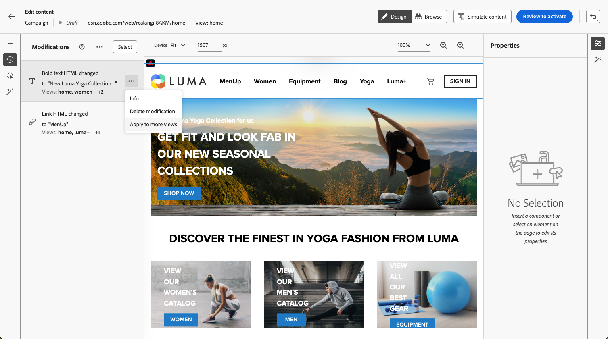

# Skapa single-page-appar {#web-author-spas}

## Om vyer {#about-views}

>[!CONTEXTUALHELP]
>id="ajo_web_designer_modifications_views"
>title="Tillämpa ändringar på markerade vyer"
>abstract="Ändringarna används bara för de valda vyerna. Vyer kan identifieras med läget **Bläddra** och navigera till dem. Hittar du inte den vy du söker?"
>additional-url="https://experienceleague.adobe.com/docs/platform-learn/implement-web-sdk/overview.html?lang=sv-SE" text="Läs mer"

**Enkelsidiga program** (SPA) kan nu skapas i webbdesignerns visuella redigerare. På så sätt kan du välja vilka specifika **vyer** du vill använda webbsidesändringarna på.

[Lär dig hur du skapar enkelsidiga program i den här videon](#video)

En vy kan definieras som en hel webbplats eller som en grupp visuella element på en webbplats, till exempel hemsidan, hela produktwebbplatsen eller leveransinställningsramen på alla utcheckningssidor.

Det krävs en engångsinstallation av utvecklaren för att definiera vyerna i Adobe Experience Platform Web SDK-implementeringen. På så sätt kan ni skapa och köra Adobe Journey Optimizer webbkampanjer på SPA-program.

## Definiera vyer i Web SDK-implementeringen {#define-views}

XDM-vyer kan utnyttjas i Adobe [!DNL Journey Optimizer] för att marknadsförare ska kunna köra webbpersonaliserings- och experimenteringskampanjer på SPA via den webbaserade visuella redigeraren. [Läs mer](https://experienceleague.adobe.com/docs/experience-platform/edge/personalization/ajo/web-spa-implementation.html?lang=sv-SE){target="_blank"}

Om du vill kunna komma åt och redigera vyer i användargränssnittet för [!DNL Journey Optimizer] måste du följa de steg som anges i [det här avsnittet](https://experienceleague.adobe.com/docs/experience-platform/edge/personalization/ajo/web-spa-implementation.html?lang=sv-SE#implement-xdm-views){target="_blank"}.

## Upptäck vyer i webbdesignern {#discover-views}

När SPA-inställningarna är klara i Adobe Experience Platform Web SDK-implementeringen måste du navigera bland alla vyer på webbplatsen som du vill ändra. Följ stegen nedan.

1. [Skapa en webbresa eller kampanj](create-web.md) och få tillgång till [webbdesignern](web-visual-editor.md).

   Den vy du befinner dig i visas längst upp till vänster.

   

1. Växla till läget **[!UICONTROL Browse]**. [Läs mer](web-visual-editor.md#browse-mode)

   

1. Navigera mellan de olika sidorna på webbplatsen för att identifiera alla. Vynamnet som visas överst ändras när du går igenom en annan sida.

   

## Använda ändringar i andra vyer {#apply-modifications-views}

När du har lagt till en ändring i en viss vy kan du använda den i andra markerade vyer. Följ stegen nedan.

>[!CAUTION]
>
>Om du inte har identifierat vyer i läget **[!UICONTROL Browse]** kan du inte markera dem för att tillämpa ändringarna. [Läs mer](#discover-views)

1. Markera ikonen **[!UICONTROL Modifications]** om du vill visa motsvarande ruta till vänster.

   

1. Markera en ändring och klicka på knappen **[!UICONTROL More actions]** bredvid den. Välj **[!UICONTROL Apply to more views]**.

   

1. Markera de vyer som du vill använda ändringarna på.

   

1. Klicka på **[!UICONTROL Apply]**.

1. Växla till läget **[!UICONTROL Browse]** om du vill kontrollera att ändringarna tillämpas på de önskade sidorna.

   

## Instruktionsvideo{#video}

I den här videon beskrivs hur du:

* Upptäck SPA-vyer i läget **[!UICONTROL Browse]**
* Utför redigering i den aktuella vyn
* Använd webbplatsändringar på flera vyer eller på alla vyer som identifierats
* Göra satsåtgärder på ändringar

>[!VIDEO](https://video.tv.adobe.com/v/3424536/?quality=12&learn=on)
