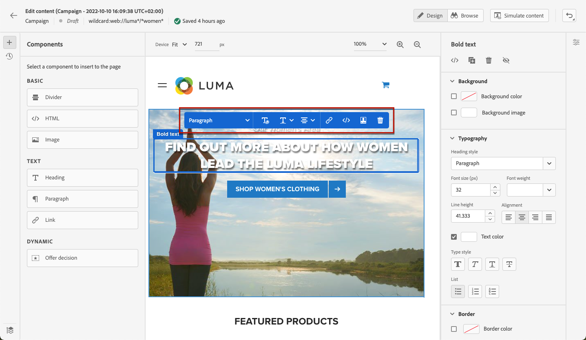
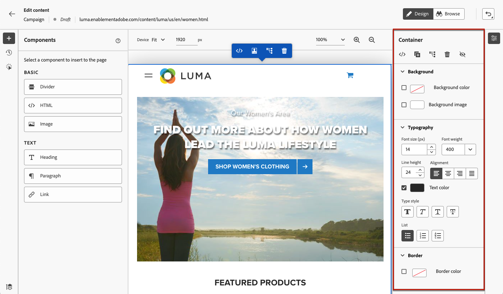
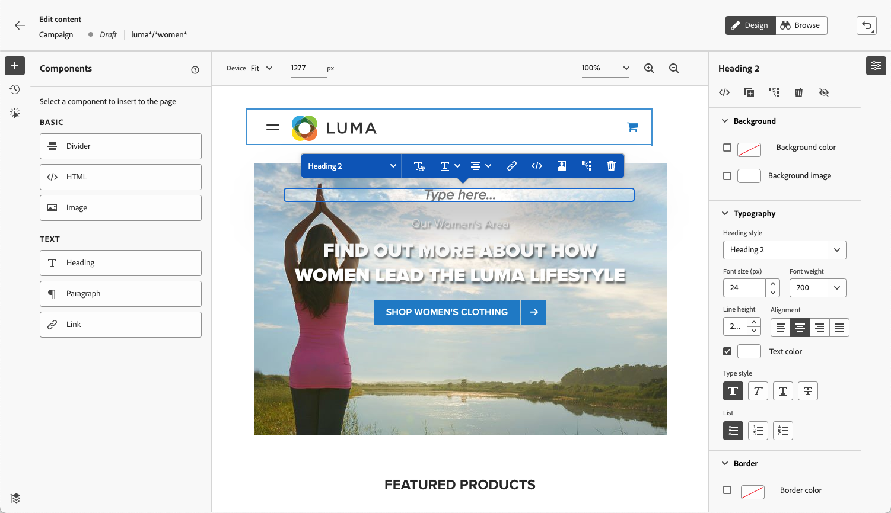

# Arbeta med webbdesignern {#work-with-web-designer}

<!--
>[!CONTEXTUALHELP]
>id="ajo_web_url_to_edit_surface"
>title="Confirm the URL to edit"
>abstract="Confirm the URL of the specific web page to use for editing the content that will be applied on the web configuration defined above. The web page must be implemented using the Adobe Experience Platform Web SDK."
>additional-url="https://experienceleague.adobe.com/docs/platform-learn/implement-web-sdk/overview.html?lang=sv-SE" text="Learn more"

>[!CONTEXTUALHELP]
>id="ajo_web_url_to_edit_rule"
>title="Enter the URL to edit"
>abstract="Enter the URL of a specific web page to use for editing the content that will be applied to all pages matching the rule. The web page must be implemented using Adobe Experience Platform Web SDK."
>additional-url="https://experienceleague.adobe.com/docs/platform-learn/implement-web-sdk/overview.html?lang=sv-SE" text="Learn more"
-->

I [!DNL Journey Optimizer] hanteras visuell webbutveckling av webbläsartillägget **Adobe Experience Cloud Visual Helper** i Chrome. [Läs mer](web-prerequisites.md#visual-authoring-prerequisites)

>[!CAUTION]
>
>Om du vill kunna komma åt och redigera webbsidor i användargränssnittet för [!DNL Journey Optimizer] måste du följa de krav som anges i [det här avsnittet](web-prerequisites.md).

## Börja skapa en webbupplevelse

Följ stegen nedan för att börja skapa din webbupplevelse med den visuella webbdesignern.

>[!CAUTION]
>
>[Adobe Experience Platform Web SDK](https://experienceleague.adobe.com/docs/platform-learn/implement-web-sdk/overview.html?lang=sv-SE){target="_blank"} måste inkluderas på din webbsida. [Läs mer](web-prerequisites.md#implementation-prerequisites)

1. Öppna webbdesignern genom att klicka på **[!UICONTROL Edit content]** på skärmen **[!UICONTROL Edit web page]**.

   

   <!---->

   >[!NOTE]
   >
   >Om du försöker läsa in en webbplats som inte kan läsas in visas ett meddelande om att du har installerat webbläsartillägget [Visuell redigeringshjälp](#install-visual-editing-helper). Se några tips om felsökning i [det här avsnittet](web-prerequisites.md#troubleshooting).
   >
   >Du kan även redigera webbinnehåll utan att läsa in den visuella redigeraren. Om du vill göra det avmarkerar du alternativet **[!UICONTROL Visual editor]** om du vill använda det icke-visuella versionsläget i stället. [Läs mer](web-non-visual-editor.md)

1. I webbdesignern markerar du ett element på arbetsytan, till exempel bild, knapp, stycke, text, behållare, rubrik, länk osv. [Läs mer](#content-components)

1. Om du vill redigera ett element kan du använda:

   * Den sammanhangsbaserade menyn där du kan redigera innehåll, layout, infoga länkar eller personalisering, osv.

     

   * Ikonerna överst på den högra panelen för att redigera, duplicera, ta bort eller dölja varje element.

     

   * Den högra panelen som ändras dynamiskt enligt det valda elementet. Du kan till exempel redigera bakgrunden, typografin, kanten, storleken, positionen, mellanrummet, effekterna eller textbundna format för ett element.

     

>[!NOTE]
>
>Webbinnehållsdesignern liknar oftast e-post-Designer. Läs mer om att [utforma innehåll med  [!DNL Journey Optimizer]](../email/get-started-email-design.md).

När du har redigerat webbinnehållet kan du hantera ändringarna. [Läs mer](manage-web-modifications.md)

## Använda komponenter {#content-components}

>[!CONTEXTUALHELP]
>id="ajo_web_designer_components"
>title="Lägga till komponenter på webbsidan"
>abstract="Du kan lägga till ett antal komponenter på webbsidan och redigera dem efter behov."

1. Markera ett objekt i rutan **[!UICONTROL Components]** till vänster. Du kan lägga till följande komponenter på webbsidan och redigera dem efter behov:

   * [Delare](../email/content-components.md#divider)
   * [HTML](../email/content-components.md#HTML)
   * [Bild](../email/content-components.md#image)
   * Rubrik - Att använda den här komponenten påminner om att använda komponenten **[!UICONTROL Text]** i e-post-Designer. [Läs mer](../email/content-components.md#text)
   * Stycke - Att använda den här komponenten påminner om att använda komponenten **[!UICONTROL Text]** i e-post-Designer. [Läs mer](../email/content-components.md#text)
   * Länk

   

1. Håll muspekaren på sidan och klicka på knappen **[!UICONTROL Insert before]** eller **[!UICONTROL Insert after]** för att lägga till komponenten i ett befintligt element på sidan.

   

   >[!NOTE]
   >
   >Om du vill avmarkera en komponent klickar du på knappen **[!UICONTROL ESC]** i den kontextuella blå banderollen som visas ovanpå arbetsytan.

1. Redigera komponenten efter behov direkt i innehållet på sidan.

   

1. Justera de format som visas i rutan till höger, t.ex. bakgrund, textfärg, kant, storlek, position. - beroende på vald komponent.

   

## Lägg till personalisering

Om du vill lägga till personalisering markerar du en behållare och väljer personaliseringsikonen på den snabbmenyrad som visas. Lägg till ändringarna med personaliseringsredigeraren. [Läs mer](../personalization/personalization-build-expressions.md)

## Navigera i webbdesignern {#navigate-web-designer}

I det här avsnittet beskrivs olika sätt att navigera i webbdesignern. Information om hur du visar och hanterar de ändringar som har lagts till i webbupplevelsen finns i [det här avsnittet](manage-web-modifications.md).

### Använd vägbeskrivningar {#breadcrumbs}

1. Markera ett element på arbetsytan.

1. Klicka på knappen **[!UICONTROL Expand/Collapse Breadcrumbs]** längst ned till vänster på skärmen för att snabbt visa information om det markerade elementet.

   

1. När du håller muspekaren över vägbeskrivningarna markeras motsvarande element i redigeraren.

1. Med den kan du enkelt navigera till alla överordnade, jämställda eller underordnade element i den visuella redigeraren.

### Växla till bläddringsläge {#browse-mode}

>[!CONTEXTUALHELP]
>id="ajo_web_designer_browse"
>title="Använda bläddringsläget"
>abstract="I det här läget kan du navigera till den exakta sidan från den valda konfigurationen som du vill anpassa."

Du kan växla från standardläget **[!UICONTROL Design]** till läget **[!UICONTROL Browse]** med den dedikerade knappen.

I **[!UICONTROL Browse]**-läget kan du navigera till den exakta sidan från den valda konfigurationen som du vill anpassa.

Det är särskilt användbart när du hanterar sidor som är bakom autentisering eller som inte är tillgängliga från början på en viss URL. Du kan till exempel autentisera, navigera till din kontosida eller till kundvagnssidan och sedan växla tillbaka till läget **[!UICONTROL Design]** för att kunna utföra ändringarna på den önskade sidan.

I **[!UICONTROL Browse]**-läget kan du även navigera i alla vyer på webbplatsen när du redigerar ensidiga program. [Läs mer](web-spa.md)

### Ändra enhetsstorlek {#change-device-size}

Du kan ändra enhetsstorleken för webbdesignervisningen till en fördefinierad storlek som **[!UICONTROL Tablet]** eller **[!UICONTROL Mobile landscape]**, eller definiera en anpassad storlek genom att ange önskat antal pixlar.

Du kan också ändra zoomfokus - från 25 % till 400 %.

Möjligheten att ändra enhetsstorleken är utformad för responsiva sajter som återges bra på olika enheter, fönster och skärmstorlekar. Responsiva sajter justeras och anpassas automatiskt efter alla skärmstorlekar, inklusive stationära datorer, bärbara datorer, surfplattor och mobiltelefoner.

>[!CAUTION]
>
>Du kan redigera en webbupplevelse med en viss enhetsstorlek. Så länge väljarna är desamma gäller dock dessa ändringar för alla storlekar och enheter, inte bara för den enhetsstorlek som du arbetar i. På samma sätt tillämpas ändringarna på alla skärmstorlekar, inte bara på skrivbordsvyn, när du redigerar en upplevelse i den normala skrivbordsvyn.
>
>[!DNL Journey Optimizer] stöder för närvarande inte enhetsstorleksspecifika sidändringar. Det innebär att om du till exempel har en separat mobilwebbplats med en separat webbplatsstruktur, bör du göra ändringarna specifika för din mobilwebbplats i en annan kampanj.

## Instruktionsvideo{#video}

I videon nedan visas hur du skapar en webbupplevelse med webbdesignern i [!DNL Journey Optimizer]-kampanjer.

>[!VIDEO](https://video.tv.adobe.com/v/3418803/?quality=12&learn=on)
