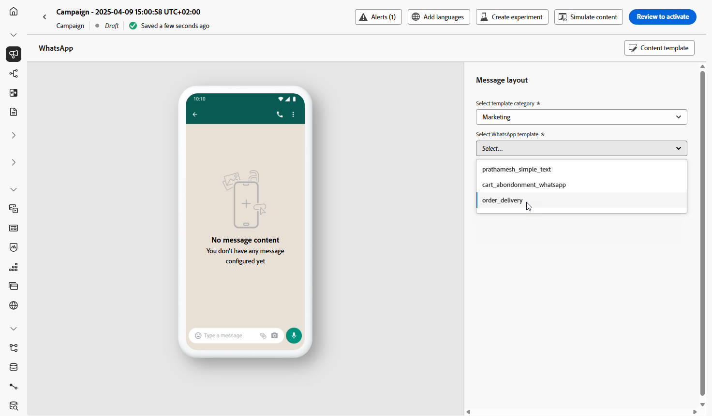
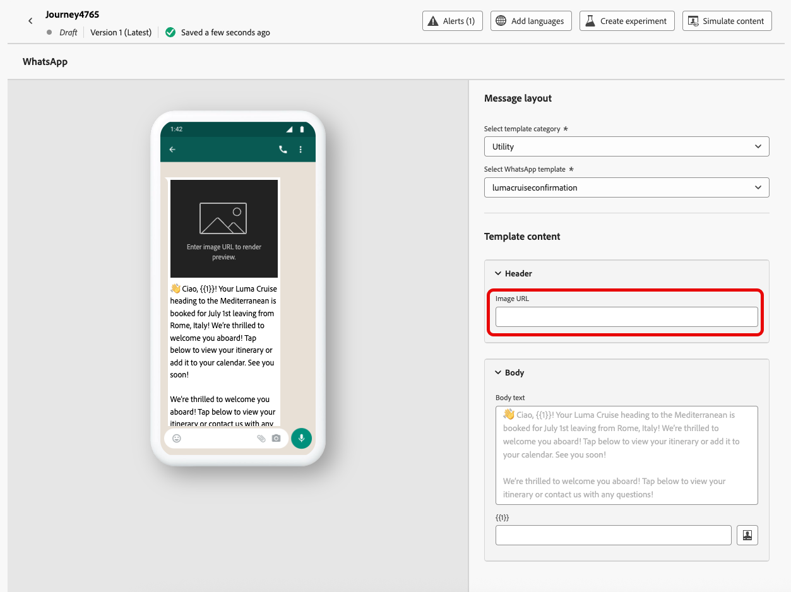
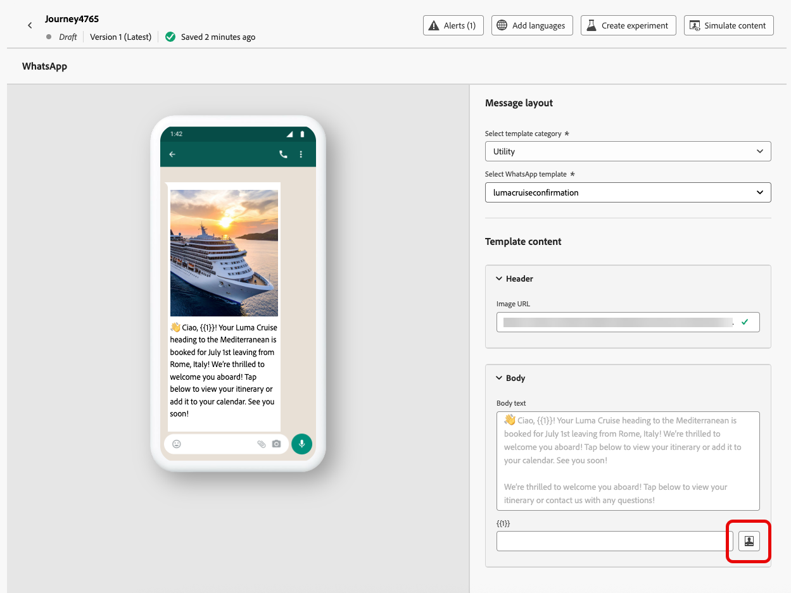

# Skapa ett WhatsApp-meddelande {#create-whatsapp}

Med Adobe Journey Optimizer kan du utforma och skicka engagerande meddelanden om whatsApp. Lägg bara till en whatsApp-åtgärd till resan eller kampanjen och skapa meddelandeinnehållet enligt beskrivningen nedan. Med Adobe Journey Optimizer kan du också testa dina whatsApp-meddelanden innan du skickar dem, vilket ger perfekt återgivning, korrekt personalisering och korrekt konfiguration av alla inställningar.

Observera att endast utgående meddelandeelement stöds i Journey Optimizer.

+++ Läs mer om meddelandeelement som stöds och anrop till åtgärder

Följande meddelandetyper stöds i WhatsApp:

| Meddelandefunktion | Beskrivning |
|-|-|
| Sidhuvuden | Valfri text som visas ovanför meddelandetexten. |
| Text | Stöder dynamiskt innehåll via parametrar. |
| Bilder (JPEG, PNG) | Måste vara i 8-bitars RGB- eller RGBA-format och mindre än 5 MB. |
| Videor | Måste vara 3GPP eller MP4, mindre än 16 MB, och vara värd via URL. |
| Ljud | Endast tillgängligt för svarsmeddelanden. Måste vara AAC-, AMR-, MP3-, MP4- eller OGG-format, värd på en URL och under 16 MB. |
| Dokument | Måste vara mindre än 100 MB, finnas på en URL och i något av följande format: .txt, .xls/.xlsx, .doc/.docx, .ppt/.pptx eller .pdf. |
| Brödtext | Stöder dynamiskt innehåll via parametrar. |
| Sidfotstext | Stöder dynamiskt innehåll via parametrar. |

Följande call-to-action-alternativ är tillgängligt för dina WhatsApp-meddelanden:

| Utlysning av åtgärder | Beskrivning |
|-|-|
| Besök webbplatsen | Endast en knapp tillåts med variabelparametrar. |
| Anropa whatsApp | Tillhandahåller en knapp som öppnar en whatsApp-chatt med det angivna telefonnumret direkt från meddelandet. |
| Telefonnummer | Tillhandahåller en knapp som initierar ett telefonsamtal till det angivna numret när användaren knackar på det. |

+++

## Lägg till ett WhatsApp-meddelande {#create-whatsapp-journey-campaign}

Bläddra bland flikarna nedan för att lära dig hur du lägger till ett WhatsApp-meddelande i en kampanj eller en resa.

>[!BEGINTABS]

>[!TAB Lägg till ett WhatsApp-meddelande på en resa]

1. Öppna din resa och dra och släpp en **whatsApp-aktivitet** från **Actions** -sektionen på paletten.

   

1. Ange grundläggande information i meddelandet (etikett, beskrivning, kategori) och välj sedan den meddelandekonfiguration som ska användas.

   Mer information om hur du konfigurerar en resa finns på [sidan](../building-journeys/journey-gs.md)

   Fältet **[!UICONTROL configuration]** är som standard förfyllt med den senaste konfigurationen som används av användaren för den kanalen.

Nu kan du börja designa innehållet i ditt whatsApp-meddelande från knappen **[!UICONTROL Edit content]**, enligt beskrivningen nedan.

>[!TAB Lägg till ett WhatsApp-meddelande i en kampanj]

1. Öppna menyn **[!UICONTROL Campaigns]** och klicka sedan på **[!UICONTROL Create campaign]**.

1. Välj kampanjtypen **Schemalagd - marknadsföring**.

1. I avsnittet **[!UICONTROL Properties]** redigerar du din kampanjs **[!UICONTROL Title]** och **[!UICONTROL Description]**.

1. Klicka på knappen **[!UICONTROL Select audience]** för att definiera målgruppen i listan över tillgängliga Adobe Experience Platform-målgrupper. [Läs mer](../audience/about-audiences.md).

1. I fältet **[!UICONTROL Identity namespace]** väljer du det namnutrymme som ska användas för att identifiera personer från den valda målgruppen. [Läs mer](../event/about-creating.md#select-the-namespace).

1. I avsnittet **[!UICONTROL Actions]** väljer du **[!UICONTROL WhatsApp]** och väljer eller skapar en ny konfiguration.

   Läs mer om konfigurationen för whatsApp på [den här sidan](whatsapp-configuration.md).

   

1. Klicka på **[!UICONTROL Create experiment]** för att börja konfigurera ditt innehållsexperiment och skapa behandlingar för att mäta deras prestanda och identifiera det bästa alternativet för målgruppen. [Läs mer](../content-management/content-experiment.md)

1. I avsnittet **[!UICONTROL Actions tracking]** anger du om du vill spåra klickningar på länkar i meddelandet WhatsApp.

1. Kampanjer är utformade för att köras ett visst datum eller med en återkommande frekvens. Lär dig hur du konfigurerar **[!UICONTROL Schedule]** för din kampanj i [det här avsnittet](../campaigns/create-campaign.md#schedule).

1. På menyn **[!UICONTROL Action triggers]** väljer du **[!UICONTROL Frequency]** för ditt WhatsApp-meddelande:

   * En gång
   * Dagligen
   * Vecka
   * Månad

Nu kan du börja designa innehållet i ditt whatsApp-meddelande från knappen **[!UICONTROL Edit content]**, enligt beskrivningen nedan.

>[!ENDTABS]

## Definiera innehållet i whatsApp{#whatsapp-content}

>[!BEGINSHADEBOX]

Innan du utformar whatsApp-meddelandet i Journey Optimizer måste du först skapa och utforma mallen i Meta. [Läs mer](https://www.facebook.com/business/help/2055875911147364?id=2129163877102343)

Observera att din whatsApp-mall först måste godkännas av Meta innan den kan användas i Journey Optimizer. Denna process tar vanligtvis några timmar, men kan ta upp till 24 timmar. [Läs mer](https://developers.facebook.com/docs/whatsapp/message-templates/guidelines/#approval-process)

>[!ENDSHADEBOX]

1. Klicka på knappen **[!UICONTROL Edit content]** på skärmen för resan eller kampanjkonfigurationen för att konfigurera innehållet i WhatsApp-meddelandet.

<!--
1. Select **[!UICONTROL Template message]**.
-->

1. Välj din **mallkategori**:

   * Marknadsföring
   * Verktyg
   * Autentisering

   [Läs mer om mallkategorier](https://developers.facebook.com/docs/whatsapp/updates-to-pricing/new-template-guidelines/#template-category-guidelines)

   

1. I listrutan **whatsApp-mall** väljer du den mall du skapade tidigare i Meta.

   [Läs mer om hur du skapar dina whatsApp-mallar](https://www.facebook.com/business/help/2055875911147364?id=2129163877102343)

   

1. Lägg till medie-URL:er i fältet **[!UICONTROL Image URL]** för att ersätta platshållare i mallen. Meta mallmedier är bara platshållare. Om du vill visa bilder, ljud eller video på rätt sätt måste du använda externa URL:er från Adobe Experience Manager eller andra källor.

   

1. Använd personaliseringsredigeraren för att lägga till personalisering i mallen. Du kan använda alla attribut, till exempel profilnamnet eller stad.

   Bläddra igenom följande sida om du vill veta mer om [personalisering](../personalization/personalize.md).

   

1. Använd knappen **[!UICONTROL Simulate content]** för att förhandsgranska innehållet i dina WhatsApp-meddelanden, förkortade URL:er och anpassat innehåll. [Läs mer](send-whatsapp.md)

När du har utfört dina tester och validerat innehållet kan du [skicka whatsApp-meddelandet](send-whatsapp.md) till din publik och övervaka dess prestanda genom [rapportering](../reports/campaign-global-report-cja.md).

<!--
* **[!UICONTROL Template message]**: Predefined message imported from Meta into Journey Optimizer. These are intended for sending notifications, alerts, or updates to your customers.

* **[!UICONTROL Response message]**: Message created in Journey Optimizer and sent in reply to customer queries or interactions.

>[!BEGINTABS]

>[!TAB Template message]

1. From the journey or campaign configuration screen, click the **[!UICONTROL Edit content]** button to configure the WhatsApp message content.

1. Select **[!UICONTROL Template message]**.

1. Choose your Template category. [Learn more](https://developers.facebook.com/docs/WhatsApp/updates-to-pricing/new-template-guidelines/)

1. From the **WhatsApp template** drop-down, select your previously created template designed in Meta.

1. Use the personalization editor to define content, add personalization and dynamic content. You can use any attribute, such as the profile name or city for example. You can also define conditional rules. Browse to the following pages to learn more about [personalization](../personalization/personalize.md) and [dynamic content](../personalization/get-started-dynamic-content.md) in the personalization editor.

1. Use the **[!UICONTROL Simulate content]** button to preview your WhatsApp message content, shortened URLs, and personalized content. [Learn more](send-whatsapp.md)

Once you have performed your tests and validated the content, you can send your WhatsApp message to your audience. These steps are detailed on [this page](send-whatsapp.md)

>[!TAB Response message]

1. From the journey or campaign configuration screen, click the **[!UICONTROL Edit content]** button to configure the WhatsApp message content.

1. Select **[!UICONTROL Response message]**.

1. Enter your text in the **[!UICONTROL Body]** field.

1. Use the personalization editor to define content, add personalization and dynamic content. You can use any attribute, such as the profile name or city for example. You can also define conditional rules. Browse to the following pages to learn more about [personalization](../personalization/personalize.md) and [dynamic content](../personalization/get-started-dynamic-content.md) in the personalization editor.

1. Use the **[!UICONTROL Simulate content]** button to preview your WhatsApp message content, shortened URLs, and personalized content. [Learn more](send-whatsapp.md)

Once you have performed your tests and validated the content, you can send your WhatsApp message to your audience. These steps are detailed on [this page](send-whatsapp.md)

>[!ENDTABS]
-->

## Instruktionsvideo {#video}

I videon nedan visas hur du skapar en whatsApp-resa i flera steg med Adobe Journey Optimizer.

+++ Se videon

>[!VIDEO](https://video.tv.adobe.com/v/3470282/?learn=on")

+++
