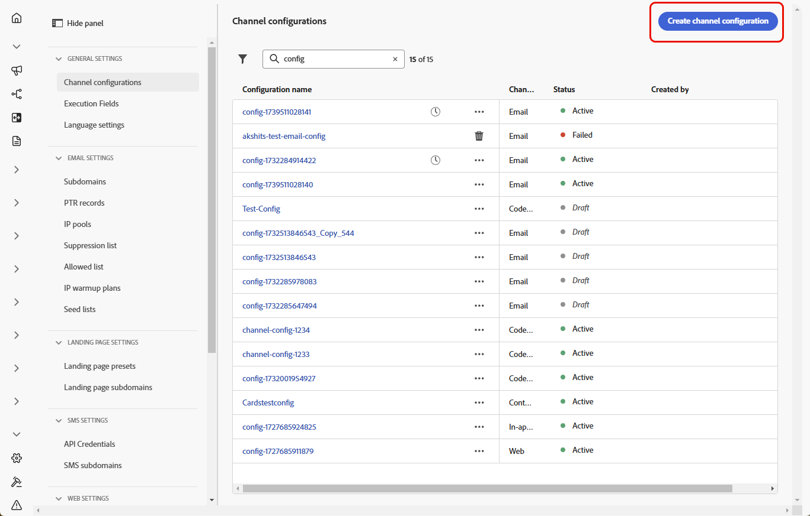

# Kom igång med konfigurationen för whatsApp {#whatsapp-config}

>[!BEGINSHADEBOX]

**Innehållsförteckning**

* [Kom igång med whatsApp-meddelanden](get-started-whatsapp.md)
* **[Kom igång med whatsApp-konfiguration](whatsapp-configuration.md)**
* [Skapa ett WhatsApp-meddelande](create-whatsapp.md)
* [Kontrollera och skicka dina meddelanden om whatsApp](send-whatsapp.md)

>[!ENDSHADEBOX]

Innan du skickar ett WhatsApp-meddelande måste du konfigurera din Adobe Journey Optimizer-miljö och associera med ditt WhatsApp-konto. Så här gör du:

1. [Skapa dina API-autentiseringsuppgifter för WhatsApp](#WhatsApp-credentials)
1. [Skapa webbhotell för whatsApp](#WhatsApp-webhook)
1. [Skapa din whatsApp-konfiguration](#WhatsApp-configuration)

Dessa steg måste utföras av en Adobe Journey Optimizer [systemadministratör](../start/path/administrator.md).

## Skapa API-autentiseringsuppgifter för whatsApp {#whatsapp-credentials}

1. I den vänstra listen bläddrar du till **[!UICONTROL Administration]** `>` **[!UICONTROL Channels]** och väljer menyn **[!UICONTROL API Credentials]** . Klicka på knappen **[!UICONTROL Create new API credentials]**.

1. Konfigurera dina API-autentiseringsuppgifter enligt nedanstående:

   * **API-token**: Ange din API-token. Läs mer i [Metadatadokumentation](https://developers.facebook.com/docs/facebook-login/guides/access-tokens/)
   * **Konto-ID**: Ange det unika nummer som hör till din företagsportfölj. Läs mer i [Metadatadokumentation](https://www.facebook.com/business/help/1181250022022158?id=180505742745347).

   

1. Klicka på **[!UICONTROL Continue]**.

1. Välj det **företagskonto** som du vill ansluta till dina API-autentiseringsuppgifter för WhatsApp.

   

1. Välj det **avsändarnamn** som ska användas för att skicka dina Whatsapp-meddelanden.

1. Dina telefonnummerinställningar fylls i automatiskt:

   * **Kvalitetsklassificering**: Återger kundens feedback på meddelanden som skickats de senaste 24 timmarna.
      * Grön: Hög kvalitet
      * Gul: Medium-kvalitet
      * Röd: Låg kvalitet

     Läs mer om [Kvalitetsklassificering](https://www.facebook.com/business/help/766346674749731#)

   * **Genomflöde**: anger den hastighet med vilken ditt telefonnummer kan skicka meddelanden.

1. Klicka på **[!UICONTROL Submit]** när du är klar med konfigurationen av dina API-autentiseringsuppgifter.

När du har skapat och konfigurerat dina API-autentiseringsuppgifter måste du nu skapa en kanalkonfiguration för WhatsApp-meddelanden. [Läs mer](#whatsapp-configuration)

## Skapa webkrok {#WhatsApp-webhook}

>[!CONTEXTUALHELP]
>id="ajo_admin_whatsapp_webhook_inbound_keyword_category"
>title="Ankommande nyckelordskategori"
>abstract=" <b>Opt-In</b>: skickar ditt definierade autosvar när en användare prenumererar.  <b>Avanmäl dig</b>: skickar ditt definierade autosvar när en användare avbeställer prenumerationen.  <b>Hjälp</b>: skickar det definierade automatiska svaret när en användare begär hjälp eller support.  <b>Standard</b>: skickar det automatiska svaret för reservlösningar när inga nyckelord matchar."

>[!CONTEXTUALHELP]
>id="ajo_admin_whatsapp_webhook_inbound_keyword"
>title="Ange dina nyckelord"
>abstract= "You can define keywords to trigger specific auto-responses, such as for Opt-In, Opt-Out, Help, or Default, based on what users text. Keywords are not case-sensitive, e.g., "stop" and "STOP" are treated the same."

>[!CONTEXTUALHELP]
>id="ajo_admin_whatsapp_webhook_webhook_url"
>title=" Återanrops-URL"
>abstract="Verifieringsbegäran och webkrok-meddelanden för det här objektet skickas till den angivna URL:en."

>[!CONTEXTUALHELP]
>id="ajo_admin_whatsapp_webhook_verify_token"
>title="Verifiera token"
>abstract="Den token som Meta återställer för att bekräfta och verifiera återanrops-URL:en under verifieringsprocessen."

>[!NOTE]
>
>Utan angivna nyckelord för anmälan eller avanmälan aktiveras inte standardmeddelanden för samtycke.

När dina API-autentiseringsuppgifter för WhatsApp och dina [Meta Webhooks](https://developers.facebook.com/docs/whatsapp/webhooks/) har skapats är nästa steg att skapa en webkrok och konfigurera dina inkommande inställningar.

1. Navigera till **[!UICONTROL Administration]** `>` **[!UICONTROL Channels]** i den vänstra listen, välj menyn **[!UICONTROL WhatsApp Webhooks]** under **[!UICONTROL WhatsApp settings]** och klicka på knappen **[!UICONTROL Create Webhook]**.

1. Ange en [!UICONTROL Name] för din webkrok.

1. I listrutan väljer du de [API-autentiseringsuppgifter](#whatsapp-credentials) som du skapade tidigare.

1. Klicka på  för att börja konfigurera en **[!UICONTROL Inbound keyword category]** som:

   * **[!UICONTROL Opt-in Keywords]**
   * **[!UICONTROL Opt-out Keywords]**
   * **[!UICONTROL Help Keywords]**

1. Ange din **[!UICONTROL Keyword]**.

   Om du vill lägga till flera nyckelord klickar du på .

1. Ange **[!UICONTROL Reply Message]** som ska skickas när ett konfigurerat nyckelord tas emot.

<!--
1. Click **[!UICONTROL View payload editor]** to validate and customize your request payloads. 
    
    You can dynamically personalize your payload using profile attributes, and ensure accurate data is sent for processing and response generation with the help of built-in helper functions.
-->

1. Klicka på **[!UICONTROL Submit]** när du är klar med konfigurationen av din WhatsApp-webkrok.

1. Klicka på ikonen **[!UICONTROL Webhooks]** bin för att ta bort din WhatsApp-webkrok.

1. Om du vill ändra den befintliga konfigurationen letar du reda på önskad webbkrok och klickar på alternativet **[!UICONTROL Edit]** för att göra de ändringar som behövs.

1. Få åtkomst till och kopiera din nya **[!UICONTROL Webhook URL]** från din tidigare inskickade **[!UICONTROL WhatsApp Webhook]**.

Nu när din webkrok är konfigurerad kan du skapa din whatsApp-konfiguration.

## Skapa whatsApp-konfiguration {#whatsapp-configuration}

1. I den vänstra listen bläddrar du till **[!UICONTROL Administration]** > **[!UICONTROL Channels]** och väljer **[!UICONTROL General settings]** > **[!UICONTROL Channel configurations]**. Klicka på knappen **[!UICONTROL Create channel configuration]**.

   

1. Ange ett namn och en beskrivning (valfritt) för konfigurationen och välj sedan WhatsApp-kanalen.

   >[!NOTE]
   >
   > Namn måste börja med en bokstav (A-Z). Det får bara innehålla alfanumeriska tecken. Du kan också använda understreck `_`, punkt `.` och bindestreck `-`.

1. Välj **[!DNL WhatsApp]** som kanal.

   

1. Välj **[!UICONTROL Marketing action(s)]** om du vill associera medgivandeprinciper till meddelanden med den här konfigurationen. Alla policyer för samtycke som är kopplade till marknadsföringsåtgärden utnyttjas för att ta hänsyn till kundernas preferenser. Läs mer

1. Markera tidigare skapade **[!UICONTROL WhatsApp API configuration]**.

   

1. Ange den **[!UICONTROL Sender number]**-&#x200B; som du vill använda för kommunikationen.

1. När alla parametrar har konfigurerats klickar du på **[!UICONTROL Submit]** för att bekräfta. Du kan också spara kanalkonfigurationen som utkast och återuppta konfigurationen senare.

1. När kanalkonfigurationen har skapats visas den i listan med statusen **[!UICONTROL Processing]**.

   >[!NOTE]
   >
   >Om kontrollerna inte lyckas kan du läsa mer om möjliga felorsaker i [det här avsnittet](../configuration/channel-surfaces.md).

1. När kontrollerna har slutförts får kanalkonfigurationen statusen **[!UICONTROL Active]**. Den är klar att användas för att leverera meddelanden.

När konfigurationen är klar kan ni utnyttja alla färdiga kanalfunktioner som meddelandeframställning, personalisering, länkspårning och rapportering.

Du kan nu skicka meddelanden om whatsApp med Journey Optimizer.