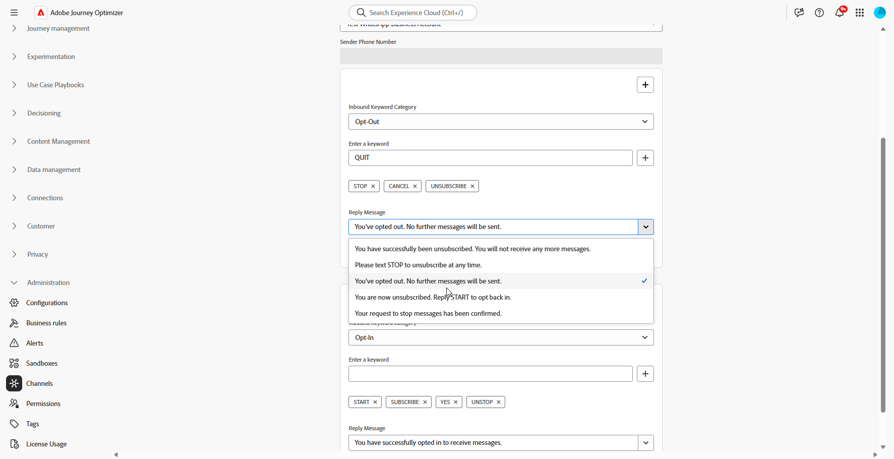
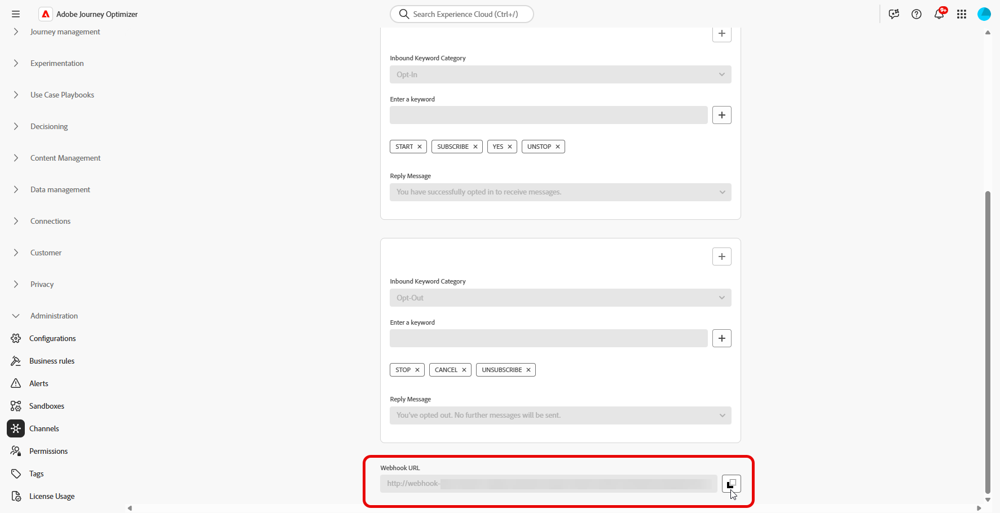

# Kom igång med konfigurationen för whatsApp {#whatsapp-config}

Innan du skickar ett WhatsApp-meddelande måste du konfigurera din Adobe Journey Optimizer-miljö och associera med ditt WhatsApp-konto. Så här gör du:

1. [Skapa dina API-autentiseringsuppgifter för WhatsApp](#WhatsApp-credentials)
1. [Skapa webbhotell för whatsApp](#WhatsApp-webhook)
1. [Skapa din whatsApp-konfiguration](#WhatsApp-configuration)

Dessa steg måste utföras av en Adobe Journey Optimizer [systemadministratör](../start/path/administrator.md).

## Skapa API-autentiseringsuppgifter för whatsApp {#whatsapp-credentials}

1. I den vänstra listen bläddrar du till **[!UICONTROL Administration]** `>` **[!UICONTROL Channels]** och väljer menyn **[!UICONTROL API Credentials]** . Klicka på knappen **[!UICONTROL Create new API credentials]**.

1. Konfigurera dina API-autentiseringsuppgifter enligt nedanstående:

   * **API-token**: Ange din API-token. Läs mer i [Meta-dokumentation](https://developers.facebook.com/blog/post/2022/12/05/auth-tokens/)
   * **Konto-ID**: Ange det unika nummer som hör till din företagsportfölj. Läs mer i [Meta-dokumentation](https://www.facebook.com/business/help/1181250022022158?id=180505742745347).

   

1. Klicka på **[!UICONTROL Continue]**.

1. Välj det **whatsApp-företagskonto** som du vill ansluta till dina API-autentiseringsuppgifter för WhatsApp.

   

1. Välj det **avsändarnamn** som ska användas för att skicka dina WhatsApp-meddelanden.

1. Dina telefonnummerinställningar fylls i automatiskt:

   * **Kvalitetsklassificering**: Återger kundens feedback på meddelanden som skickats de senaste 24 timmarna.
      * Grön: Hög kvalitet
      * Gul: Medium-kvalitet
      * Röd: Låg kvalitet

     Läs mer om [Kvalitetsklassificering](https://www.facebook.com/business/help/766346674749731#)

   * **Genomflöde**: anger den hastighet med vilken ditt telefonnummer kan skicka meddelanden.

1. Klicka på **[!UICONTROL Submit]** när du är klar med konfigurationen av dina API-autentiseringsuppgifter.

När du har skapat och konfigurerat API-autentiseringsuppgifterna måste du nu skapa en webkrok för WhatsApp-meddelanden. [Läs mer](#whatsapp-webhook)

## Skapa webkrok {#WhatsApp-webhook}

>[!CONTEXTUALHELP]
>id="ajo_admin_whatsapp_webhook_inbound_keyword_category"
>title="Ankommande nyckelordskategori"
>abstract="<b>Opt-In</b>: skickar ditt definierade autosvar när en användare prenumererar.  <b>Avanmäl dig</b>: skickar ditt definierade autosvar när en användare avbeställer prenumerationen.  <b>Hjälp</b>: skickar det definierade automatiska svaret när en användare begär hjälp eller support.  <b>Standard</b>: skickar det automatiska svaret för reservlösningar när inga nyckelord matchar."

>[!CONTEXTUALHELP]
>id="ajo_admin_whatsapp_webhook_inbound_keyword"
>title="Ange dina nyckelord"
>abstract="Du kan definiera nyckelord för att aktivera specifika automatiska svar baserat på vilken användartext som visas. Nyckelord är inte skiftlägeskänsliga, t.ex. stoppas och STOP behandlas på samma sätt."

>[!CONTEXTUALHELP]
>id="ajo_admin_whatsapp_webhook_webhook_url"
>title="Återanrops-URL"
>abstract="Verifieringsbegäran och webkrok-meddelanden för det här objektet skickas till den angivna URL:en."

>[!CONTEXTUALHELP]
>id="ajo_admin_whatsapp_webhook_verify_token"
>title="Verifiera token"
>abstract="Den token som Meta återställer för att bekräfta och verifiera återanrops-URL:en under verifieringsprocessen."

>[!NOTE]
>
>Utan angivna nyckelord för anmälan eller avanmälan aktiveras inte standardmeddelanden för samtycke.

När dina API-autentiseringsuppgifter för whatsApp har skapats kan du nu konfigurera Webhooks till:

* **Hämta inkommande svar** för hantering av godkännande av anmälan och avanmälan
* **Ta emot leveransrapporter**, t.ex. läskvitton (om tillgängligt) och meddelandeleveransstatus
* **Aktivera spårningshändelser** för analys och rapportering i Adobe Experience Platform-datauppsättningar

Webhooks fungerar som en kommunikationslänk mellan Meta whatsApp Business Platform och Adobe Journey Optimizer, så att du kan få meddelanden i realtid om meddelandehändelser och användarinteraktioner.

1. Navigera till **[!UICONTROL Administration]** `>` **[!UICONTROL Channels]** i den vänstra listen, välj menyn **[!UICONTROL WhatsApp Webhooks]** under **[!UICONTROL WhatsApp settings]** och klicka på knappen **[!UICONTROL Create Webhook]**.

   

1. Ange en **[!UICONTROL Name]** för din webkrok.

1. I listrutan **[!UICONTROL Select configuration]** väljer du de [API-autentiseringsuppgifter](#whatsapp-credentials) som du skapade tidigare.

   

1. Välj din **[!UICONTROL Inbound keyword category]**, till exempel:

   * **[!UICONTROL Opt-in Keywords]**
   * **[!UICONTROL Opt-out Keywords]**
   * **[!UICONTROL Help Keywords]**
   * **[!UICONTROL Default]** - Reservkategori för alla inkommande meddelanden som inte matchar andra nyckelord. Använd den här kategorin för att aktivera spårningshändelser (öppningar, leveransrapporter) i Adobe Experience Platform datamängder.

1. Ange din **[!UICONTROL Keywords]** och klicka på .

   

1. I fältet **[!UICONTROL Reply Message]** anger du meddelandet som skickas när ett konfigurerat nyckelord tas emot, eller väljer ett fördefinierat alternativ i listrutan.

   

<!--
1. Click **[!UICONTROL View payload editor]** to validate and customize your request payloads. 
    
    You can dynamically personalize your payload using profile attributes, and ensure accurate data is sent for processing and response generation with the help of built-in helper functions.
-->
1. Klicka på  om du vill lägga till ytterligare **[!UICONTROL Inbound keyword]**.

1. Klicka på **[!UICONTROL Submit]** när du är klar med konfigurationen av din WhatsApp-webkrok.

1. Klicka på ikonen **[!UICONTROL Webhooks]** bin för att ta bort din WhatsApp-webkrok.

   

1. Om du vill ändra befintlig konfiguration och få tillgång till din **[!UICONTROL Webhook URL]** eller **[!UICONTROL Webhook Verify toker]**, letar du reda på önskad webbkrok och klickar på alternativet **[!UICONTROL Edit]** för att göra de ändringar som behövs.

1. Kopiera **[!UICONTROL Webhook Verify toker]** som har skapats här och klistra sedan in den i Meta-gränssnittet som en del av Webkrok-konfigurationen.

   Detaljerade instruktioner om hur och var denna verifieringstoken ska läggas till finns i [Meta-dokumentationen](https://developers.facebook.com/docs/graph-api/webhooks/getting-started#configure-webhooks-product).

1. Få åtkomst till och kopiera din nya **[!UICONTROL Webhook URL]** från din tidigare inskickade **[!UICONTROL WhatsApp Webhook]**.

   

Nu när din webkrok är konfigurerad kan du skapa din whatsApp-konfiguration.

## Skapa whatsApp-konfiguration {#whatsapp-configuration}

1. I den vänstra listen bläddrar du till **[!UICONTROL Administration]** > **[!UICONTROL Channels]** och väljer **[!UICONTROL General settings]** > **[!UICONTROL Channel configurations]**. Klicka på knappen **[!UICONTROL Create channel configuration]**.

   

1. Ange ett namn och en beskrivning (valfritt) för konfigurationen och välj sedan WhatsApp-kanalen.

   >[!NOTE]
   >
   > Namn måste börja med en bokstav (A-Z). Det får bara innehålla alfanumeriska tecken. Du kan också använda understreck `_`, punkt `.` och bindestreck `-`.

1. Välj **[!DNL WhatsApp]** som kanal.

   {width=80%}

1. Välj **[!UICONTROL Marketing action(s)]** om du vill associera medgivandeprinciper till meddelanden med den här konfigurationen. Alla policyer för samtycke som är kopplade till marknadsföringsåtgärden utnyttjas för att ta hänsyn till kundernas preferenser. [Läs mer](../action/consent.md#surface-marketing-actions)

1. I avsnittet **[!UICONTROL WhatsApp Settings]** markerar du den **[!UICONTROL WhatsApp configuration]** som skapades tidigare.

   {width=80%}

1. Ange den **[!UICONTROL Sender Phone Number]**-&#x200B; som du vill använda för kommunikationen.

1. Använd **[!UICONTROL WhatsApp Execution Field]** för att bland profilattributen välja det telefonnummer som du vill använda med prioritet om det finns flera tillgängliga nummer i databasen. [Läs mer](../configuration/primary-email-addresses.md#override-execution-address-channel-config)

   >[!NOTE]
   >
   >Som standard använder [!DNL Journey Optimizer] det telefonnummer som anges i de [allmänna inställningarna](../configuration/primary-email-addresses.md) på sandlådenivå. Om du uppdaterar det här fältet åsidosätts standardvärdet för resor och kampanjer som använder den här konfigurationen.

1. När alla parametrar har konfigurerats klickar du på **[!UICONTROL Submit]** för att bekräfta. Du kan också spara kanalkonfigurationen som utkast och återuppta konfigurationen senare.

1. När kanalkonfigurationen har skapats visas den i listan med statusen **[!UICONTROL Processing]**.

   >[!NOTE]
   >
   >Om kontrollerna inte lyckas kan du läsa mer om möjliga felorsaker i [det här avsnittet](../configuration/channel-surfaces.md).

1. När kontrollerna har slutförts får kanalkonfigurationen statusen **[!UICONTROL Active]**. Den är klar att användas för att leverera meddelanden.

När konfigurationen är klar kan ni utnyttja alla färdiga kanalfunktioner som meddelandeframställning, personalisering, länkspårning och rapportering.

Du kan nu skicka meddelanden om whatsApp med Journey Optimizer.

## Felsöka konfigurationen av whatsApp-kanalen {#troubleshooting}

### HTTP 500-fel vid konfiguration av API-autentiseringsuppgifter

Om du får ett HTTP 500-fel när du konfigurerar API-autentiseringsuppgifter för WhatsApp följer du dessa felsökningssteg:

1. **Verifiera berättiganden**: Bekräfta att din organisation har `cjm_whatsapp`-berättigandet etablerat. Utan det här berättigandet kan inte whatsApp-kanalen konfigureras.

1. **Verifiera företagskontofält**: Kontrollera att alla obligatoriska fält är korrekt ifyllda:
   * **API-token**: Måste vara en giltig Meta-åtkomsttoken med lämplig behörighet. [Läs mer](https://developers.facebook.com/blog/post/2022/12/05/auth-tokens/)
   * **Konto-ID**: Måste matcha ditt Meta Business Account ID exakt. [Läs mer](https://www.facebook.com/business/help/1181250022022158?id=180505742745347)

1. **Testa autentiseringsuppgifterna externt**: Verifiera dina autentiseringsuppgifter direkt med Meta API för att bekräfta om problemet gäller autentiseringsuppgifterna eller med Journey Optimizer autentiseringsuppgifter.

1. **Aktivera avancerad loggning**: Om du vill identifiera interna server- eller autentiseringsfel aktiverar du avancerade loggar i Journey Optimizer-miljön för att ge detaljerad information om API-anropsfel.

1. **Kontakta support**: Om miljön och berättigandena har bekräftats vara giltiga men HTTP 500-felet kvarstår kontaktar du Adobe.

## Instruktionsvideo {#video}

I videon nedan visas hur du konfigurerar WhatsApp-kanalen i Adobe Journey Optimizer.

+++ Se videon

>[!VIDEO](https://video.tv.adobe.com/v/3470268/?learn=on)

+++
